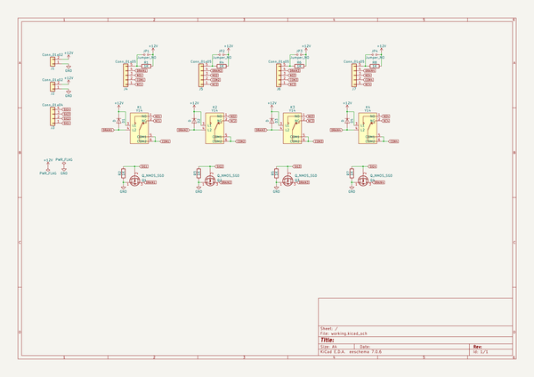

# relays_base
 
## summary 
* id: asukiaaa_relays_base_relays_base
* user: asukiaaa
* name: relays_base
* board: relays_base
* repo: https://github.com/asukiaaa/relays_base
* src_file_repo_kicad_pcb: relays_base.kicad_pcb
* src_file_repo_kicad_pcb_link: https://github.com/asukiaaa/relays_base/tree/master/relays_base.kicad_pcb

* src_file_repo_sch: relays_base.sch
* src_file_repo_sch_link: https://github.com/asukiaaa/relays_base/tree/master/relays_base.sch
* full details link: https://github.com/oomlout/oomlout_oomp_project_bot_v_2/tree/main/projects/asukiaaa_relays_base_relays_base/current_version/working  

## schematic  
  
[schematic (pdf)](working_schematic.pdf) 

## pcb  
 
  
  
  
[board (pdf)](working.pdf)  

## working_bom
| Id | Designator | Footprint | Quantity | Designation | Supplier and ref |  | None | 
| --- | --- | --- | --- | --- | --- | --- | --- | 
| 1 | J1,J2 | PinHeader_1x02_P2.54mm_Vertical | 2 | Conn_01x02 |  |  | [''] | 
| 2 | J3 | PinHeader_1x04_P2.54mm_Vertical | 1 | Conn_01x04 |  |  | [''] | 
| 3 | J4,J5,J6,J7 | PinHeader_1x05_P2.54mm_Vertical | 4 | Conn_01x05 |  |  | [''] | 
| 4 | K1,K2,K3,K4 | Relay_Y14 | 4 | Y14 |  |  | [''] | 
| 5 | Q1,Q2,Q3,Q4 | TO-92_Inline | 4 | Q_NMOS_SGD |  |  | [''] | 
| 6 | D1,D2,D3,D4 | D_A-405_P7.62mm_Horizontal | 4 | D |  |  | [''] | 
| 7 | R1,R2,R3,R4,R5,R6,R7,R8 | R_Axial_DIN0207_L6.3mm_D2.5mm_P2.54mm_Vertical | 8 | 1K |  |  | [''] | 

## bom_schematic
| Ref | Qnty | Value | Cmp name | Footprint | Description | Vendor | DNP | 
| --- | --- | --- | --- | --- | --- | --- | --- | 
| D1, D2, D3, D4 | 4 | D | D | Diode_THT:D_A-405_P7.62mm_Horizontal |  |  |  | 
| J1, J2 | 2 | Conn_01x02 | Conn_01x02 | Connector_PinHeader_2.54mm:PinHeader_1x02_P2.54mm_Vertical |  |  |  | 
| J3 | 1 | Conn_01x04 | Conn_01x04 | Connector_PinHeader_2.54mm:PinHeader_1x04_P2.54mm_Vertical |  |  |  | 
| J4, J5, J6, J7 | 4 | Conn_01x05 | Conn_01x05 | Connector_PinHeader_2.54mm:PinHeader_1x05_P2.54mm_Vertical |  |  |  | 
| JP1, JP2, JP3, JP4 | 4 | Jumper_NO | Jumper_NO_Small | Jumper:SolderJumper_01x02 |  |  |  | 
| K1, K2, K3, K4 | 4 | Y14 | Y14 | Relay_THT:Relay_Y14 |  |  |  | 
| Q1, Q2, Q3, Q4 | 4 | Q_NMOS_SGD | Q_NMOS_SGD | Package_TO_SOT_THT:TO-92_Inline |  |  |  | 
| R1, R2, R3, R4, R5, R6, R7, R8 | 8 | 1K | R-RESCUE-relays_base | Resistor_THT:R_Axial_DIN0207_L6.3mm_D2.5mm_P2.54mm_Vertical |  |  |  | 

