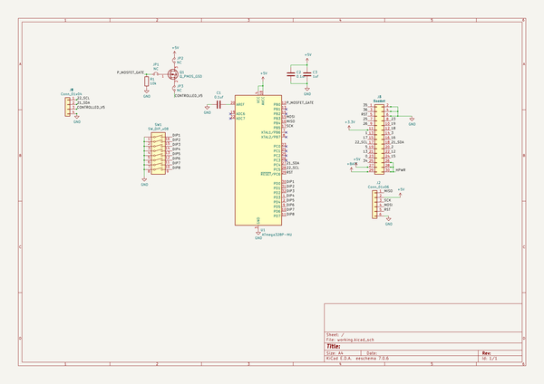
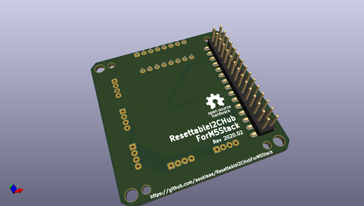
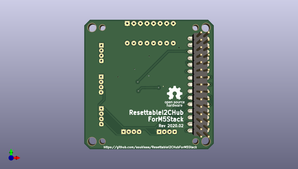
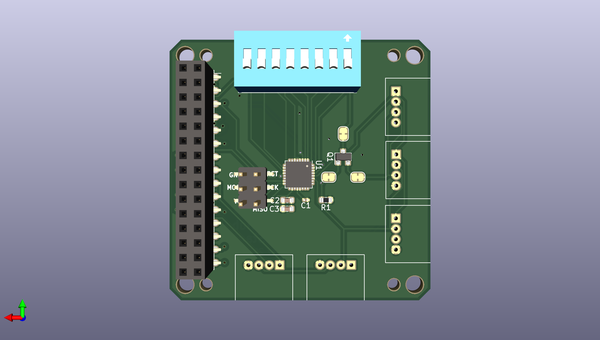

# resettablei2chubform5stack
 
## summary 
* id: asukiaaa_resettablei2chubform5stack_resettablei2chubform5stack
* user: asukiaaa
* name: resettablei2chubform5stack
* board: resettablei2chubform5stack
* repo: https://github.com/asukiaaa/ResettableI2CHubForM5Stack
* src_file_repo_kicad_pcb: pcb/ResettableI2CHubForM5Stack.kicad_pcb
* src_file_repo_kicad_pcb_link: https://github.com/asukiaaa/ResettableI2CHubForM5Stack/tree/master/pcb/ResettableI2CHubForM5Stack.kicad_pcb

* src_file_repo_sch: pcb/ResettableI2CHubForM5Stack.sch
* src_file_repo_sch_link: https://github.com/asukiaaa/ResettableI2CHubForM5Stack/tree/master/pcb/ResettableI2CHubForM5Stack.sch
* full details link: https://github.com/oomlout/oomlout_oomp_project_bot_v_2/tree/main/projects/asukiaaa_resettablei2chubform5stack_resettablei2chubform5stack/current_version/working  

## schematic  
  
[schematic (pdf)](working_schematic.pdf) 

## pcb  
 
  
  
  
[board (pdf)](working.pdf)  

## working_bom
| Id | Designator | Footprint | Quantity | Designation | Supplier and ref |  | None | 
| --- | --- | --- | --- | --- | --- | --- | --- | 
| 1 | J3 | PinHeader_2x15_P2.54mm_M5Stack | 1 | Header |  |  | [''] | 
| 2 | J4 | PinSocket_2x15_P2.54mm_Vertical_SMD_just_for_M5Stack_bottom | 1 | Socket |  |  | [''] | 
| 3 | C1 | C_0201_0603Metric | 1 | 0.1uf |  |  | [''] | 
| 4 | C2 | C_0603_1608Metric | 1 | 0.1uf |  |  | [''] | 
| 5 | C3 | C_0603_1608Metric | 1 | 1uf |  |  | [''] | 
| 6 | J1,J5,J6,J7,J8 | NS-Tech_Grove_1x04_P2mm_Horizontal | 5 | Conn_01x04 |  |  | [''] | 
| 7 | J2 | 2x03_P2.54mm_Pads | 1 | Conn_01x06 |  |  | [''] | 
| 8 | R1 | R_0603_1608Metric | 1 | 10k |  |  | [''] | 
| 9 | SW1 | SW_DIP_SPSTx08_Slide_9.78x22.5mm_W7.62mm_P2.54mm | 1 | SW_DIP_x08 |  |  | [''] | 
| 10 | U1 | QFN-32-1EP_5x5mm_P0.5mm_EP3.1x3.1mm | 1 | ATmega328P-MU |  |  | [''] | 
| 11 | Q1 | SOT-23 | 1 | Q_PMOS_GSD |  |  | [''] | 

## bom_schematic
| Ref | Qnty | Value | Cmp name | Footprint | Description | Vendor | DNP | 
| --- | --- | --- | --- | --- | --- | --- | --- | 
| C1 | 1 | 0.1uf | C | Capacitor_SMD:C_0201_0603Metric | Unpolarized capacitor |  |  | 
| C2 | 1 | 0.1uf | C | Capacitor_SMD:C_0603_1608Metric | Unpolarized capacitor |  |  | 
| C3 | 1 | 1uf | C | Capacitor_SMD:C_0603_1608Metric | Unpolarized capacitor |  |  | 
| J1, J5, J6, J7, J8 | 5 | Conn_01x04 | Conn_01x04 | footprints:NS-Tech_Grove_1x04_P2mm_Horizontal | Generic connector, single row, 01x04, script generated (kicad-library-utils/schlib/autogen/connector/) |  |  | 
| J2 | 1 | Conn_01x06 | Conn_01x06 | footprints:2x03_P2.54mm_Pads | Generic connector, single row, 01x06, script generated (kicad-library-utils/schlib/autogen/connector/) |  |  | 
| J3 | 1 | Header | Conn_02x15_Odd_Even | footprints:PinHeader_2x15_P2.54mm_M5Stack | Generic connector, double row, 02x15, odd/even pin numbering scheme (row 1 odd numbers, row 2 even numbers), script generated (kicad-library-utils/schlib/autogen/connector/) |  |  | 
| J4 | 1 | Socket | Conn_02x15_Odd_Even | footprints:PinSocket_2x15_P2.54mm_Vertical_SMD_just_for_M5Stack_bottom | Generic connector, double row, 02x15, odd/even pin numbering scheme (row 1 odd numbers, row 2 even numbers), script generated (kicad-library-utils/schlib/autogen/connector/) |  |  | 
| JP1, JP2, JP3 | 3 | NC | Jumper_NC_Small-Device | Jumper:SolderJumper-2_P1.3mm_Bridged_RoundedPad1.0x1.5mm |  |  |  | 
| Q1 | 1 | Q_PMOS_GSD | Q_PMOS_GSD | Package_TO_SOT_SMD:SOT-23 | P-MOSFET transistor, gate/source/drain |  |  | 
| R1 | 1 | 10k | R | Resistor_SMD:R_0603_1608Metric | Resistor |  |  | 
| SW1 | 1 | SW_DIP_x08 | SW_DIP_x08 | Button_Switch_THT:SW_DIP_SPSTx08_Slide_9.78x22.5mm_W7.62mm_P2.54mm | 8x DIP Switch, Single Pole Single Throw (SPST) switch, small symbol |  |  | 
| U1 | 1 | ATmega328P-MU | ATmega328P-MU-MCU_Microchip_ATmega | Package_DFN_QFN:QFN-32-1EP_5x5mm_P0.5mm_EP3.1x3.1mm |  |  |  | 

