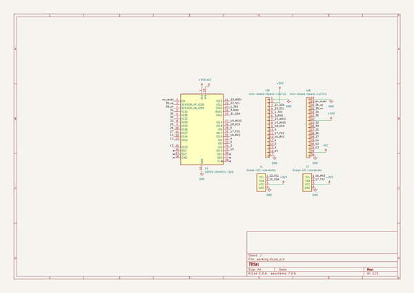
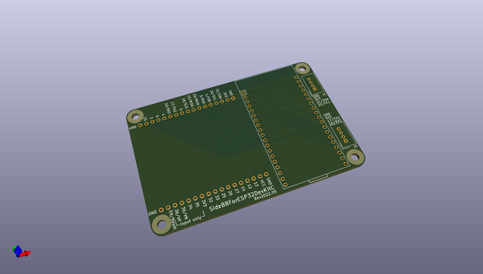
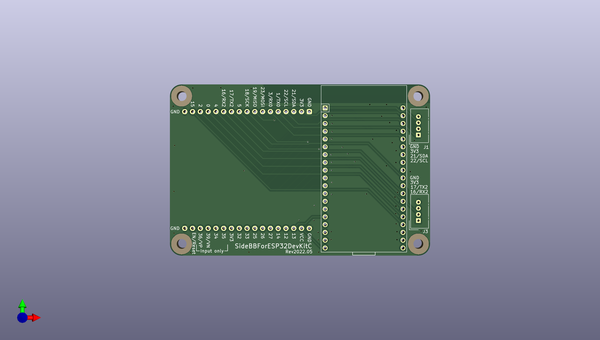
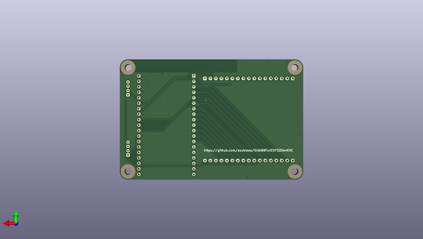

# sidebbforesp32devkitc
 
## summary 
* id: asukiaaa_sidebbforesp32devkitc_sidebbforesp32devkitc
* user: asukiaaa
* name: sidebbforesp32devkitc
* board: sidebbforesp32devkitc
* repo: https://github.com/asukiaaa/SideBBForESP32DevKitC
* src_file_repo_kicad_pcb: SideBBForESP32DevKitC.kicad_pcb
* src_file_repo_kicad_pcb_link: https://github.com/asukiaaa/SideBBForESP32DevKitC/tree/main/SideBBForESP32DevKitC.kicad_pcb
* src_file_repo_kicad_sch: SideBBForESP32DevKitC.kicad_sch
* src_file_repo_kicad_sch_link: https://github.com/asukiaaa/SideBBForESP32DevKitC/tree/main/SideBBForESP32DevKitC.kicad_sch

* src_file_repo_sch: 
* src_file_repo_sch_link: https://github.com/asukiaaa/SideBBForESP32DevKitC/tree/main/
* full details link: https://github.com/oomlout/oomlout_oomp_project_bot_v_2/tree/main/projects/asukiaaa_sidebbforesp32devkitc_sidebbforesp32devkitc/current_version/working  

## schematic  
  
[schematic (pdf)](working_schematic.pdf) 

## pcb  
 
  
  
  
[board (pdf)](working.pdf)  

## working_bom
| Id | Designator | Footprint | Quantity | Designation | Supplier and ref |  | None | 
| --- | --- | --- | --- | --- | --- | --- | --- | 
| 1 | U1 | ESP32-DEVKITC-32D | 1 | ESP32-DEVKITC-32D |  |  | [''] | 
| 2 | J3,J1 | NS-Tech_Grove_1x04_P2mm_Vertical | 2 | Grove-I2C-connector |  |  | [''] | 
| 3 | J2 | mini-bread-board-1x17x2 | 1 | mini-bread-board-1x17x2 |  |  | [''] | 

## bom_schematic
| Ref | Qnty | Value | Cmp name | Footprint | Description | Vendor | DNP | 
| --- | --- | --- | --- | --- | --- | --- | --- | 
| J1, J3 | 2 | Grove-I2C-connector | Grove-I2C-connector | Connector:NS-Tech_Grove_1x04_P2mm_Vertical |  |  |  | 
| J2 | 1 | mini-bread-board-1x17x2 | mini-bread-board-1x17x2 | asukiaaa-kicad-footprints:mini-bread-board-1x17x2 |  |  |  | 
| U1 | 1 | ESP32-DEVKITC-32D | ESP32-DEVKITC-32D | asukiaaa-kicad-footprints:ESP32-DEVKITC-32D |  |  |  | 

