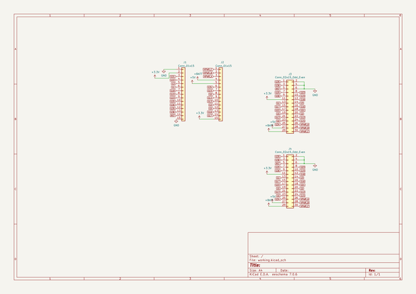
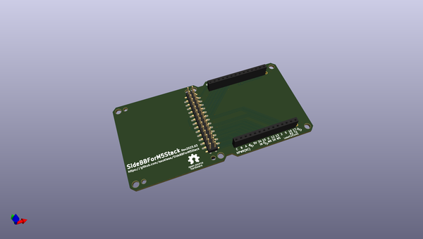
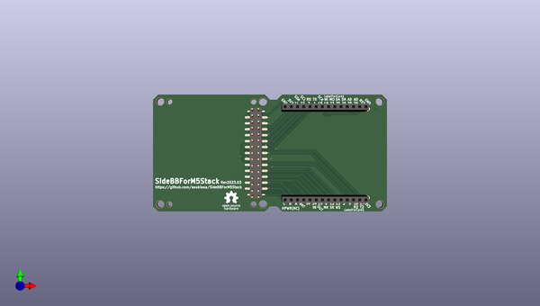
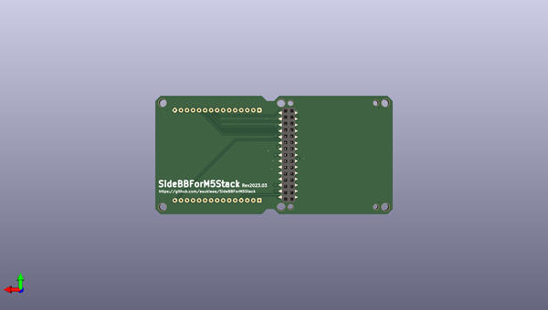

# sidebbform5stack
 
## summary 
* id: asukiaaa_sidebbform5stack_sidebbform5stack
* user: asukiaaa
* name: sidebbform5stack
* board: sidebbform5stack
* repo: https://github.com/asukiaaa/SideBBForM5Stack
* src_file_repo_kicad_pcb: pcb/SideBBForM5Stack.kicad_pcb
* src_file_repo_kicad_pcb_link: https://github.com/asukiaaa/SideBBForM5Stack/tree/master/pcb/SideBBForM5Stack.kicad_pcb
* src_file_repo_kicad_sch: pcb/SideBBForM5Stack.kicad_sch
* src_file_repo_kicad_sch_link: https://github.com/asukiaaa/SideBBForM5Stack/tree/master/pcb/SideBBForM5Stack.kicad_sch

* src_file_repo_sch: 
* src_file_repo_sch_link: https://github.com/asukiaaa/SideBBForM5Stack/tree/master/
* full details link: https://github.com/oomlout/oomlout_oomp_project_bot_v_2/tree/main/projects/asukiaaa_sidebbform5stack_sidebbform5stack/current_version/working  

## schematic  
  
[schematic (pdf)](working_schematic.pdf) 

## pcb  
 
  
  
  
[board (pdf)](working.pdf)  

## working_bom
| Id | Designator | Footprint | Quantity | Designation | Supplier and ref |  | None | 
| --- | --- | --- | --- | --- | --- | --- | --- | 
| 1 | J1,J2 | PinSocket_1x15_P2.54mm_Vertical_without_silk | 2 | Conn_01x15 |  |  | [''] | 
| 2 | J3 | PinHeader_2x15_P2.54mm_M5Stack_SpacerPCB_pads | 1 | Conn_02x15_Odd_Even |  |  | [''] | 
| 3 | J4 | PinSocket_2x15_P2.54mm_Vertical_SMD_just_for_M5Stack_bottom | 1 | Conn_02x15_Odd_Even |  |  | [''] | 

## bom_schematic
| Ref | Qnty | Value | Cmp name | Footprint | Description | Vendor | DNP | 
| --- | --- | --- | --- | --- | --- | --- | --- | 
| J1, J2 | 2 | Conn_01x15 | Conn_01x15 | footprints:PinSocket_1x15_P2.54mm_Vertical_without_silk | Generic connector, single row, 01x15, script generated (kicad-library-utils/schlib/autogen/connector/) |  |  | 
| J3 | 1 | Conn_02x15_Odd_Even | Conn_02x15_Odd_Even | footprints:PinHeader_2x15_P2.54mm_M5Stack_SpacerPCB_pads | Generic connector, double row, 02x15, odd/even pin numbering scheme (row 1 odd numbers, row 2 even numbers), script generated (kicad-library-utils/schlib/autogen/connector/) |  |  | 
| J4 | 1 | Conn_02x15_Odd_Even | Conn_02x15_Odd_Even | footprints:PinSocket_2x15_P2.54mm_Vertical_SMD_just_for_M5Stack_bottom | Generic connector, double row, 02x15, odd/even pin numbering scheme (row 1 odd numbers, row 2 even numbers), script generated (kicad-library-utils/schlib/autogen/connector/) |  |  | 

