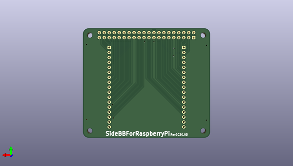

# sidebbforraspberrypi
 
## summary 
* id: asukiaaa_sidebbforraspberrypi_main_pcb
* user: asukiaaa
* name: sidebbforraspberrypi
* board: main_pcb
* repo: https://github.com/asukiaaa/SideBBForRaspberryPi
* src_file_repo_kicad_pcb: main_pcb/main_pcb.kicad_pcb
* src_file_repo_kicad_pcb_link: https://github.com/asukiaaa/SideBBForRaspberryPi/tree/master/main_pcb/main_pcb.kicad_pcb

* src_file_repo_sch: main_pcb/main_pcb.sch
* src_file_repo_sch_link: https://github.com/asukiaaa/SideBBForRaspberryPi/tree/master/main_pcb/main_pcb.sch
* full details link: https://github.com/oomlout/oomlout_oomp_project_bot_v_2/tree/main/projects/asukiaaa_sidebbforraspberrypi_main_pcb/current_version/working  

## schematic  
  
[schematic (pdf)](working_schematic.pdf) 

## pcb  
 
  
  
  
[board (pdf)](working.pdf)  

## working_bom
| Id | Designator | Footprint | Quantity | Designation | Supplier and ref |  | None | 
| --- | --- | --- | --- | --- | --- | --- | --- | 
| 1 | P1 | PinHeader_2x20_P2.54mm_Vertical | 1 | Conn_02x20_Odd_Even |  |  | [''] | 
| 2 | J1,J2 | PinSocket_1x17_P2.54mm_Vertical | 2 | Conn_01x17 |  |  | [''] | 

## bom_schematic
| Ref | Qnty | Value | Cmp name | Footprint | Description | Vendor | DNP | 
| --- | --- | --- | --- | --- | --- | --- | --- | 
| J1, J2 | 2 | Conn_01x17 | Conn_01x17 | Connector_PinSocket_2.54mm:PinSocket_1x17_P2.54mm_Vertical | Generic connector, single row, 01x17, script generated (kicad-library-utils/schlib/autogen/connector/) |  |  | 
| MK1, MK2, MK3, MK4 | 4 | M2.5 | Mounting_Hole-Mechanical-main_pcb-rescue | MountingHole:MountingHole_2.7mm_M2.5 |  |  |  | 
| P1 | 1 | Conn_02x20_Odd_Even | Conn_02x20_Odd_Even | Connector_PinHeader_2.54mm:PinHeader_2x20_P2.54mm_Vertical | Generic connector, double row, 02x20, odd/even pin numbering scheme (row 1 odd numbers, row 2 even numbers), script generated (kicad-library-utils/schlib/autogen/connector/) |  |  | 

