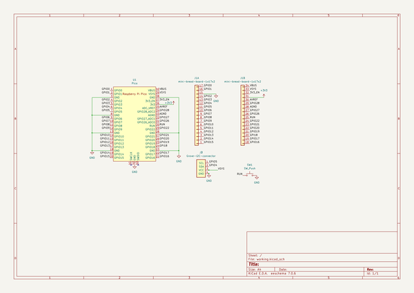

# sidebbforraspberrypipico
 
## summary 
* id: asukiaaa_sidebbforraspberrypipico_sidebbforraspberrypipico
* user: asukiaaa
* name: sidebbforraspberrypipico
* board: sidebbforraspberrypipico
* repo: https://github.com/asukiaaa/SideBBForRaspberryPiPico
* src_file_repo_kicad_pcb: SideBBForRaspberryPiPico.kicad_pcb
* src_file_repo_kicad_pcb_link: https://github.com/asukiaaa/SideBBForRaspberryPiPico/tree/main/SideBBForRaspberryPiPico.kicad_pcb
* src_file_repo_kicad_sch: SideBBForRaspberryPiPico.kicad_sch
* src_file_repo_kicad_sch_link: https://github.com/asukiaaa/SideBBForRaspberryPiPico/tree/main/SideBBForRaspberryPiPico.kicad_sch

* src_file_repo_sch: 
* src_file_repo_sch_link: https://github.com/asukiaaa/SideBBForRaspberryPiPico/tree/main/
* full details link: https://github.com/oomlout/oomlout_oomp_project_bot_v_2/tree/main/projects/asukiaaa_sidebbforraspberrypipico_sidebbforraspberrypipico/current_version/working  

## schematic  
  
[schematic (pdf)](working_schematic.pdf) 

## pcb  
 
  
  
  
[board (pdf)](working.pdf)  

## working_bom
| Id | Designator | Footprint | Quantity | Designation | Supplier and ref |  | None | 
| --- | --- | --- | --- | --- | --- | --- | --- | 
| 1 | J2,J3 | NS-Tech_Grove_1x04_P2mm_Vertical | 2 | Grove-I2C-connector |  |  | [''] | 
| 2 | J1 | mini-bread-board-1x17x2 | 1 | mini-bread-board-1x17x2 |  |  | [''] | 
| 3 | SW1 | SW_PUSH_6mm | 1 | SW_Push |  |  | [''] | 
| 4 | U1 | RPi_Pico_TH | 1 | Pico |  |  | [''] | 

## bom_schematic
| Ref | Qnty | Value | Cmp name | Footprint | Description | Vendor | DNP | 
| --- | --- | --- | --- | --- | --- | --- | --- | 
| J1 | 1 | mini-bread-board-1x17x2 | mini-bread-board-1x17x2 | asukiaaa-kicad-footprints:mini-bread-board-1x17x2 |  |  |  | 
| J2, J3 | 2 | Grove-I2C-connector | Grove-I2C-connector | Connector:NS-Tech_Grove_1x04_P2mm_Vertical |  |  |  | 
| SW1 | 1 | SW_Push | SW_Push | Button_Switch_THT:SW_PUSH_6mm | Push button switch, generic, two pins |  |  | 
| U1 | 1 | Pico | Pico | asukiaaa-kicad-footprints:RPi_Pico_TH |  |  |  | 

