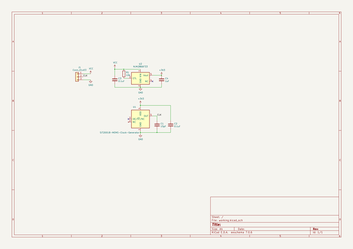
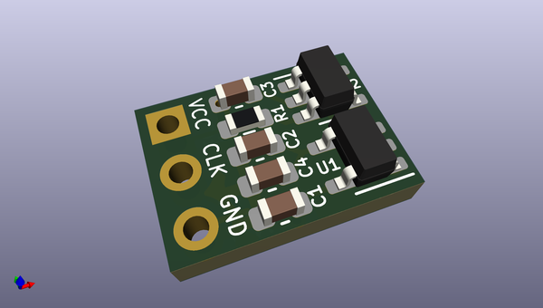
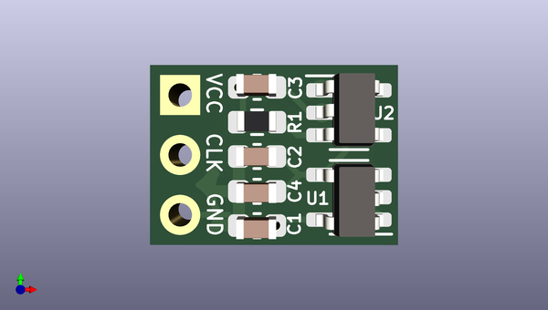
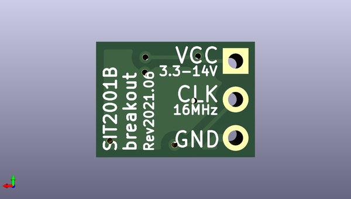

# sit2001b_breakout
 
## summary 
* id: asukiaaa_sit2001b_breakout_sit2001b_breakout
* user: asukiaaa
* name: sit2001b_breakout
* board: sit2001b_breakout
* repo: https://github.com/asukiaaa/SIT2001B-breakout
* src_file_repo_kicad_pcb: SIT2001B-breakout.kicad_pcb
* src_file_repo_kicad_pcb_link: https://github.com/asukiaaa/SIT2001B-breakout/tree/master/SIT2001B-breakout.kicad_pcb

* src_file_repo_sch: SIT2001B-breakout.sch
* src_file_repo_sch_link: https://github.com/asukiaaa/SIT2001B-breakout/tree/master/SIT2001B-breakout.sch
* full details link: https://github.com/oomlout/oomlout_oomp_project_bot_v_2/tree/main/projects/asukiaaa_sit2001b_breakout_sit2001b_breakout/current_version/working  

## schematic  
  
[schematic (pdf)](working_schematic.pdf) 

## pcb  
 
  
  
  
[board (pdf)](working.pdf)  

## working_bom
| Id | Designator | Footprint | Quantity | Designation | Supplier and ref |  | None | 
| --- | --- | --- | --- | --- | --- | --- | --- | 
| 1 | C1 | C_0603_1608Metric | 1 | 15pf |  |  | [''] | 
| 2 | C2,C3 | C_0603_1608Metric | 2 | 0.1uf |  |  | [''] | 
| 3 | C4 | C_0603_1608Metric | 1 | 1uf |  |  | [''] | 
| 4 | J1 | Pin_1x03_P2.54mm_nosilk | 1 | Conn_01x03 |  |  | [''] | 
| 5 | R1 | R_0603_1608Metric | 1 | 10k |  |  | [''] | 
| 6 | U1 | SOT-23-5 | 1 | SiT2001B-MEMS-Clock-Generator |  |  | [''] | 
| 7 | U2 | SOT-23-5 | 1 | NJM2866F33 |  |  | [''] | 

## bom_schematic
| Ref | Qnty | Value | Cmp name | Footprint | Description | Vendor | DNP | 
| --- | --- | --- | --- | --- | --- | --- | --- | 
| C1 | 1 | 15pf | C | Capacitor_SMD:C_0603_1608Metric | Unpolarized capacitor |  |  | 
| C2, C3 | 2 | 0.1uf | C | Capacitor_SMD:C_0603_1608Metric | Unpolarized capacitor |  |  | 
| C4 | 1 | 1uf | C | Capacitor_SMD:C_0603_1608Metric | Unpolarized capacitor |  |  | 
| J1 | 1 | Conn_01x03 | Conn_01x03 | my-kicad-footprints:Pin_1x03_P2.54mm_nosilk | Generic connector, single row, 01x03, script generated (kicad-library-utils/schlib/autogen/connector/) |  |  | 
| R1 | 1 | 10k | R | Resistor_SMD:R_0603_1608Metric | Resistor |  |  | 
| U1 | 1 | SiT2001B-MEMS-Clock-Generator | SiT2001B-MEMS-Clock-Generator-my-kicad-symbols | Package_TO_SOT_SMD:SOT-23-5 |  |  |  | 
| U2 | 1 | NJM2866F33 | NJM2866F33-my-kicad-symbols | Package_TO_SOT_SMD:SOT-23-5 |  |  |  | 

