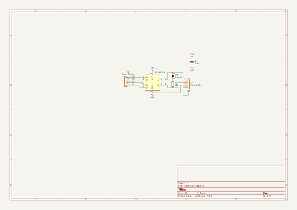

# sp3485_breakout
 
## summary 
* id: asukiaaa_sp3485_breakout_sp3485_breakout
* user: asukiaaa
* name: sp3485_breakout
* board: sp3485_breakout
* repo: https://github.com/asukiaaa/sp3485-breakout
* src_file_repo_kicad_pcb: sp3485-breakout.kicad_pcb
* src_file_repo_kicad_pcb_link: https://github.com/asukiaaa/sp3485-breakout/tree/master/sp3485-breakout.kicad_pcb

* src_file_repo_sch: sp3485-breakout.sch
* src_file_repo_sch_link: https://github.com/asukiaaa/sp3485-breakout/tree/master/sp3485-breakout.sch
* full details link: https://github.com/oomlout/oomlout_oomp_project_bot_v_2/tree/main/projects/asukiaaa_sp3485_breakout_sp3485_breakout/current_version/working  

## schematic  
  
[schematic (pdf)](working_schematic.pdf) 

## pcb  
 
  
  
  
[board (pdf)](working.pdf)  

## working_bom
| Id | Designator | Footprint | Quantity | Designation | Supplier and ref |  | None | 
| --- | --- | --- | --- | --- | --- | --- | --- | 
| 1 | J1,J2 | Pin_1x04_P2.54mm_nosilk | 2 | Conn_01x04 |  |  | [''] | 
| 2 | R1 | R_0402_1005Metric | 1 | 220 |  |  | [''] | 
| 3 | U1 | SOIC-8_3.9x4.9mm_P1.27mm | 1 | SP3485CN |  |  | [''] | 
| 4 | C1 | C_0402_1005Metric | 1 | 0.1u |  |  | [''] | 

## bom_schematic
| Ref | Qnty | Value | Cmp name | Footprint | Description | Vendor | DNP | 
| --- | --- | --- | --- | --- | --- | --- | --- | 
| C1 | 1 | 0.1u | C | Capacitor_SMD:C_0402_1005Metric | Unpolarized capacitor |  |  | 
| J1, J2 | 2 | Conn_01x04 | Conn_01x04 | my-kicad-footprints:Pin_1x04_P2.54mm_nosilk | Generic connector, single row, 01x04, script generated (kicad-library-utils/schlib/autogen/connector/) |  |  | 
| JP1 | 1 | Bridged | SolderJumper_2_Bridged | my-kicad-footprints:SolderJumper-2_P1.3mm_Bridged_RoundedPad1.0x1.5mm | Solder Jumper, 2-pole, closed/bridged |  |  | 
| R1 | 1 | 220 | R | Resistor_SMD:R_0402_1005Metric | Resistor |  |  | 
| U1 | 1 | SP3485CN | SP3485CN | Package_SO:SOIC-8_3.9x4.9mm_P1.27mm | 3.3V Low Power Half-Duplex RS-485 Transceiver 10Mbps, SOIC-8 |  |  | 

