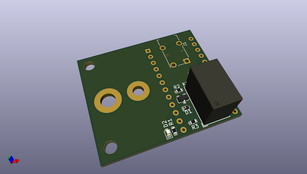
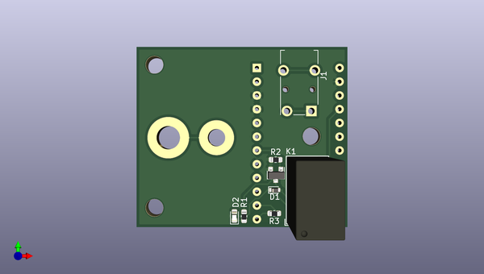
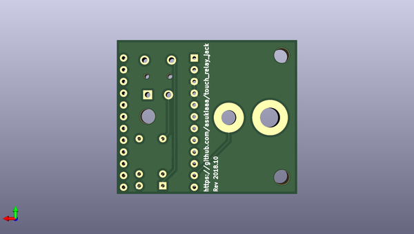

# touch_relay_jack
 
## summary 
* id: asukiaaa_touch_relay_jack_touch_relay_jack
* user: asukiaaa
* name: touch_relay_jack
* board: touch_relay_jack
* repo: https://github.com/asukiaaa/touch_relay_jack
* src_file_repo_kicad_pcb: pcb/touch_relay_jack.kicad_pcb
* src_file_repo_kicad_pcb_link: https://github.com/asukiaaa/touch_relay_jack/tree/master/pcb/touch_relay_jack.kicad_pcb

* src_file_repo_sch: pcb/touch_relay_jack.sch
* src_file_repo_sch_link: https://github.com/asukiaaa/touch_relay_jack/tree/master/pcb/touch_relay_jack.sch
* full details link: https://github.com/oomlout/oomlout_oomp_project_bot_v_2/tree/main/projects/asukiaaa_touch_relay_jack_touch_relay_jack/current_version/working  

## schematic  
  
[schematic (pdf)](working_schematic.pdf) 

## pcb  
 
  
  
  
[board (pdf)](working.pdf)  

## working_bom
| Id | Designator | Footprint | Quantity | Designation | Supplier and ref |  | None | 
| --- | --- | --- | --- | --- | --- | --- | --- | 
| 1 | A1 | Pro_Micro | 1 | Pro_Micro |  |  | [''] | 
| 2 | D1 | D_SOD-523 | 1 | D_Shockley |  |  | [''] | 
| 3 | D2 | LED_0603_1608Metric | 1 | LED |  |  | [''] | 
| 4 | J1 | Jack_3.5mm_Switronic_ST-005-G_horizontal | 1 | AudioJack3_Ground |  |  | [''] | 
| 5 | K1 | Relay_SPDT_HsinDa_Y14 | 1 | Y14x-1C-xxDS |  |  | [''] | 
| 6 | Q1 | SOT-23 | 1 | Q_NMOS_GSD |  |  | [''] | 
| 7 | R1,R2 | R_0603_1608Metric | 2 | 1K |  |  | [''] | 
| 8 | R3 | R_0603_1608Metric | 1 | 1M |  |  | [''] | 

## bom_schematic
no data

