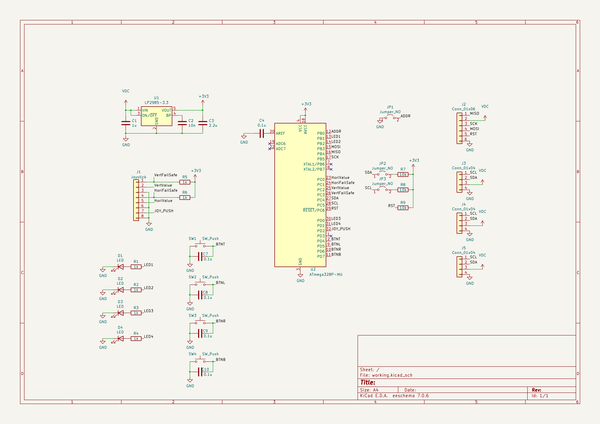
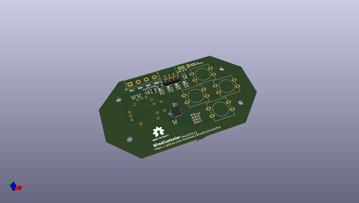
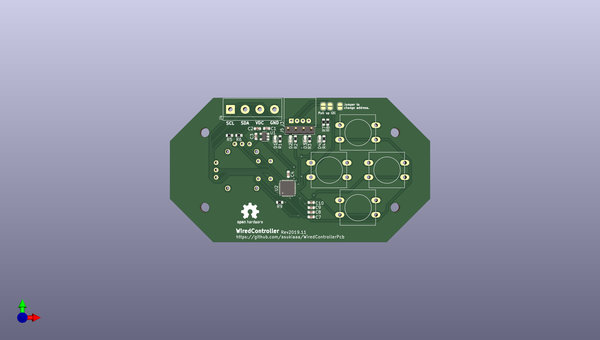
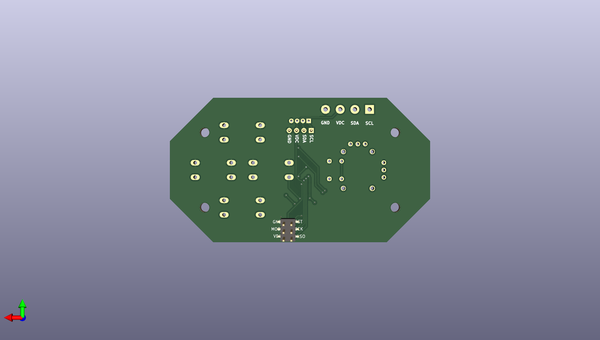

# wiredcontrollerpcb
 
## summary 
* id: asukiaaa_wiredcontrollerpcb_wiredcontrollerpcb
* user: asukiaaa
* name: wiredcontrollerpcb
* board: wiredcontrollerpcb
* repo: https://github.com/asukiaaa/WiredControllerPcb
* src_file_repo_kicad_pcb: WiredControllerPcb.kicad_pcb
* src_file_repo_kicad_pcb_link: https://github.com/asukiaaa/WiredControllerPcb/tree/master/WiredControllerPcb.kicad_pcb
* src_file_repo_kicad_sch: WiredControllerPcb.kicad_sch
* src_file_repo_kicad_sch_link: https://github.com/asukiaaa/WiredControllerPcb/tree/master/WiredControllerPcb.kicad_sch

* src_file_repo_sch: 
* src_file_repo_sch_link: https://github.com/asukiaaa/WiredControllerPcb/tree/master/
* full details link: https://github.com/oomlout/oomlout_oomp_project_bot_v_2/tree/main/projects/asukiaaa_wiredcontrollerpcb_wiredcontrollerpcb/current_version/working  

## schematic  
  
[schematic (pdf)](working_schematic.pdf) 

## pcb  
 
  
  
  
[board (pdf)](working.pdf)  

## working_bom
| Id | Designator | Footprint | Quantity | Designation | Supplier and ref |  | None | 
| --- | --- | --- | --- | --- | --- | --- | --- | 
| 1 | C1 | C_0603_1608Metric | 1 | 1u |  |  | [''] | 
| 2 | C2 | C_0603_1608Metric | 1 | 10n |  |  | [''] | 
| 3 | C3 | C_0603_1608Metric | 1 | 2.2u |  |  | [''] | 
| 4 | C4,C7,C8,C9,C10 | C_0603_1608Metric | 5 | 0.1u |  |  | [''] | 
| 5 | D1,D2,D3,D4 | LED_0603_1608Metric | 4 | LED |  |  | [''] | 
| 6 | J1 | PS4tJoystick | 1 | Joystick |  |  | [''] | 
| 7 | J3 | NS-Tech_Grove_1x04_P2mm_Horizontal | 1 | Conn_01x04 |  |  | [''] | 
| 8 | R1,R2,R3,R5,R6,R4 | R_0603_1608Metric | 6 | 1k |  |  | [''] | 
| 9 | SW1,SW2,SW3,SW4 | SW_Center_PUSH-12mm | 4 | SW_Push |  |  | [''] | 
| 10 | U1 | SOT-23-5 | 1 | LP2985-3.3 |  |  | [''] | 
| 11 | U2 | QFN-32-1EP_5x5mm_P0.5mm_EP3.1x3.1mm | 1 | ATmega328P-MU |  |  | [''] | 
| 12 | JP1,JP2,JP3 | SolderJumper-2_P1.3mm_Open_RoundedPad1.0x1.5mm | 3 | Jumper_NO |  |  | [''] | 
| 13 | J4 | TerminalBlock_bornier-4_P5.08mm | 1 | Conn_01x04 |  |  | [''] | 
| 14 | R7,R8,R9 | R_0603_1608Metric | 3 | 10k |  |  | [''] | 
| 15 | J5 | PinHeader_1x04_P2.54mm_Vertical | 1 | Conn_01x04 |  |  | [''] | 
| 16 | J2 | 2x03_P2.54mm_Pads | 1 | Conn_01x06 |  |  | [''] | 

## bom_schematic
| Ref | Qnty | Value | Cmp name | Footprint | Description | Vendor | DNP | 
| --- | --- | --- | --- | --- | --- | --- | --- | 
| C1 | 1 | 1u | C | Capacitor_SMD:C_0603_1608Metric | Unpolarized capacitor |  |  | 
| C2 | 1 | 10n | C | Capacitor_SMD:C_0603_1608Metric | Unpolarized capacitor |  |  | 
| C3 | 1 | 2.2u | C | Capacitor_SMD:C_0603_1608Metric | Unpolarized capacitor |  |  | 
| C4, C7, C8, C9, C10 | 5 | 0.1u | C | Capacitor_SMD:C_0603_1608Metric | Unpolarized capacitor |  |  | 
| D1, D2, D3, D4 | 4 | LED | LED | LED_SMD:LED_0603_1608Metric | Light emitting diode |  |  | 
| J1 | 1 | Joystick | Conn_01x08 | footprints:PS4tJoystick | Generic connector, single row, 01x08, script generated (kicad-library-utils/schlib/autogen/connector/) |  |  | 
| J2 | 1 | Conn_01x06 | Conn_01x06 | footprints:2x03_P2.54mm_Pads | Generic connector, single row, 01x06, script generated (kicad-library-utils/schlib/autogen/connector/) |  |  | 
| J3 | 1 | Conn_01x04 | Conn_01x04 | footprints:NS-Tech_Grove_1x04_P2mm_Horizontal | Generic connector, single row, 01x04, script generated (kicad-library-utils/schlib/autogen/connector/) |  |  | 
| J4 | 1 | Conn_01x04 | Conn_01x04 | TerminalBlock:TerminalBlock_bornier-4_P5.08mm | Generic connector, single row, 01x04, script generated (kicad-library-utils/schlib/autogen/connector/) |  |  | 
| J5 | 1 | Conn_01x04 | Conn_01x04 | Connector_PinHeader_2.54mm:PinHeader_1x04_P2.54mm_Vertical | Generic connector, single row, 01x04, script generated (kicad-library-utils/schlib/autogen/connector/) |  |  | 
| JP1, JP2, JP3 | 3 | Jumper_NO | Jumper_2_Open | Jumper:SolderJumper-2_P1.3mm_Open_RoundedPad1.0x1.5mm | Jumper, 2-pole, open |  |  | 
| R1, R2, R3, R4, R5, R6 | 6 | 1k | R | Resistor_SMD:R_0603_1608Metric | Resistor |  |  | 
| R7, R8, R9 | 3 | 10k | R | Resistor_SMD:R_0603_1608Metric | Resistor |  |  | 
| SW1, SW2, SW3, SW4 | 4 | SW_Push | SW_Push | footprints:SW_Center_PUSH-12mm | Push button switch, generic, two pins |  |  | 
| U1 | 1 | LP2985-3.3 | LP2985-3.3 | Package_TO_SOT_SMD:SOT-23-5 | 150mA 16V Low-noise Low-dropout Regulator With Shutdown, 3.3V output voltage, SOT-23-5 |  |  | 
| U2 | 1 | ATmega328P-MU | ATmega328P-MU-MCU_Microchip_ATmega | Package_DFN_QFN:QFN-32-1EP_5x5mm_P0.5mm_EP3.1x3.1mm |  |  |  | 

