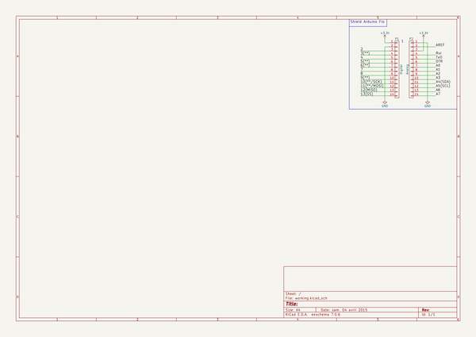

# kicad_library
 
## summary 
* id: asutp_kicad_library_arduino_fio
* user: asutp
* name: kicad_library
* board: arduino_fio
* repo: https://github.com/asutp/kicad-library
* src_file_repo_kicad_pcb: template/Arduino_Fio/Arduino_Fio.kicad_pcb
* src_file_repo_kicad_pcb_link: https://github.com/asutp/kicad-library/tree/master/template/Arduino_Fio/Arduino_Fio.kicad_pcb

* src_file_repo_sch: template/Arduino_Fio/Arduino_Fio.sch
* src_file_repo_sch_link: https://github.com/asutp/kicad-library/tree/master/template/Arduino_Fio/Arduino_Fio.sch
* full details link: https://github.com/oomlout/oomlout_oomp_project_bot_v_2/tree/main/projects/asutp_kicad_library_arduino_fio/current_version/working  

## schematic  
  
[schematic (pdf)](working_schematic.pdf) 

## pcb  
 
  
  
  
[board (pdf)](working.pdf)  

## working_bom
| Id | Designator | Footprint | Quantity | Designation | Supplier and ref |  | None | 
| --- | --- | --- | --- | --- | --- | --- | --- | 
| 1 | P1 | Socket_Strip_Straight_1x14 | 1 | Digital |  |  | [''] | 
| 2 | P2 | Socket_Strip_Straight_1x14 | 1 | Analog |  |  | [''] | 

## bom_schematic
| Ref | Qnty | Value | Cmp name | Footprint | Description | Vendor | DNP | 
| --- | --- | --- | --- | --- | --- | --- | --- | 
| P1 | 1 | Digital | CONN_01X14 | Socket_Arduino_Fio:Socket_Strip_Straight_1x14 |  |  |  | 
| P2 | 1 | Analog | CONN_01X14 | Socket_Arduino_Fio:Socket_Strip_Straight_1x14 |  |  |  | 

