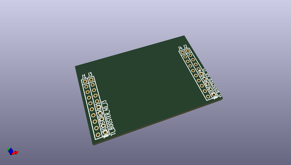

# kicad_library
 
## summary 
* id: asutp_kicad_library_boosterpack40_min
* user: asutp
* name: kicad_library
* board: boosterpack40_min
* repo: https://github.com/asutp/kicad-library
* src_file_repo_kicad_pcb: template/ti-stellaris-boosterpack40_min/boosterpack40_min.kicad_pcb
* src_file_repo_kicad_pcb_link: https://github.com/asutp/kicad-library/tree/master/template/ti-stellaris-boosterpack40_min/boosterpack40_min.kicad_pcb

* src_file_repo_sch: template/ti-stellaris-boosterpack40_min/boosterpack40_min.sch
* src_file_repo_sch_link: https://github.com/asutp/kicad-library/tree/master/template/ti-stellaris-boosterpack40_min/boosterpack40_min.sch
* full details link: https://github.com/oomlout/oomlout_oomp_project_bot_v_2/tree/main/projects/asutp_kicad_library_boosterpack40_min/current_version/working  

## schematic  
  
[schematic (pdf)](working_schematic.pdf) 

## pcb  
 
  
  
  
[board (pdf)](working.pdf)  

## working_bom
| Id | Designator | Footprint | Quantity | Designation | Supplier and ref |  | None | 
| --- | --- | --- | --- | --- | --- | --- | --- | 
| 1 | J3 | SIL-10 | 1 | TI_BOOSTER_40_J3 |  |  | [''] | 
| 2 | J1 | SIL-10 | 1 | TI_BOOSTER_40_J1 |  |  | [''] | 
| 3 | J2 | SIL-10 | 1 | TI_BOOSTER_40_J2 |  |  | [''] | 
| 4 | J4 | SIL-10 | 1 | TI_BOOSTER_40_J4 |  |  | [''] | 

## bom_schematic
| Ref | Qnty | Value | Cmp name | Footprint | Description | Vendor | DNP | 
| --- | --- | --- | --- | --- | --- | --- | --- | 
| J1 | 1 | TI_BOOSTER_40_J1 | Ti_Booster_40_J1 |  |  |  |  | 
| J2 | 1 | TI_BOOSTER_40_J2 | Ti_Booster_40_J2 |  |  |  |  | 
| J3 | 1 | TI_BOOSTER_40_J3 | Ti_Booster_40_J3 |  |  |  |  | 
| J4 | 1 | TI_BOOSTER_40_J4 | Ti_Booster_40_J4 |  |  |  |  | 

