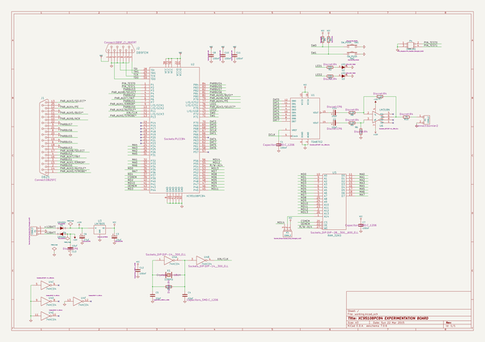
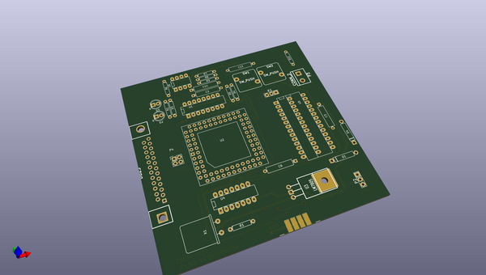
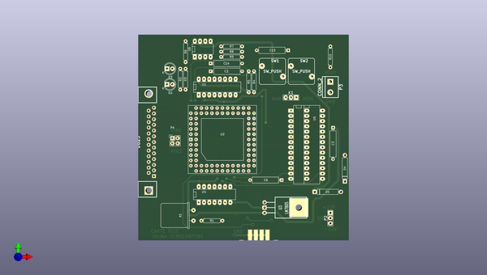
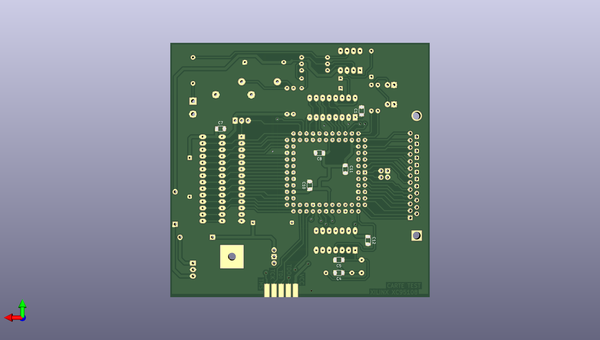

# kicad_source_mirror
 
## summary 
* id: asutp_kicad_source_mirror_carte_test
* user: asutp
* name: kicad_source_mirror
* board: carte_test
* repo: https://github.com/asutp/kicad-source-mirror
* src_file_repo_kicad_pcb: demos/test_xil_95108/carte_test.kicad_pcb
* src_file_repo_kicad_pcb_link: https://github.com/asutp/kicad-source-mirror/tree/master/demos/test_xil_95108/carte_test.kicad_pcb

* src_file_repo_sch: demos/test_xil_95108/carte_test.sch
* src_file_repo_sch_link: https://github.com/asutp/kicad-source-mirror/tree/master/demos/test_xil_95108/carte_test.sch
* full details link: https://github.com/oomlout/oomlout_oomp_project_bot_v_2/tree/main/projects/asutp_kicad_source_mirror_carte_test/current_version/working  

## schematic  
  
[schematic (pdf)](working_schematic.pdf) 

## pcb  
 
  
  
  
[board (pdf)](working.pdf)  

## working_bom
| Id | Designator | Footprint | Quantity | Designation | Supplier and ref |  | None | 
| --- | --- | --- | --- | --- | --- | --- | --- | 
| 1 | C2,C3,C13,C14 | CP6 | 4 | 10uF |  |  | [''] | 
| 2 | C6 | CP6 | 1 | 47uF |  |  | [''] | 
| 3 | D1,D4 | D5 | 2 | 1N4004 |  |  | [''] | 
| 4 | J1 | DB25FC | 1 | DB25 |  |  | [''] | 
| 5 | J2 | DB9F_CI_INVERT | 1 | DB9FEM |  |  | [''] | 
| 6 | P3 | bornier2 | 1 | CONN_2 |  |  | [''] | 
| 7 | R1 | R4 | 1 | 100K |  |  | [''] | 
| 8 | R2,R3 | R4 | 2 | 330 |  |  | [''] | 
| 9 | R4,R5 | R4 | 2 | 4,7K |  |  | [''] | 
| 10 | R6 | R4 | 1 | 1,1k |  |  | [''] | 
| 11 | R7 | R4 | 1 | 1,1K |  |  | [''] | 
| 12 | R8,R9 | R4 | 2 | 2,2K |  |  | [''] | 
| 13 | R10 | R4 | 1 | 75 |  |  | [''] | 
| 14 | SW1,SW2 | SW_PUSH | 2 | SW_PUSH |  |  | [''] | 
| 15 | U1 | DIP-16__300_ELL | 1 | TDA8702 |  |  | [''] | 
| 16 | U2 | PLCC84 | 1 | XC95108PC84 |  |  | [''] | 
| 17 | U3 | LM78XX | 1 | LM7805 |  |  | [''] | 
| 18 | U4 | DIP-14__300_ELL | 1 | 74HC04 |  |  | [''] | 
| 19 | U5 | DIP-28__300__600_ELL | 1 | RAM_32KO |  |  | [''] | 
| 20 | U6 | DIP-8__300_ELL | 1 | LM318N |  |  | [''] | 
| 21 | X1 | HC-18UH | 1 | 10MHz |  |  | [''] | 
| 22 | D2,D3 | LED-5MM | 2 | LED |  |  | [''] | 
| 23 | P2,K1 | Socket_Strip_Straight_1x03 | 2 | CONN_3 |  |  | [''] | 
| 24 | P4 | Pin_Header_Straight_2x02 | 1 | CONN_2X2 |  |  | [''] | 
| 25 | C1,C7,C8,C10,C11,C12 | C_1206 | 6 | 100nF |  |  | [''] | 
| 26 | C4,C5 | C_1206 | 2 | 22pF |  |  | [''] | 

## bom_schematic
| Ref | Qnty | Value | Cmp name | Footprint | Description | Vendor | DNP | 
| --- | --- | --- | --- | --- | --- | --- | --- | 
| C1, C7, C8, C10, C11, C12 | 6 | 100nF | C | Capacitors_SMD:C_1206 |  |  |  | 
| C2, C3, C13, C14 | 4 | 10uF | CP | Discret:CP6 |  |  |  | 
| C4, C5 | 2 | 22pF | C | Capacitors_SMD:C_1206 |  |  |  | 
| C6 | 1 | 47uF | CP | Discret:CP6 |  |  |  | 
| D1, D4 | 2 | 1N4004 | DIODE | Discret:D5 |  |  |  | 
| D2, D3 | 2 | LED | LED | LEDs:LED-5MM |  |  |  | 
| J1 | 1 | DB25 | DB25 | Connect:DB25FC |  |  |  | 
| J2 | 1 | DB9FEM | DB9 | Connect:DB9F_CI_INVERT |  |  |  | 
| K1 | 1 | CONN_3 | CONN_3 | Socket_Strips:Socket_Strip_Straight_1x03 |  |  |  | 
| P2 | 1 | CONN_3 | CONN_3 | Socket_Strips:Socket_Strip_Straight_1x03 |  |  |  | 
| P3 | 1 | CONN_2 | CONN_2 | Connect:bornier2 |  |  |  | 
| P4 | 1 | CONN_2X2 | CONN_2X2 | Pin_Headers:Pin_Header_Straight_2x02 |  |  |  | 
| R1 | 1 | 100K | R | Discret:R4 |  |  |  | 
| R2, R3 | 2 | 330 | R | Discret:R4 |  |  |  | 
| R4, R5 | 2 | 4,7K | R | Discret:R4 |  |  |  | 
| R6 | 1 | 1,1k | R | Discret:R4 |  |  |  | 
| R7 | 1 | 1,1K | R | Discret:R4 |  |  |  | 
| R8, R9 | 2 | 2,2K | R | Discret:R4 |  |  |  | 
| R10 | 1 | 75 | R | Discret:R4 |  |  |  | 
| SW1, SW2 | 2 | SW_PUSH | SW_PUSH | Discret:SW_PUSH |  |  |  | 
| U1 | 1 | TDA8702 | TDA8702 | Sockets_DIP:DIP-16__300_ELL |  |  |  | 
| U2 | 1 | XC95108PC84 | XC95108PC84 | Sockets:PLCC84 |  |  |  | 
| U3 | 1 | LM7805 | LM7805 | Discret:LM78XX |  |  |  | 
| U4 | 1 | 74HC04 | 74HC04 | Sockets_DIP:DIP-14__300_ELL |  |  |  | 
| U5 | 1 | RAM_32KO | RAM_32KO | Sockets_DIP:DIP-28__300__600_ELL |  |  |  | 
| U6 | 1 | LM318N | LM318N | Sockets_DIP:DIP-8__300_ELL |  |  |  | 
| X1 | 1 | 10MHz | CRYSTAL | Crystals:HC-18UH |  |  |  | 

