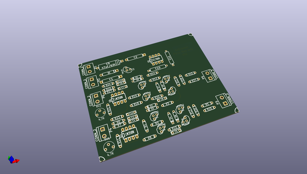
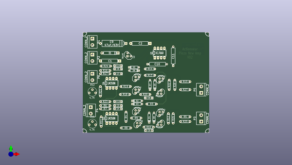
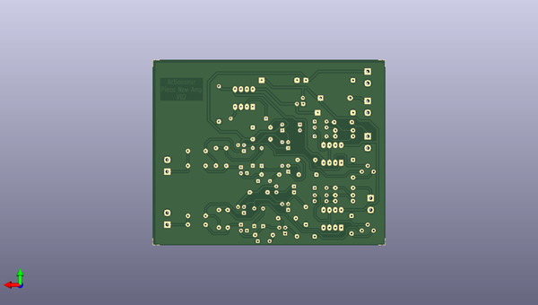

# kicad_source_mirror
 
## summary 
* id: asutp_kicad_source_mirror_complex_hierarchy
* user: asutp
* name: kicad_source_mirror
* board: complex_hierarchy
* repo: https://github.com/asutp/kicad-source-mirror
* src_file_repo_kicad_pcb: qa/data/complex_hierarchy.kicad_pcb
* src_file_repo_kicad_pcb_link: https://github.com/asutp/kicad-source-mirror/tree/master/qa/data/complex_hierarchy.kicad_pcb

* src_file_repo_sch: helpers/tools_to_build_newstroke-font/font.sch
* src_file_repo_sch_link: https://github.com/asutp/kicad-source-mirror/tree/master/helpers/tools_to_build_newstroke-font/font.sch
* full details link: https://github.com/oomlout/oomlout_oomp_project_bot_v_2/tree/main/projects/asutp_kicad_source_mirror_complex_hierarchy/current_version/working  

## pcb  
 
  
  
  
[board (pdf)](working.pdf)  

## working_bom
| Id | Designator | Footprint | Quantity | Designation | Supplier and ref |  | None | 
| --- | --- | --- | --- | --- | --- | --- | --- | 
| 1 | P1,P3,P2,P4,P5,P6 | bornier2 | 6 | CONN_2 |  |  | [''] | 
| 2 | C8,C5 | C2 | 2 | 820pF |  |  | [''] | 
| 3 | C4,C7 | C2 | 2 | 4,7nF |  |  | [''] | 
| 4 | C2 | CP6 | 1 | 47uF/20V |  |  | [''] | 
| 5 | C9 | CP8 | 1 | 47uF/63V |  |  | [''] | 
| 6 | C3,C6 | C2 | 2 | 15nF |  |  | [''] | 
| 7 | C1 | CP6 | 1 | 47uF |  |  | [''] | 
| 8 | D6,D4,D3,D2,D7,D5,D9,D8 | D3 | 8 | 1N4148 |  |  | [''] | 
| 9 | D1 | D5 | 1 | 1N4007 |  |  | [''] | 
| 10 | U2 | LM78LXX | 1 | 78L05 |  |  | [''] | 
| 11 | R12,R22,R4,R14,R26,R28 | R3-LARGE_PADS | 6 | 220K |  |  | [''] | 
| 12 | R17,R6,R16,R7 | R3-LARGE_PADS | 4 | 22K |  |  | [''] | 
| 13 | R3,R13 | R3-LARGE_PADS | 2 | 470 |  |  | [''] | 
| 14 | R18,R8,R19,R9,R23,R24 | R3-LARGE_PADS | 6 | 1K |  |  | [''] | 
| 15 | R5,R15,R25,R27 | R3-LARGE_PADS | 4 | 47 |  |  | [''] | 
| 16 | R11,R21 | R3-LARGE_PADS | 2 | 4,7K |  |  | [''] | 
| 17 | R10,R20 | R3-LARGE_PADS | 2 | 5,6K |  |  | [''] | 
| 18 | Q3,Q5,Q7,Q1 | TO92-CBE | 4 | MPAS92 |  |  | [''] | 
| 19 | Q6,Q2,Q4,Q8 | TO92-CBE | 4 | MPAS42 |  |  | [''] | 
| 20 | U1 | DIP-8__300_ELL | 1 | ICL7660 |  |  | [''] | 
| 21 | U4,U3 | DIP-8__300_ELL | 2 | LM358N |  |  | [''] | 
| 22 | RV1,RV2 | RV2 | 2 | 4,7K |  |  | [''] | 
| 23 | MIRE,MIRE,MIRE,MIRE | MIRE | 4 | * |  |  | [''] | 
| 24 | C10,C11 | CP6 | 2 | 10uF |  |  | [''] | 
| 25 | C14,C12 | C2 | 2 | 150nF |  |  | [''] | 

