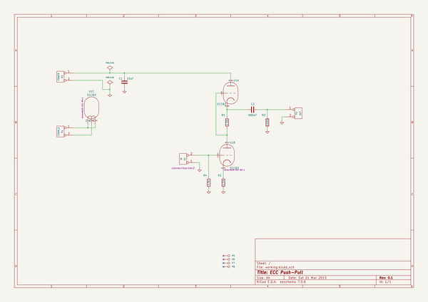

# kicad_source_mirror
 
## summary 
* id: asutp_kicad_source_mirror_ecc83_pp_v2
* user: asutp
* name: kicad_source_mirror
* board: ecc83_pp_v2
* repo: https://github.com/asutp/kicad-source-mirror
* src_file_repo_kicad_pcb: demos/ecc83/ecc83-pp.kicad_pcb
* src_file_repo_kicad_pcb_link: https://github.com/asutp/kicad-source-mirror/tree/master/demos/ecc83/ecc83-pp.kicad_pcb

* src_file_repo_sch: demos/ecc83/ecc83-pp.sch
* src_file_repo_sch_link: https://github.com/asutp/kicad-source-mirror/tree/master/demos/ecc83/ecc83-pp.sch
* full details link: https://github.com/oomlout/oomlout_oomp_project_bot_v_2/tree/main/projects/asutp_kicad_source_mirror_ecc83_pp_v2/current_version/working  

## schematic  
  
[schematic (pdf)](working_schematic.pdf) 

## pcb  
 
  
  
  
[board (pdf)](working.pdf)  

## working_bom
| Id | Designator | Footprint | Quantity | Designation | Supplier and ref |  | None | 
| --- | --- | --- | --- | --- | --- | --- | --- | 
| 1 | C1 | C2V10 | 1 | 10uF |  |  | [''] | 
| 2 | C2 | C2 | 1 | 680nF |  |  | [''] | 
| 3 | P1 | bornier2 | 1 | IN |  |  | [''] | 
| 4 | P2 | bornier2 | 1 | OUT |  |  | [''] | 
| 5 | P3 | bornier2 | 1 | POWER |  |  | [''] | 
| 6 | P4 | bornier2 | 1 | CONN_2 |  |  | [''] | 
| 7 | P5,P6,P7,P8 | 1pin | 4 | CONN_1 |  |  | [''] | 
| 8 | R1,R2 | R3 | 2 | 1.5K |  |  | [''] | 
| 9 | R3 | R3 | 1 | 100K |  |  | [''] | 
| 10 | R4 | R3 | 1 | 47K |  |  | [''] | 
| 11 | U1 | VALVE-ECC-83-1 | 1 | ECC83 |  |  | [''] | 

## bom_schematic
| Ref | Qnty | Value | Cmp name | Footprint | Description | Vendor | DNP | 
| --- | --- | --- | --- | --- | --- | --- | --- | 
| C1 | 1 | 10uF | C | discret:C2V10 |  |  |  | 
| C2 | 1 | 680nF | C | discret:C2 |  |  |  | 
| P1 | 1 | IN | CONN_2 | connect:bornier2 |  |  |  | 
| P2 | 1 | OUT | CONN_2 | connect:bornier2 |  |  |  | 
| P3 | 1 | POWER | CONN_2 | connect:bornier2 |  |  |  | 
| P4 | 1 | CONN_2 | CONN_2 | connect:bornier2 |  |  |  | 
| P5, P6, P7, P8 | 4 | CONN_1 | CONN_1 | connect:1pin |  |  |  | 
| R1, R2 | 2 | 1.5K | R | discret:R3 |  |  |  | 
| R3 | 1 | 100K | R | discret:R3 |  |  |  | 
| R4 | 1 | 47K | R | discret:R3 |  |  |  | 
| U1 | 1 | ECC83 | ECC83 | Valves:VALVE-ECC-83-1 |  |  |  | 

