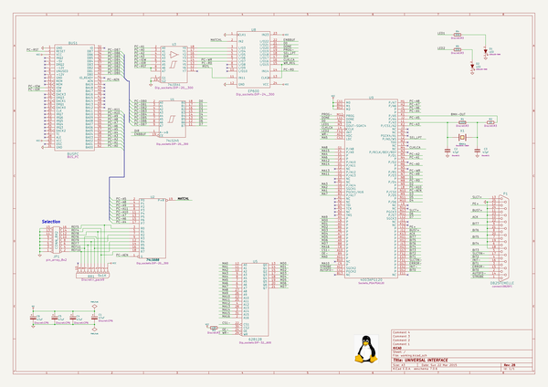
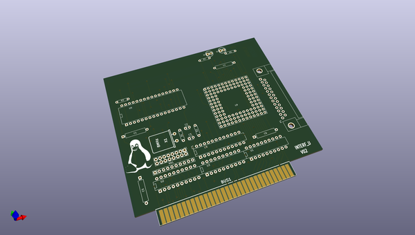
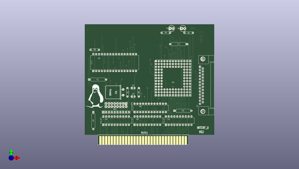
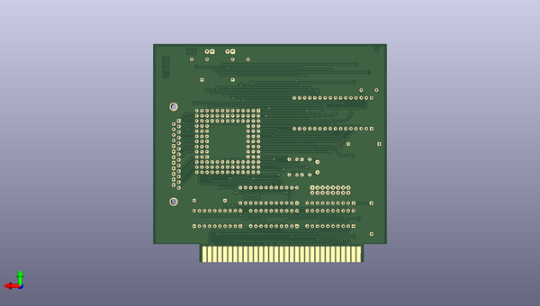

# kicad_source_mirror
 
## summary 
* id: asutp_kicad_source_mirror_interf_u
* user: asutp
* name: kicad_source_mirror
* board: interf_u
* repo: https://github.com/asutp/kicad-source-mirror
* src_file_repo_kicad_pcb: demos/interf_u/interf_u.kicad_pcb
* src_file_repo_kicad_pcb_link: https://github.com/asutp/kicad-source-mirror/tree/master/demos/interf_u/interf_u.kicad_pcb

* src_file_repo_sch: demos/interf_u/interf_u.sch
* src_file_repo_sch_link: https://github.com/asutp/kicad-source-mirror/tree/master/demos/interf_u/interf_u.sch
* full details link: https://github.com/oomlout/oomlout_oomp_project_bot_v_2/tree/main/projects/asutp_kicad_source_mirror_interf_u/current_version/working  

## schematic  
  
[schematic (pdf)](working_schematic.pdf) 

## pcb  
 
  
  
  
[board (pdf)](working.pdf)  

## working_bom
| Id | Designator | Footprint | Quantity | Designation | Supplier and ref |  | None | 
| --- | --- | --- | --- | --- | --- | --- | --- | 
| 1 | BUS1 | BUS_PC | 1 | BUSPC |  |  | [''] | 
| 2 | R4,R5 | R3 | 2 | 330 |  |  | [''] | 
| 3 | D1,D2 | LED-5MM | 2 | LED |  |  | [''] | 
| 4 | U9 | PGA120 | 1 | 4003APG120 |  |  | [''] | 
| 5 | C6,C5,C4,C1 | CP6 | 4 | 47uF |  |  | [''] | 
| 6 | R1 | R3 | 1 | 100K |  |  | [''] | 
| 7 | R2 | R3 | 1 | 1K |  |  | [''] | 
| 8 | X1 | HC-18UH | 1 | 8MHz |  |  | [''] | 
| 9 | C2,C3 | C_Disc_D3_P2.5 | 2 | 47pF |  |  | [''] | 
| 10 | U5 | DIP-32__600 | 1 | 628128 |  |  | [''] | 
| 11 | R3 | R3 | 1 | 10K |  |  | [''] | 
| 12 | P1 | DB25FC | 1 | DB25FEMELLE |  |  | [''] | 
| 13 | RR1 | r_pack9 | 1 | 9x1K |  |  | [''] | 
| 14 | JP1 | Pin_Header_Straight_2x08 | 1 | CONN_8X2 |  |  | [''] | 
| 15 | U1 | DIP-20__300 | 1 | 74LS245 |  |  | [''] | 
| 16 | U2 | DIP-20__300 | 1 | 74LS688 |  |  | [''] | 
| 17 | U3 | DIP-20__300 | 1 | 74LS541 |  |  | [''] | 
| 18 | U8 | DIP-24__300 | 1 | EP600 |  |  | [''] | 
| 19 | G*** | LOGO | 1 | LOGO |  |  | [''] | 

## bom_schematic
| Ref | Qnty | Value | Cmp name | Footprint | Description | Vendor | DNP | 
| --- | --- | --- | --- | --- | --- | --- | --- | 
| BUS1 | 1 | BUSPC | BUSPC | BUS_PC |  |  |  | 
| C1, C4, C5, C6 | 4 | 47uF | CP | Discret:CP6 |  |  |  | 
| C2, C3 | 2 | 47pF | C | Discret:C1 |  |  |  | 
| D1, D2 | 2 | LED | LED | LEDs:LED-5MM |  |  |  | 
| JP1 | 1 | CONN_8X2 | CONN_8X2 | pin_array_8x2 |  |  |  | 
| P1 | 1 | DB25FEMELLE | DB25 | connect:DB25FC |  |  |  | 
| R1 | 1 | 100K | R | Discret:R3 |  |  |  | 
| R2 | 1 | 1K | R | Discret:R3 |  |  |  | 
| R3 | 1 | 10K | R | Discret:R3 |  |  |  | 
| R4, R5 | 2 | 330 | R | Discret:R3 |  |  |  | 
| RR1 | 1 | 9x1K | RR9 | Discret:r_pack9 |  |  |  | 
| U1 | 1 | 74LS245 | 74LS245 | Dip_sockets:DIP-20__300 |  |  |  | 
| U2 | 1 | 74LS688 | 74LS688 | Dip_sockets:DIP-20__300 |  |  |  | 
| U3 | 1 | 74LS541 | 74LS541 | Dip_sockets:DIP-20__300 |  |  |  | 
| U5 | 1 | 628128 | 628128 | Dip_sockets:DIP-32__600 |  |  |  | 
| U8 | 1 | EP600 | EP600 | Dip_sockets:DIP-24__300 |  |  |  | 
| U9 | 1 | 4003APG120 | 4003APG120 | Sockets_PGA:PGA120 |  |  |  | 
| X1 | 1 | 8MHz | CRYSTAL | Discret:HC-18UH |  |  |  | 

