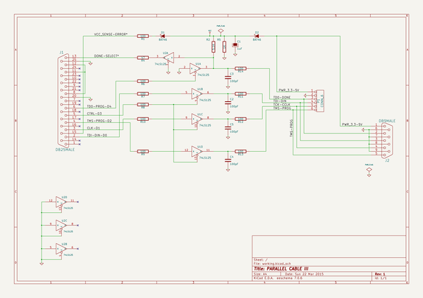
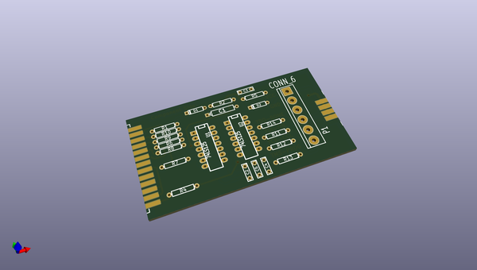
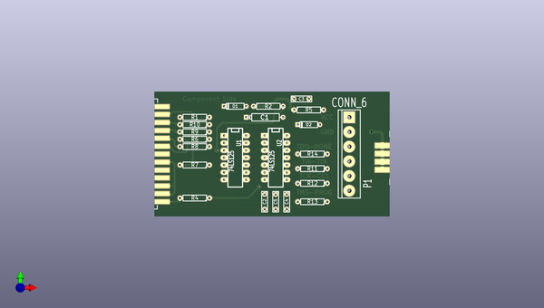
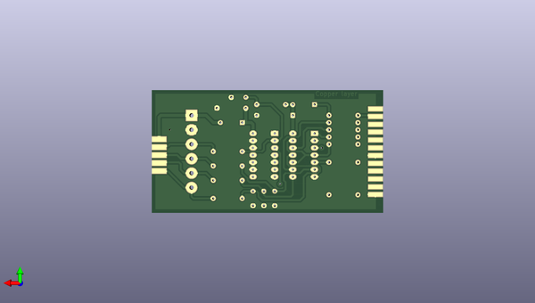

# kicad_source_mirror
 
## summary 
* id: asutp_kicad_source_mirror_sonde_xilinx
* user: asutp
* name: kicad_source_mirror
* board: sonde_xilinx
* repo: https://github.com/asutp/kicad-source-mirror
* src_file_repo_kicad_pcb: demos/sonde xilinx/sonde xilinx.kicad_pcb
* src_file_repo_kicad_pcb_link: https://github.com/asutp/kicad-source-mirror/tree/master/demos/sonde xilinx/sonde xilinx.kicad_pcb

* src_file_repo_sch: demos/sonde xilinx/sonde xilinx.sch
* src_file_repo_sch_link: https://github.com/asutp/kicad-source-mirror/tree/master/demos/sonde xilinx/sonde xilinx.sch
* full details link: https://github.com/oomlout/oomlout_oomp_project_bot_v_2/tree/main/projects/asutp_kicad_source_mirror_sonde_xilinx/current_version/working  

## schematic  
  
[schematic (pdf)](working_schematic.pdf) 

## pcb  
 
  
  
  
[board (pdf)](working.pdf)  

## working_bom
| Id | Designator | Footprint | Quantity | Designation | Supplier and ref |  | None | 
| --- | --- | --- | --- | --- | --- | --- | --- | 
| 1 | U1,U2 | 14DIP-ELL300 | 2 | 74LS125 |  |  | [''] | 
| 2 | R13,R7,R14,R10,R1,R9,R6,R8,R11,R12 | R4 | 10 | 100 |  |  | [''] | 
| 3 | D1,D2 | D3 | 2 | BAT46 |  |  | [''] | 
| 4 | C1 | CP5 | 1 | 1uF |  |  | [''] | 
| 5 | R4 | R4 | 1 | 47 |  |  | [''] | 
| 6 | C5,C3,C2,C4 | C2 | 4 | 100pF |  |  | [''] | 
| 7 | P1 | bornier6 | 1 | CONN_6 |  |  | [''] | 
| 8 | R5 | R4 | 1 | 1K |  |  | [''] | 
| 9 | R2 | R4 | 1 | 5,1K |  |  | [''] | 
| 10 | J2 | DB9M_CI_INVERT | 1 | DB9MALE |  |  | [''] | 
| 11 | J1 | DB25M_CI | 1 | DB25MALE |  |  | [''] | 

## bom_schematic
| Ref | Qnty | Value | Cmp name | Footprint | Description | Vendor | DNP | 
| --- | --- | --- | --- | --- | --- | --- | --- | 
| C1 | 1 | 1uF | CP | Discret:CP5 |  |  |  | 
| C2, C3, C4, C5 | 4 | 100pF | C | Discret:C2 |  |  |  | 
| D1, D2 | 2 | BAT46 | DIODESCH | Discret:D3 |  |  |  | 
| J1 | 1 | DB25MALE | DB25 | Connect:DB25M_CI |  |  |  | 
| J2 | 1 | DB9MALE | DB9 | Connect:DB9M_CI_INVERT |  |  |  | 
| P1 | 1 | CONN_6 | CONN_6 | Connect:bornier6 |  |  |  | 
| R1, R6, R7, R8, R9, R10, R11, R12, R13, R14 | 10 | 100 | R | Discret:R4 |  |  |  | 
| R2 | 1 | 5,1K | R | Discret:R4 |  |  |  | 
| R4 | 1 | 47 | R | Discret:R4 |  |  |  | 
| R5 | 1 | 1K | R | Discret:R4 |  |  |  | 
| U1, U2 | 2 | 74LS125 | 74LS125 | Sockets_DIP:DIP-14__300_ELL |  |  |  | 

