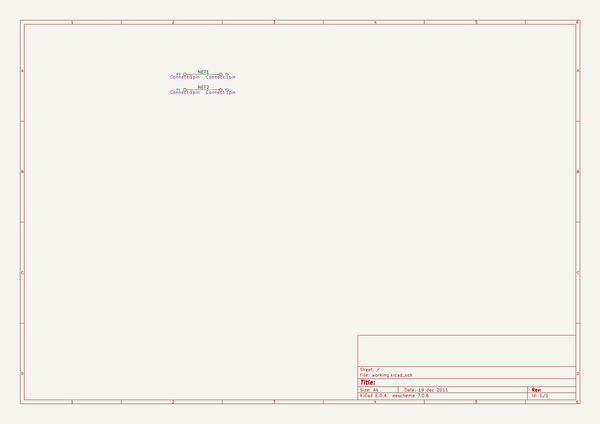

# kicad_source_mirror
 
## summary 
* id: asutp_kicad_source_mirror_test_pads_inside_pads
* user: asutp
* name: kicad_source_mirror
* board: test_pads_inside_pads
* repo: https://github.com/asutp/kicad-source-mirror
* src_file_repo_kicad_pcb: demos/test_pads_inside_pads/test_pads_inside_pads.kicad_pcb
* src_file_repo_kicad_pcb_link: https://github.com/asutp/kicad-source-mirror/tree/master/demos/test_pads_inside_pads/test_pads_inside_pads.kicad_pcb

* src_file_repo_sch: demos/test_pads_inside_pads/test_pads_inside_pads.sch
* src_file_repo_sch_link: https://github.com/asutp/kicad-source-mirror/tree/master/demos/test_pads_inside_pads/test_pads_inside_pads.sch
* full details link: https://github.com/oomlout/oomlout_oomp_project_bot_v_2/tree/main/projects/asutp_kicad_source_mirror_test_pads_inside_pads/current_version/working  

## schematic  
  
[schematic (pdf)](working_schematic.pdf) 

## pcb  
 
  
  
  
[board (pdf)](working.pdf)  

## working_bom
| Id | Designator | Footprint | Quantity | Designation | Supplier and ref |  | None | 
| --- | --- | --- | --- | --- | --- | --- | --- | 
| 1 | P1,P2,P3,P4 | 1pin | 4 | CONN_1 |  |  | [''] | 

## bom_schematic
| Ref | Qnty | Value | Cmp name | Footprint | Description | Vendor | DNP | 
| --- | --- | --- | --- | --- | --- | --- | --- | 
| P1, P2, P3, P4 | 4 | CONN_1 | CONN_1 | Connect:1pin |  |  |  | 

