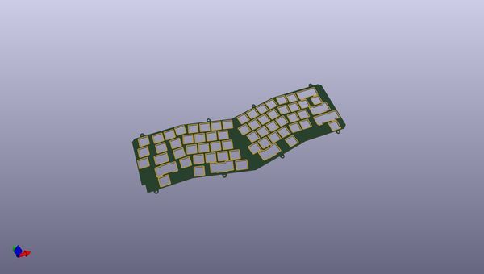
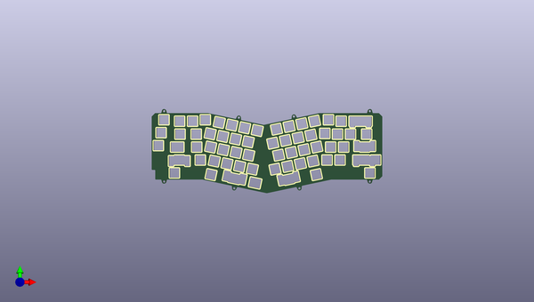
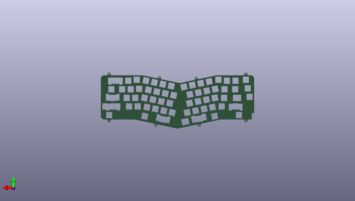

# alice_reference
 
## summary 
* id: audrentis_alice_reference_alice_plate
* user: audrentis
* name: alice_reference
* board: alice_plate
* repo: https://github.com/audrentis/Alice-Reference
* src_file_repo_kicad_pcb: Alice Plate/Alice Plate.kicad_pcb
* src_file_repo_kicad_pcb_link: https://github.com/audrentis/Alice-Reference/tree/main/Alice Plate/Alice Plate.kicad_pcb

* src_file_repo_sch: Alice Plate/Alice Plate.sch
* src_file_repo_sch_link: https://github.com/audrentis/Alice-Reference/tree/main/Alice Plate/Alice Plate.sch
* full details link: https://github.com/oomlout/oomlout_oomp_project_bot_v_2/tree/main/projects/audrentis_alice_reference_alice_plate/current_version/working  

## schematic  
  
[schematic (pdf)](working_schematic.pdf) 

## pcb  
 
  
  
  
[board (pdf)](working.pdf)  

## working_bom
| Id | Designator | Footprint | Quantity | Designation | Supplier and ref |  | None | 
| --- | --- | --- | --- | --- | --- | --- | --- | 
| 1 | REF**,REF**,REF**,REF**,REF**,REF**,REF**,REF**,REF**,REF**,REF**,REF**,REF**,REF**,REF**,REF**,REF**,REF**,REF**,REF**,REF**,REF**,REF**,REF**,REF**,REF**,REF**,REF**,REF**,REF**,REF**,REF**,REF**,REF**,REF**,REF**,REF**,REF**,REF**,REF**,REF**,REF**,REF**,REF**,REF**,REF**,REF**,REF**,REF**,REF** | 1u | 50 | 1u |  |  | [''] | 
| 2 | REF** | CapsLock_Combo | 1 | CapsLock_Combo |  |  | [''] | 
| 3 | REF** | 2u_Split | 1 | 2u_Split |  |  | [''] | 
| 4 | REF**,REF**,REF**,REF**,REF**,REF** | 1.5u | 6 | 1.5u |  |  | [''] | 
| 5 | REF** | 2.25u | 1 | 2.25u |  |  | [''] | 
| 6 | REF** | 2.25u_ReversedStabilizers | 1 | 2.25u_ReversedStabilizers |  |  | [''] | 
| 7 | REF** | Alice_LH_Spacebar | 1 | Alice_LH_Spacebar |  |  | [''] | 
| 8 | REF** | Alice_LH_Macro | 1 | Alice_LH_Macro |  |  | [''] | 
| 9 | REF** | SplitRightShift | 1 | SplitRightShift |  |  | [''] | 
| 10 | REF** | 2.75u_ReversedStabilizers | 1 | 2.75u_ReversedStabilizers |  |  | [''] | 

## bom_schematic
no data

