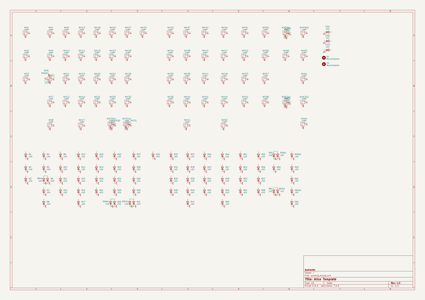

# alice_reference
 
## summary 
* id: audrentis_alice_reference_alice_template
* user: audrentis
* name: alice_reference
* board: alice_template
* repo: https://github.com/audrentis/Alice-Reference
* src_file_repo_kicad_pcb: alice template/alice template.kicad_pcb
* src_file_repo_kicad_pcb_link: https://github.com/audrentis/Alice-Reference/tree/main/alice template/alice template.kicad_pcb

* src_file_repo_sch: alice template/alice template.sch
* src_file_repo_sch_link: https://github.com/audrentis/Alice-Reference/tree/main/alice template/alice template.sch
* full details link: https://github.com/oomlout/oomlout_oomp_project_bot_v_2/tree/main/projects/audrentis_alice_reference_alice_template/current_version/working  

## schematic  
  
[schematic (pdf)](working_schematic.pdf) 

## pcb  
 
  
  
  
[board (pdf)](working.pdf)  

## working_bom
| Id | Designator | Footprint | Quantity | Designation | Supplier and ref |  | None | 
| --- | --- | --- | --- | --- | --- | --- | --- | 
| 1 | LED1,LED2,LED3 | LED_D3.0mm | 3 | LED |  |  | [''] | 
| 2 | MX1,MX2,MX3,MX4,MX9,MX10,MX11,MX12,MX13,MX14,MX15,MX16,MX18,MX19,MX20,MX21,MX22,MX23,MX24,MX25,MX27,MX28,MX29,MX30,MX31,MX32,MX33,MX34,MX35,MX36,MX37,MX38,MX39,MX40,MX42,MX43,MX44,MX45,MX46,MX47,MX48,MX49,MX51,MX52,MX53,MX54,MX55,MX56,MX57,MX58,MX60,MX59A2,MX62A2,MX59A1 | MXOnly-1U-NoLED | 54 | MX-NoLED |  |  | [''] | 
| 3 | MX5,MX8,MX17,MX50,MX63,MX64 | MXOnly-1.5U-NoLED | 6 | MX-NoLED |  |  | [''] | 
| 4 | MX6,MX62A1 | MXOnly-1.75U-NoLED | 2 | MX-NoLED |  |  | [''] | 
| 5 | MX7 | MXOnly-2.25U-NoLED | 1 | MX-NoLED |  |  | [''] | 
| 6 | MX6A1,MX31A1 | MXOnly-1.25U-NoLED | 2 | MX-NoLED |  |  | [''] | 
| 7 | B1,B2,B3,B4,B5,B6,B7,B8,B9,B10,B11,B12,B6A1,B13,B14,B15,B16,B17,B18,B19,B20,B21,B22,B23,B24,B25,B26,B26A1,B27,B28,B29,B30,B31,B32,B31A1,B33,B34,B35,B36,B37,B38,B39,B40,B41,B42,B43,B44,B45,B46,B47,B48,B49,B50,B51,B52,B53,B54,B55,B56,B57,B58,B59,B60,B61,B62,B63,B64,B59A1,B59A2,B62A1,B62A2 | MXOnly-LEDONLY | 71 | LED |  |  | [''] | 
| 8 | MX26,MX61 | MXOnly-2.25U-ReversedStabilizers-NoLED | 2 | MX-NoLED |  |  | [''] | 
| 9 | MX26A1 | MXOnly-2U-ReversedStabilizers-NoLED | 1 | MX-NoLED |  |  | [''] | 
| 10 | MX41 | MXOnly-2.75U-ReversedStabilizers-NoLED | 1 | MX-NoLED |  |  | [''] | 
| 11 | MX59 | MXOnly-2U-NoLED | 1 | MX-NoLED |  |  | [''] | 
| 12 | MX62 | MXOnly-2.75U-NoLED | 1 | MX-NoLED |  |  | [''] | 

## bom_schematic
| Ref | Qnty | Value | Cmp name | Footprint | Description | Vendor | DNP | 
| --- | --- | --- | --- | --- | --- | --- | --- | 
| B1, B2, B3, B4, B5, B6, B7, B8, B9, B10, B11, B12, B13, B14, B15, B16, B17, B18, B19, B20, B21, B22, B23, B24, B25, B26, B27, B28, B29, B30, B31, B32, B33, B34, B35, B36, B37, B38, B39, B40, B41, B42, B43, B44, B45, B46, B47, B48, B49, B50, B51, B52, B53, B54, B55, B56, B57, B58, B59, B60, B61, B62, B63, B64 | 64 | LED | LED | MX_Alps:MXOnly-LEDONLY | Light emitting diode |  |  | 
| B6A1 | 1 | LED | LED | MX_Alps:MXOnly-LEDONLY | Light emitting diode |  |  | 
| B26A1 | 1 | LED | LED | MX_Alps:MXOnly-LEDONLY | Light emitting diode |  |  | 
| B31A1 | 1 | LED | LED | MX_Alps:MXOnly-LEDONLY | Light emitting diode |  |  | 
| B59A1, B59A2 | 2 | LED | LED | MX_Alps:MXOnly-LEDONLY | Light emitting diode |  |  | 
| B62A1, B62A2 | 2 | LED | LED | MX_Alps:MXOnly-LEDONLY | Light emitting diode |  |  | 
| H1, H2 | 2 | MountingHole | MountingHole | MountingHole:MountingHole_5mm | Mounting Hole without connection |  |  | 
| LED1, LED2, LED3 | 3 | LED | LED | LED_THT:LED_D3.0mm | Light emitting diode |  |  | 
| MX1, MX2, MX3, MX4, MX9, MX10, MX11, MX12, MX13, MX14, MX15, MX16, MX18, MX19, MX20, MX21, MX22, MX23, MX24, MX25, MX27, MX28, MX29, MX30, MX31, MX32, MX33, MX34, MX35, MX36, MX37, MX38, MX39, MX40, MX42, MX43, MX44, MX45, MX46, MX47, MX48, MX49, MX51, MX52, MX53, MX54, MX55, MX56, MX57, MX58, MX60 | 51 | MX-NoLED | MX-NoLED-MX_Alps | MX_Alps:MXOnly-1U-NoLED |  |  |  | 
| MX5, MX8, MX17, MX50, MX63, MX64 | 6 | MX-NoLED | MX-NoLED-MX_Alps | MX_Alps:MXOnly-1.5U-NoLED |  |  |  | 
| MX6 | 1 | MX-NoLED | MX-NoLED-MX_Alps | MX_Alps:MXOnly-1.75U-NoLED |  |  |  | 
| MX6A1 | 1 | MX-NoLED | MX-NoLED-MX_Alps | MX_Alps:MXOnly-1.25U-NoLED |  |  |  | 
| MX7 | 1 | MX-NoLED | MX-NoLED-MX_Alps | MX_Alps:MXOnly-2.25U-NoLED |  |  |  | 
| MX26, MX61 | 2 | MX-NoLED | MX-NoLED-MX_Alps | MX_Alps:MXOnly-2.25U-ReversedStabilizers-NoLED |  |  |  | 
| MX26A1 | 1 | MX-NoLED | MX-NoLED-MX_Alps | MX_Alps:MXOnly-2U-ReversedStabilizers-NoLED |  |  |  | 
| MX31A1 | 1 | MX-NoLED | MX-NoLED-MX_Alps | MX_Alps:MXOnly-1.25U-NoLED |  |  |  | 
| MX41 | 1 | MX-NoLED | MX-NoLED-MX_Alps | MX_Alps:MXOnly-2.75U-ReversedStabilizers-NoLED |  |  |  | 
| MX59 | 1 | MX-NoLED | MX-NoLED-MX_Alps | MX_Alps:MXOnly-2U-NoLED |  |  |  | 
| MX59A1, MX59A2 | 2 | MX-NoLED | MX-NoLED-MX_Alps | MX_Alps:MXOnly-1U-NoLED |  |  |  | 
| MX62 | 1 | MX-NoLED | MX-NoLED-MX_Alps | MX_Alps:MXOnly-2.75U-NoLED |  |  |  | 
| MX62A1 | 1 | MX-NoLED | MX-NoLED-MX_Alps | MX_Alps:MXOnly-1.75U-NoLED |  |  |  | 
| MX62A2 | 1 | MX-NoLED | MX-NoLED-MX_Alps | MX_Alps:MXOnly-1U-NoLED |  |  |  | 

