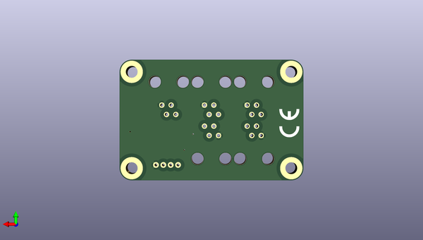

# kicad
 
## summary 
* id: axello_kicad_1w_grove_v0_1
* user: axello
* name: kicad
* board: 1w_grove_v0_1
* repo: https://github.com/axello/kicad
* src_file_repo_kicad_pcb: 6.0/projects/1w-grove-v0.1/1w-grove-v0.1.kicad_pcb
* src_file_repo_kicad_pcb_link: https://github.com/axello/kicad/tree/master/6.0/projects/1w-grove-v0.1/1w-grove-v0.1.kicad_pcb
* src_file_repo_kicad_sch: 6.0/projects/1w-grove-v0.1/1w-grove-v0.1.kicad_sch
* src_file_repo_kicad_sch_link: https://github.com/axello/kicad/tree/master/6.0/projects/1w-grove-v0.1/1w-grove-v0.1.kicad_sch

* src_file_repo_sch: 6.0/projects/1w-grove-v0.1/1w-grove-v0.1.sch
* src_file_repo_sch_link: https://github.com/axello/kicad/tree/master/6.0/projects/1w-grove-v0.1/1w-grove-v0.1.sch
* full details link: https://github.com/oomlout/oomlout_oomp_project_bot_v_2/tree/main/projects/axello_kicad_1w_grove_v0_1/current_version/working  

## pcb  
 
  
  
  
[board (pdf)](working.pdf)  

## working_bom
| Id | Designator | Footprint | Quantity | Designation | Supplier and ref |  | None | 
| --- | --- | --- | --- | --- | --- | --- | --- | 
| 1 | U4,U6,U10,U11 | schroef_3.5mm | 4 | schroef_3.5mm |  |  | [''] | 
| 2 | C1 | C_0805_2012Metric | 1 | 100pF |  |  | [''] | 
| 3 | C2 | C_0805_2012Metric | 1 | 100nF |  |  | [''] | 
| 4 | Q1 | SOT-323 | 1 | BSS138BKW |  |  | [''] | 
| 5 | Q2 | SOT-23-3 | 1 | NX2301P |  |  | [''] | 
| 6 | R1,R2,R7 | R_0805_2012Metric | 3 | 10k |  |  | [''] | 
| 7 | R4 | R_0805_2012Metric | 1 | 5.6k |  |  | [''] | 
| 8 | R5,R6,R8 | R_0805_2012Metric | 3 | 22R |  |  | [''] | 
| 9 | CN2,CN3,CN4,CN1,CN5 | rj10-v2 | 5 | RJ10 |  |  | [''] | 
| 10 | F1 | C1210 | 1 | Polyfuse_Small |  |  | [''] | 
| 11 | CN6 | grove-v0.1 | 1 | grove |  |  | [''] | 
| 12 | U3 | CE-140 | 1 | CE-mark |  |  | [''] | 

