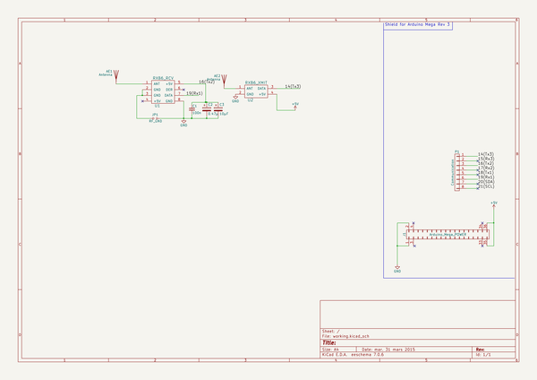

# kicad
 
## summary 
* id: axello_kicad_arduino_mega
* user: axello
* name: kicad
* board: arduino_mega
* repo: https://github.com/axello/kicad
* src_file_repo_kicad_pcb: Arduino_Mega_433Mhz_Shield/Arduino_Mega.kicad_pcb
* src_file_repo_kicad_pcb_link: https://github.com/axello/kicad/tree/master/Arduino_Mega_433Mhz_Shield/Arduino_Mega.kicad_pcb
* src_file_repo_kicad_sch: 6.0/projects/NodeMCU-Metriful2/NodeMCU-Metriful.kicad_sch
* src_file_repo_kicad_sch_link: https://github.com/axello/kicad/tree/master/6.0/projects/NodeMCU-Metriful2/NodeMCU-Metriful.kicad_sch

* src_file_repo_sch: Arduino_Mega_433Mhz_Shield/Arduino_Mega.sch
* src_file_repo_sch_link: https://github.com/axello/kicad/tree/master/Arduino_Mega_433Mhz_Shield/Arduino_Mega.sch
* full details link: https://github.com/oomlout/oomlout_oomp_project_bot_v_2/tree/main/projects/axello_kicad_arduino_mega/current_version/working  

## schematic  
  
[schematic (pdf)](working_schematic.pdf) 

## pcb  
 
  
  
  
[board (pdf)](working.pdf)  

## working_bom
| Id | Designator | Footprint | Quantity | Designation | Supplier and ref |  | None | 
| --- | --- | --- | --- | --- | --- | --- | --- | 
| 1 | P9,P10,P13 | Arduino_1pin | 3 | CONN_01X01 |  |  | [''] | 
| 2 | J1 | Power_Strip_Arduino_Mega_2x18 | 1 | Arduino Mega POWER |  |  | [''] | 
| 3 | P1 | Socket_Strip_Arduino_1x08 | 1 | Communication |  |  | [''] | 
| 4 | AE1 | Pin_Header_Straight_1x01 | 1 | Tx Antenna |  |  | [''] | 
| 5 | AE2 | Pin_Header_Straight_1x01 | 1 | Rx Antenna |  |  | [''] | 
| 6 | U1 | RCV | 1 | RXB6_RCV |  |  | [''] | 
| 7 | U2 | XMIT | 1 | RXB6_XMIT |  |  | [''] | 
| 8 | C1 | C_Rect_L9.0mm_W2.5mm_P7.50mm_MKT | 1 | 100n |  |  | [''] | 
| 9 | C2 | CP_Radial_D5.0mm_P2.00mm | 1 | 0.47µ |  |  | [''] | 
| 10 | C3 | CP_Radial_D5.0mm_P2.00mm | 1 | 10µF |  |  | [''] | 
| 11 | JP1 | Pin_Header_Straight_1x02_Pitch1.27mm | 1 | RF_GND |  |  | [''] | 
| 12 | G*** | LOGO2 | 1 | LOGO |  |  | [''] | 

## bom_schematic
| Ref | Qnty | Value | Cmp name | Footprint | Description | Vendor | DNP | 
| --- | --- | --- | --- | --- | --- | --- | --- | 
| AE1, AE2 | 2 | Antenna | Antenna | Pin_Headers:Pin_Header_Straight_1x01 |  |  |  | 
| C1 | 1 | 100n | C_Small | Capacitors_THT:C_Rect_L9.0mm_W2.5mm_P7.50mm_MKT |  |  |  | 
| C2 | 1 | 0.47µ | CP | Capacitors_THT:CP_Radial_D5.0mm_P2.00mm |  |  |  | 
| C3 | 1 | 10µF | CP | Capacitors_THT:CP_Radial_D5.0mm_P2.00mm |  |  |  | 
| J1 | 1 | Arduino_Mega_POWER | ARDUINO_MEGA_POWER | Socket_Arduino_Mega:Power_Strip_Arduino_Mega_2x18 |  |  |  | 
| JP1 | 1 | RF_GND | Jumper_NO_Small | Pin_Headers:Pin_Header_Straight_1x02_Pitch1.27mm |  |  |  | 
| P1 | 1 | Communication | CONN_01X08 | Socket_Arduino_Mega:Socket_Strip_Arduino_1x08 |  |  |  | 
| U1 | 1 | RXB6_RCV | RXB6_RCV | RF:RCV |  |  |  | 
| U2 | 1 | RXB6_XMIT | RXB6_XMIT | RF:XMIT |  |  |  | 

