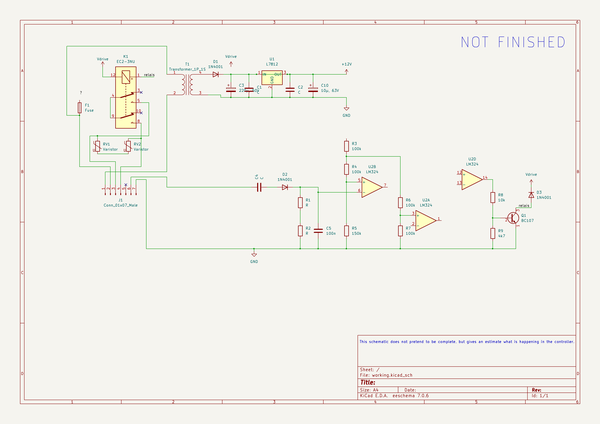

# kicad
 
## summary 
* id: axello_kicad_brasilia_espresso_controller
* user: axello
* name: kicad
* board: brasilia_espresso_controller
* repo: https://github.com/axello/kicad
* src_file_repo_kicad_pcb: 6.0/projects/Brasilia Espresso Controller/Brasilia Espresso Controller.kicad_pcb
* src_file_repo_kicad_pcb_link: https://github.com/axello/kicad/tree/master/6.0/projects/Brasilia Espresso Controller/Brasilia Espresso Controller.kicad_pcb
* src_file_repo_kicad_sch: 6.0/projects/Brasilia Espresso Controller/Brasilia Espresso Controller.kicad_sch
* src_file_repo_kicad_sch_link: https://github.com/axello/kicad/tree/master/6.0/projects/Brasilia Espresso Controller/Brasilia Espresso Controller.kicad_sch

* src_file_repo_sch: 6.0/projects/1w-grove-v0.1/1w-grove-v0.1.sch
* src_file_repo_sch_link: https://github.com/axello/kicad/tree/master/6.0/projects/1w-grove-v0.1/1w-grove-v0.1.sch
* full details link: https://github.com/oomlout/oomlout_oomp_project_bot_v_2/tree/main/projects/axello_kicad_brasilia_espresso_controller/current_version/working  

## schematic  
  
[schematic (pdf)](working_schematic.pdf) 

## pcb  
 
  
  
  
[board (pdf)](working.pdf)  

## bom_schematic
| Ref | Qnty | Value | Cmp name | Footprint | Description | Vendor | DNP | 
| --- | --- | --- | --- | --- | --- | --- | --- | 
| C1, C2, C4 | 3 | C | C |  | Unpolarized capacitor |  |  | 
| C3 | 1 | 220µ, 50V | C_Polarized |  | Polarized capacitor |  |  | 
| C5 | 1 | 100n | C |  | Unpolarized capacitor |  |  | 
| C10 | 1 | 10µ, 63V | C_Polarized |  | Polarized capacitor |  |  | 
| D1, D2, D3 | 3 | 1N4001 | 1N4001 | Diode_THT:D_DO-41_SOD81_P10.16mm_Horizontal | 50V 1A General Purpose Rectifier Diode, DO-41 |  |  | 
| F1 | 1 | Fuse | Fuse |  | Fuse |  |  | 
| J1 | 1 | Conn_01x07_Male | Conn_01x07_Male |  | Generic connector, single row, 01x07, script generated (kicad-library-utils/schlib/autogen/connector/) |  |  | 
| K1 | 1 | EC2-3NU | EC2-3NU | Relay_THT:Relay_DPDT_Kemet_EC2 | General purpose signal relay, Kemet EC2 Series, DPDT (2 Form C), non-latching, through hole, 60W/125VA, 220VDC/250VAC, 2A, 3V DC coil |  |  | 
| Q1 | 1 | BC107 | BC107 | Package_TO_SOT_THT:TO-18-3 | 0.1A Ic, 50V Vce, Low Noise General Purpose NPN Transistor, TO-18 |  |  | 
| R1, R2 | 2 | R | R |  | Resistor |  |  | 
| R3, R4, R6, R7 | 4 | 100k | R |  | Resistor |  |  | 
| R5 | 1 | 150k | R |  | Resistor |  |  | 
| R8 | 1 | 10k | R |  | Resistor |  |  | 
| R9 | 1 | 4k7 | R |  | Resistor |  |  | 
| RV1, RV2 | 2 | Varistor | Varistor |  | Voltage dependent resistor |  |  | 
| T1 | 1 | Transformer_1P_1S | Transformer_1P_1S |  | Transformer, single primary, single secondary |  |  | 
| U1 | 1 | L7812 | L7812 |  | Positive 1.5A 35V Linear Regulator, Fixed Output 12V, TO-220/TO-263/TO-252 |  |  | 
| U2 | 1 | LM324 | LM324 |  | Low-Power, Quad-Operational Amplifiers, DIP-14/SOIC-14/SSOP-14 |  |  | 

