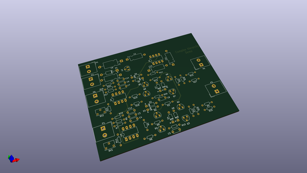
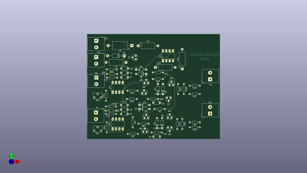
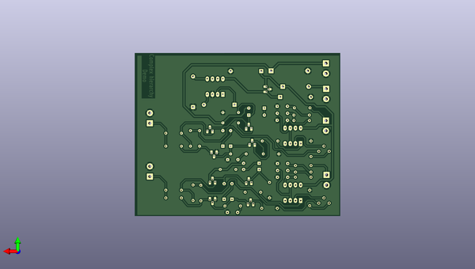

# kicad
 
## summary 
* id: axello_kicad_complex_hierarchy
* user: axello
* name: kicad
* board: complex_hierarchy
* repo: https://github.com/axello/kicad
* src_file_repo_kicad_pcb: demos/complex_hierarchy/complex_hierarchy.kicad_pcb
* src_file_repo_kicad_pcb_link: https://github.com/axello/kicad/tree/master/demos/complex_hierarchy/complex_hierarchy.kicad_pcb
* src_file_repo_kicad_sch: demos/complex_hierarchy/ampli_ht.kicad_sch
* src_file_repo_kicad_sch_link: https://github.com/axello/kicad/tree/master/demos/complex_hierarchy/ampli_ht.kicad_sch

* src_file_repo_sch: Arduino_Mega_433Mhz_Shield/Arduino_Mega.sch
* src_file_repo_sch_link: https://github.com/axello/kicad/tree/master/Arduino_Mega_433Mhz_Shield/Arduino_Mega.sch
* full details link: https://github.com/oomlout/oomlout_oomp_project_bot_v_2/tree/main/projects/axello_kicad_complex_hierarchy/current_version/working  

## pcb  
 
  
  
  
[board (pdf)](working.pdf)  

## working_bom
| Id | Designator | Footprint | Quantity | Designation | Supplier and ref |  | None | 
| --- | --- | --- | --- | --- | --- | --- | --- | 
| 1 | C2 | CP_Axial_L10.0mm_D4.5mm_P15.00mm_Horizontal | 1 | 47uF/20V |  |  | [''] | 
| 2 | C9 | CP_Axial_L11.0mm_D6.0mm_P18.00mm_Horizontal | 1 | 47uF/63V |  |  | [''] | 
| 3 | C10,C11 | CP_Axial_L10.0mm_D4.5mm_P15.00mm_Horizontal | 2 | 10uF |  |  | [''] | 
| 4 | Q1,Q3,Q5,Q7 | TO-92_HandSolder | 4 | MPSA92 |  |  | [''] | 
| 5 | Q6,Q8,Q2,Q4 | TO-92_HandSolder | 4 | MPSA42 |  |  | [''] | 
| 6 | RV1,RV2 | Potentiometer_Bourns_3266W_Vertical | 2 | 4,7K |  |  | [''] | 
| 7 | U2 | TO-92_HandSolder | 1 | 78L05 |  |  | [''] | 
| 8 | R19,R18,R9,R8,R24,R23 | R_Axial_DIN0204_L3.6mm_D1.6mm_P7.62mm_Horizontal | 6 | 1K |  |  | [''] | 
| 9 | R6,R16,R7,R17 | R_Axial_DIN0204_L3.6mm_D1.6mm_P7.62mm_Horizontal | 4 | 22K |  |  | [''] | 
| 10 | R15,R5,R27,R25 | R_Axial_DIN0204_L3.6mm_D1.6mm_P7.62mm_Horizontal | 4 | 47 |  |  | [''] | 
| 11 | R14,R12,R4,R28,R26,R22 | R_Axial_DIN0204_L3.6mm_D1.6mm_P7.62mm_Horizontal | 6 | 220K |  |  | [''] | 
| 12 | R13,R3 | R_Axial_DIN0204_L3.6mm_D1.6mm_P7.62mm_Horizontal | 2 | 470 |  |  | [''] | 
| 13 | R11,R21 | R_Axial_DIN0204_L3.6mm_D1.6mm_P7.62mm_Horizontal | 2 | 4,7K |  |  | [''] | 
| 14 | R10,R20 | R_Axial_DIN0204_L3.6mm_D1.6mm_P7.62mm_Horizontal | 2 | 5,6K |  |  | [''] | 
| 15 | U4,U3 | DIP-8_W7.62mm_LongPads | 2 | LM358N |  |  | [''] | 
| 16 | U1 | DIP-8_W7.62mm_LongPads | 1 | ICL7660 |  |  | [''] | 
| 17 | C8,C5 | C_Disc_D5.0mm_W2.5mm_P5.00mm | 2 | 820pF |  |  | [''] | 
| 18 | C7,C4 | C_Disc_D5.0mm_W2.5mm_P5.00mm | 2 | 4.7nF |  |  | [''] | 
| 19 | C6,C3 | C_Disc_D5.0mm_W2.5mm_P5.00mm | 2 | 15nF |  |  | [''] | 
| 20 | C12,C14 | C_Disc_D5.0mm_W2.5mm_P5.00mm | 2 | 150nF |  |  | [''] | 
| 21 | D1 | D_DO-41_SOD81_P12.70mm_Horizontal | 1 | 1N4007 |  |  | [''] | 
| 22 | D5,D8,D2,D3,D7,D6,D4,D9 | D_DO-35_SOD27_P7.62mm_Horizontal | 8 | 1N4148 |  |  | [''] | 
| 23 | P1,P2,P4,P3,P6,P5 | Altech_AK300_1x02_P5.00mm_45-Degree | 6 | CONN_2 |  |  | [''] | 
| 24 | C1 | CP_Axial_L10.0mm_D4.5mm_P15.00mm_Horizontal | 1 | 47uF |  |  | [''] | 

