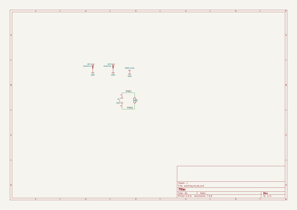
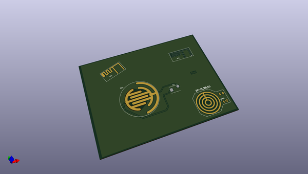
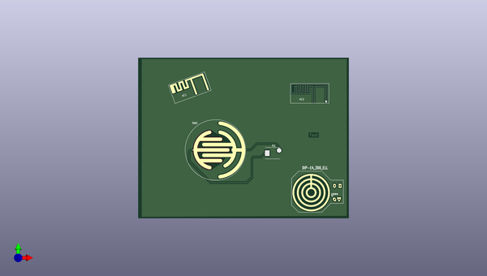

# kicad
 
## summary 
* id: axello_kicad_custom_pads_test
* user: axello
* name: kicad
* board: custom_pads_test
* repo: https://github.com/axello/kicad
* src_file_repo_kicad_pcb: demos/custom_pads_test/custom_pads_test.kicad_pcb
* src_file_repo_kicad_pcb_link: https://github.com/axello/kicad/tree/master/demos/custom_pads_test/custom_pads_test.kicad_pcb
* src_file_repo_kicad_sch: demos/custom_pads_test/custom_pads_test.kicad_sch
* src_file_repo_kicad_sch_link: https://github.com/axello/kicad/tree/master/demos/custom_pads_test/custom_pads_test.kicad_sch

* src_file_repo_sch: Arduino_Mega_433Mhz_Shield/Arduino_Mega.sch
* src_file_repo_sch_link: https://github.com/axello/kicad/tree/master/Arduino_Mega_433Mhz_Shield/Arduino_Mega.sch
* full details link: https://github.com/oomlout/oomlout_oomp_project_bot_v_2/tree/main/projects/axello_kicad_custom_pads_test/current_version/working  

## schematic  
  
[schematic (pdf)](working_schematic.pdf) 

## pcb  
 
  
  
  
[board (pdf)](working.pdf)  

## working_bom
| Id | Designator | Footprint | Quantity | Designation | Supplier and ref |  | None | 
| --- | --- | --- | --- | --- | --- | --- | --- | 
| 1 | R2 | DO-214AB | 1 | R |  |  | [''] | 
| 2 | AE2,AE1 | 1pin | 2 | Antenna |  |  | [''] | 
| 3 | U*** | DIP-14__300_ELL | 1 | DIP-14_300_ELL |  |  | [''] | 
| 4 | SW1 | C2 | 1 | R |  |  | [''] | 

## bom_schematic
| Ref | Qnty | Value | Cmp name | Footprint | Description | Vendor | DNP | 
| --- | --- | --- | --- | --- | --- | --- | --- | 
| AE1, AE2 | 2 | Antenna | Antenna |  |  |  |  | 
| R2 | 1 | R | R |  |  |  |  | 
| SW1 | 1 | R | Jumper-device |  |  |  |  | 

