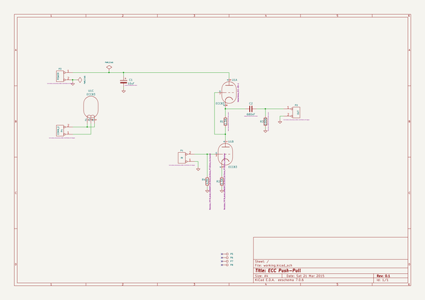

# kicad
 
## summary 
* id: axello_kicad_ecc83_pp
* user: axello
* name: kicad
* board: ecc83_pp
* repo: https://github.com/axello/kicad
* src_file_repo_kicad_pcb: demos/ecc83/ecc83-pp.kicad_pcb
* src_file_repo_kicad_pcb_link: https://github.com/axello/kicad/tree/master/demos/ecc83/ecc83-pp.kicad_pcb
* src_file_repo_kicad_sch: demos/ecc83/ecc83-pp.kicad_sch
* src_file_repo_kicad_sch_link: https://github.com/axello/kicad/tree/master/demos/ecc83/ecc83-pp.kicad_sch

* src_file_repo_sch: Arduino_Mega_433Mhz_Shield/Arduino_Mega.sch
* src_file_repo_sch_link: https://github.com/axello/kicad/tree/master/Arduino_Mega_433Mhz_Shield/Arduino_Mega.sch
* full details link: https://github.com/oomlout/oomlout_oomp_project_bot_v_2/tree/main/projects/axello_kicad_ecc83_pp/current_version/working  

## schematic  
  
[schematic (pdf)](working_schematic.pdf) 

## pcb  
 
  
  
  
[board (pdf)](working.pdf)  

## working_bom
| Id | Designator | Footprint | Quantity | Designation | Supplier and ref |  | None | 
| --- | --- | --- | --- | --- | --- | --- | --- | 
| 1 | C1 | CP_Radial_D10.0mm_P5.00mm | 1 | 10uF |  |  | [''] | 
| 2 | C2 | C_Disc_D4.7mm_W2.5mm_P5.00mm | 1 | 680nF |  |  | [''] | 
| 3 | R1,R2 | R_Axial_DIN0207_L6.3mm_D2.5mm_P7.62mm_Horizontal | 2 | 1.5K |  |  | [''] | 
| 4 | R4 | R_Axial_DIN0207_L6.3mm_D2.5mm_P7.62mm_Horizontal | 1 | 47K |  |  | [''] | 
| 5 | P2 | Altech_AK300_1x02_P5.00mm_45-Degree | 1 | OUT |  |  | [''] | 
| 6 | P3 | Altech_AK300_1x02_P5.00mm_45-Degree | 1 | POWER |  |  | [''] | 
| 7 | P4 | Altech_AK300_1x02_P5.00mm_45-Degree | 1 | CONN_2 |  |  | [''] | 
| 8 | R3 | R_Axial_DIN0207_L6.3mm_D2.5mm_P7.62mm_Horizontal | 1 | 100K |  |  | [''] | 
| 9 | U1 | Valve_ECC-83-1 | 1 | ECC83 |  |  | [''] | 
| 10 | P1 | Altech_AK300_1x02_P5.00mm_45-Degree | 1 | IN |  |  | [''] | 

## bom_schematic
| Ref | Qnty | Value | Cmp name | Footprint | Description | Vendor | DNP | 
| --- | --- | --- | --- | --- | --- | --- | --- | 
| C1 | 1 | 10uF | CP | Capacitor_THT:CP_Radial_D10.0mm_P5.00mm | Polarised capacitor |  |  | 
| C2 | 1 | 680nF | C | Capacitor_THT:C_Disc_D4.7mm_W2.5mm_P5.00mm |  |  |  | 
| P1 | 1 | IN | CONN_2 | TerminalBlock_Altech:Altech_AK300_1x02_P5.00mm_45-Degree |  |  |  | 
| P2 | 1 | OUT | CONN_2 | TerminalBlock_Altech:Altech_AK300_1x02_P5.00mm_45-Degree |  |  |  | 
| P3 | 1 | POWER | CONN_2 | TerminalBlock_Altech:Altech_AK300_1x02_P5.00mm_45-Degree |  |  |  | 
| P4 | 1 | CONN_2 | CONN_2 | TerminalBlock_Altech:Altech_AK300_1x02_P5.00mm_45-Degree |  |  |  | 
| P5, P6, P7, P8 | 4 | MOUNTING_HOLE | CONN_1 | MountingHole:MountingHole_3.2mm_M3_DIN965_Pad |  |  |  | 
| R1, R2 | 2 | 1.5K | R | Resistor_THT:R_Axial_DIN0207_L6.3mm_D2.5mm_P7.62mm_Horizontal |  |  |  | 
| R3 | 1 | 100K | R | Resistor_THT:R_Axial_DIN0207_L6.3mm_D2.5mm_P7.62mm_Horizontal |  |  |  | 
| R4 | 1 | 47K | R | Resistor_THT:R_Axial_DIN0207_L6.3mm_D2.5mm_P7.62mm_Horizontal |  |  |  | 
| U1 | 1 | ECC83 | ECC83 | Valve:Valve_ECC-83-1 |  |  |  | 

