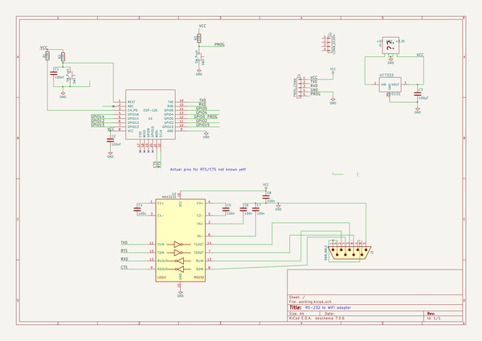

# kicad
 
## summary 
* id: axello_kicad_esp_rs232
* user: axello
* name: kicad
* board: esp_rs232
* repo: https://github.com/axello/kicad
* src_file_repo_kicad_pcb: ESP-RS232/ESP-RS232.kicad_pcb
* src_file_repo_kicad_pcb_link: https://github.com/axello/kicad/tree/master/ESP-RS232/ESP-RS232.kicad_pcb
* src_file_repo_kicad_sch: demos/video/bus_pci.kicad_sch
* src_file_repo_kicad_sch_link: https://github.com/axello/kicad/tree/master/demos/video/bus_pci.kicad_sch

* src_file_repo_sch: ESP-RS232/ESP-RS232.sch
* src_file_repo_sch_link: https://github.com/axello/kicad/tree/master/ESP-RS232/ESP-RS232.sch
* full details link: https://github.com/oomlout/oomlout_oomp_project_bot_v_2/tree/main/projects/axello_kicad_esp_rs232/current_version/working  

## schematic  
  
[schematic (pdf)](working_schematic.pdf) 

## pcb  
 
  
  
  
[board (pdf)](working.pdf)  

## bom_schematic
| Ref | Qnty | Value | Cmp name | Footprint | Description | Vendor | DNP | 
| --- | --- | --- | --- | --- | --- | --- | --- | 
| C1, C2 | 2 | 100nF | C |  |  |  |  | 
| C3 | 1 | 100µF | C |  |  |  |  | 
| C4, C5, C6, C7, C8 | 5 | 100n | C |  |  |  |  | 
| J1 | 1 | PROG_CONN | PROG_CONN |  | Connector, single row, 01x05, pin header |  |  | 
| J2 | 1 | CONN_01X04 | CONN_01X04 |  |  |  |  | 
| J3 | 1 | DB9_MALE | DB9_MALE |  |  |  |  | 
| R1, R2, R3 | 3 | 10K | R |  |  |  |  | 
| SW1, SW2 | 2 | SW_Push | SW_Push |  |  |  |  | 
| U1 | 1 | ESP-12E | ESP-12E |  | ESP8266 ESP-12E module, 22 pins, 2mm, PCB antenna |  |  | 
| U2 | 1 | MAX3232 | MAX3232 |  |  |  |  | 

