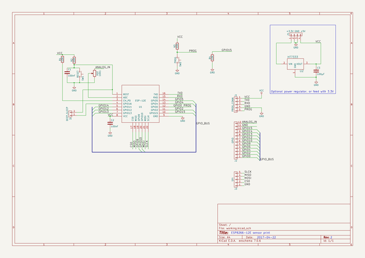
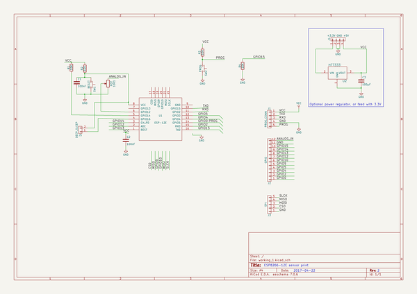
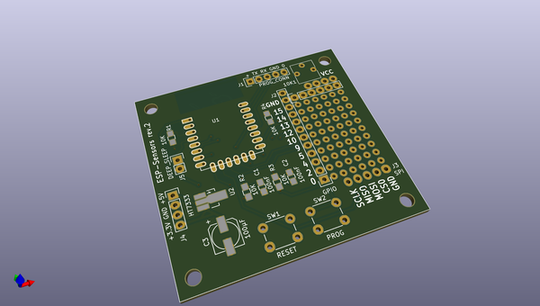
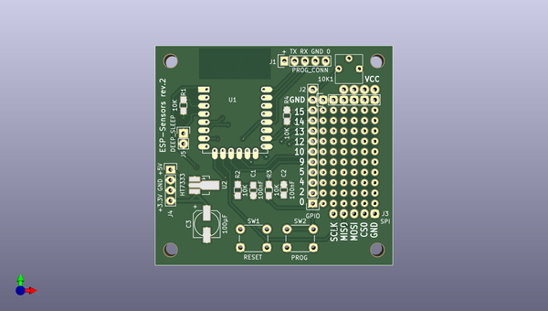
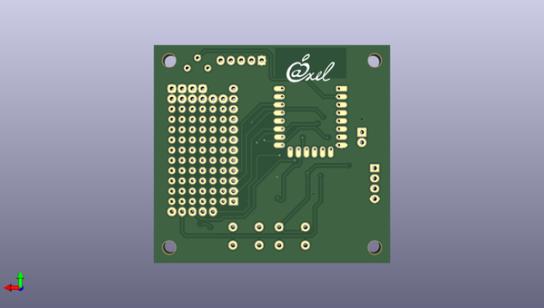

# kicad
 
## summary 
* id: axello_kicad_esp_sensors
* user: axello
* name: kicad
* board: esp_sensors
* repo: https://github.com/axello/kicad
* src_file_repo_kicad_pcb: ESP-Sensors/ESP-Sensors.kicad_pcb
* src_file_repo_kicad_pcb_link: https://github.com/axello/kicad/tree/master/ESP-Sensors/ESP-Sensors.kicad_pcb
* src_file_repo_kicad_sch: ESP-Sensors/ESP-Sensors.kicad_sch
* src_file_repo_kicad_sch_link: https://github.com/axello/kicad/tree/master/ESP-Sensors/ESP-Sensors.kicad_sch

* src_file_repo_sch: ESP-Sensors/ESP-Sensors.sch
* src_file_repo_sch_link: https://github.com/axello/kicad/tree/master/ESP-Sensors/ESP-Sensors.sch
* full details link: https://github.com/oomlout/oomlout_oomp_project_bot_v_2/tree/main/projects/axello_kicad_esp_sensors/current_version/working  

## schematic  
  
[schematic (pdf)](working_schematic.pdf) 

  
[schematic 1 (pdf)](working_1_schematic.pdf) 

## pcb  
 
  
  
  
[board (pdf)](working.pdf)  

## working_bom
| Id | Designator | Footprint | Quantity | Designation | Supplier and ref |  | None | 
| --- | --- | --- | --- | --- | --- | --- | --- | 
| 1 | C1,C2 | C_0805_HandSoldering | 2 | 100nF |  |  | [''] | 
| 2 | C3 | c_elec_6.3x7.7 | 1 | 100µF |  |  | [''] | 
| 3 | J2 | Pin_Header_Straight_1x12 | 1 | GPIO |  |  | [''] | 
| 4 | J4 | Pin_Header_Straight_1x04 | 1 | +3.3V GND +5V |  |  | [''] | 
| 5 | R1,R2,R3,R4 | R_0805_HandSoldering | 4 | 10K |  |  | [''] | 
| 6 | SW1 | SW_PUSH_6mm | 1 | RESET |  |  | [''] | 
| 7 | SW2 | SW_PUSH_6mm | 1 | PROG |  |  | [''] | 
| 8 | U1 | ESP-12E | 1 | ESP-12E |  |  | [''] | 
| 9 | REF**,REF**,REF**,REF** | MountingHole_3.2mm_M3 | 4 | MountingHole_3.2mm_M3 |  |  | [''] | 
| 10 |  | proto_grid_6x10 | 1 | proto_grid_6x10 |  |  | [''] | 
| 11 | REF**,REF** | Pin_Header_Straight_1x06 | 2 | GPIO |  |  | [''] | 
| 12 | J5 | Pin_Header_Straight_1x02 | 1 | DEEP_SLEEP |  |  | [''] | 
| 13 | 10K1 | Potentiometer_Trimmer_Vishay_T73YP_Horizontal | 1 | POT |  |  | [''] | 
| 14 | J3 | SPI_Header | 1 | SPI |  |  | [''] | 
| 15 | U2 | SOT89-3_Housing_Handsoldering | 1 | HT7333 |  |  | [''] | 
| 16 | J1 | Pin_Header_Straight_1x05b | 1 | PROG_CONN |  |  | [''] | 
| 17 | G*** | LOGO2 | 1 | LOGO |  |  | [''] | 

## bom_schematic
| Ref | Qnty | Value | Cmp name | Footprint | Description | Vendor | DNP | 
| --- | --- | --- | --- | --- | --- | --- | --- | 
| 10K1 | 1 | POT | POT | Potentiometers:Potentiometer_Trimmer_Vishay_T73YP_Horizontal |  |  |  | 
| C1, C2 | 2 | 100nF | C | Capacitors_SMD:C_0805_HandSoldering |  |  |  | 
| C3 | 1 | 100µF | C | Capacitors_SMD:c_elec_6.3x7.7 |  |  |  | 
| J1 | 1 | PROG_CONN | PROG_CONN | ESP-RS232:Pin_Header_Straight_1x05b |  |  |  | 
| J2 | 1 | GPIO | CONN_01X12 | Pin_Headers:Pin_Header_Straight_1x12 |  |  |  | 
| J3 | 1 | SPI | CONN_01X05 | ESP-RS232:SPI_Header |  |  |  | 
| J4 | 1 | +3.3V GND +5V | CONN_01X04 | Pin_Headers:Pin_Header_Straight_1x04 |  |  |  | 
| J5 | 1 | DEEP_SLEEP | CONN_01X02 | Pin_Headers:Pin_Header_Straight_1x02 |  |  |  | 
| R1, R2, R3, R4 | 4 | 10K | R | Resistors_SMD:R_0805_HandSoldering |  |  |  | 
| SW1 | 1 | RESET | SW_Push | Buttons_Switches_THT:SW_PUSH_6mm |  |  |  | 
| SW2 | 1 | PROG | SW_Push | Buttons_Switches_THT:SW_PUSH_6mm |  |  |  | 
| U1 | 1 | ESP-12E | ESP-12E | ESP8266:ESP-12E |  |  |  | 
| U2 | 1 | HT7333 | HT7333 | TO_SOT_Packages_SMD:SOT89-3_Housing_Handsoldering |  |  |  | 

## mounting_holes
| x | y | package | value | ref | size | 
| --- | --- | --- | --- | --- | --- | 
| 0.0 | 46.35 | MountingHole_3.2mm_M3 | MountingHole_3.2mm_M3 | REF** | m3 | 
| 0.0 | 0.0 | MountingHole_3.2mm_M3 | MountingHole_3.2mm_M3 | REF** | m3 | 
| 50.8 | 46.35 | MountingHole_3.2mm_M3 | MountingHole_3.2mm_M3 | REF** | m3 | 
| 50.8 | 0.0 | MountingHole_3.2mm_M3 | MountingHole_3.2mm_M3 | REF** | m3 | 

