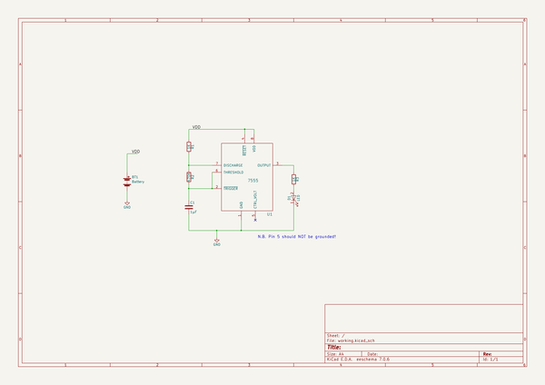
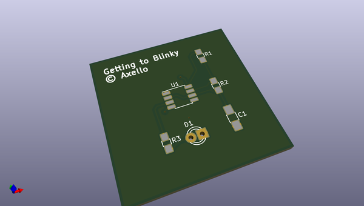
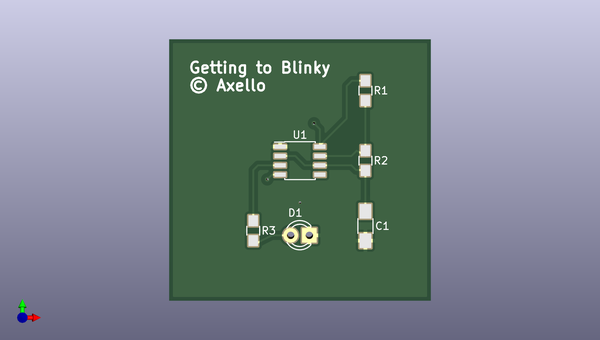
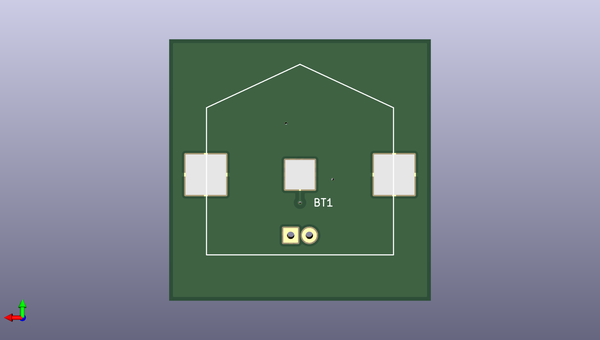

# kicad
 
## summary 
* id: axello_kicad_gettingtoblinky
* user: axello
* name: kicad
* board: gettingtoblinky
* repo: https://github.com/axello/kicad
* src_file_repo_kicad_pcb: GettingToBlinky/GettingToBlinky.kicad_pcb
* src_file_repo_kicad_pcb_link: https://github.com/axello/kicad/tree/master/GettingToBlinky/GettingToBlinky.kicad_pcb
* src_file_repo_kicad_sch: ESP-Sensors/ESP-Sensors.kicad_sch
* src_file_repo_kicad_sch_link: https://github.com/axello/kicad/tree/master/ESP-Sensors/ESP-Sensors.kicad_sch

* src_file_repo_sch: GettingToBlinky/GettingToBlinky.sch
* src_file_repo_sch_link: https://github.com/axello/kicad/tree/master/GettingToBlinky/GettingToBlinky.sch
* full details link: https://github.com/oomlout/oomlout_oomp_project_bot_v_2/tree/main/projects/axello_kicad_gettingtoblinky/current_version/working  

## schematic  
  
[schematic (pdf)](working_schematic.pdf) 

## pcb  
 
  
  
  
[board (pdf)](working.pdf)  

## working_bom
| Id | Designator | Footprint | Quantity | Designation | Supplier and ref |  | None | 
| --- | --- | --- | --- | --- | --- | --- | --- | 
| 1 | C1 | C_1206_HandSoldering | 1 | 1µF |  |  | [''] | 
| 2 | D1 | LED-3MM | 1 | LED |  |  | [''] | 
| 3 | R1,R3 | R_0805_HandSoldering | 2 | 1K |  |  | [''] | 
| 4 | R2 | R_0805_HandSoldering | 1 | 470K |  |  | [''] | 
| 5 | U1 | SOIC-8_3.9x4.9mm_Pitch1.27mm | 1 | 7555 |  |  | [''] | 
| 6 | BT1 | BatteryHolder | 1 | Battery |  |  | [''] | 

## bom_schematic
| Ref | Qnty | Value | Cmp name | Footprint | Description | Vendor | DNP | 
| --- | --- | --- | --- | --- | --- | --- | --- | 
| BT1 | 1 | Battery | Battery | GTB:BatteryHolder |  |  |  | 
| C1 | 1 | 1µF | C | Capacitors_SMD:C_1206_HandSoldering | Unpolarized capacitor |  |  | 
| D1 | 1 | LED | LED | LEDs:LED-3MM |  |  |  | 
| R1, R3 | 2 | 1K | R | Resistors_SMD:R_0805_HandSoldering |  |  |  | 
| R2 | 1 | 470K | R | Resistors_SMD:R_0805_HandSoldering |  |  |  | 
| U1 | 1 | 7555 | 7555 | Housings_SOIC:SOIC-8_3.9x4.9mm_Pitch1.27mm |  |  |  | 

