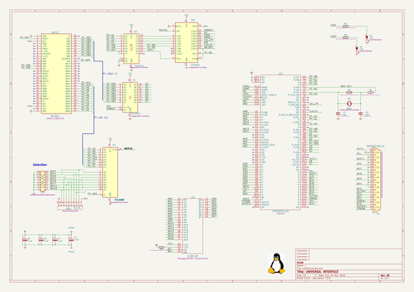
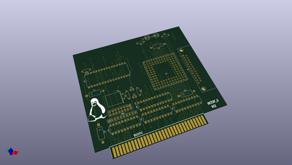
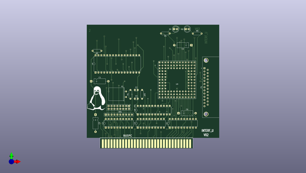
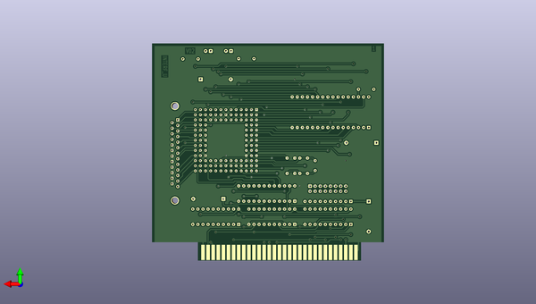

# kicad
 
## summary 
* id: axello_kicad_interf_u
* user: axello
* name: kicad
* board: interf_u
* repo: https://github.com/axello/kicad
* src_file_repo_kicad_pcb: demos/interf_u/interf_u.kicad_pcb
* src_file_repo_kicad_pcb_link: https://github.com/axello/kicad/tree/master/demos/interf_u/interf_u.kicad_pcb
* src_file_repo_kicad_sch: demos/interf_u/interf_u.kicad_sch
* src_file_repo_kicad_sch_link: https://github.com/axello/kicad/tree/master/demos/interf_u/interf_u.kicad_sch

* src_file_repo_sch: Arduino_Mega_433Mhz_Shield/Arduino_Mega.sch
* src_file_repo_sch_link: https://github.com/axello/kicad/tree/master/Arduino_Mega_433Mhz_Shield/Arduino_Mega.sch
* full details link: https://github.com/oomlout/oomlout_oomp_project_bot_v_2/tree/main/projects/axello_kicad_interf_u/current_version/working  

## schematic  
  
[schematic (pdf)](working_schematic.pdf) 

## pcb  
 
  
  
  
[board (pdf)](working.pdf)  

## working_bom
| Id | Designator | Footprint | Quantity | Designation | Supplier and ref |  | None | 
| --- | --- | --- | --- | --- | --- | --- | --- | 
| 1 | R5,R4 | R_Axial_DIN0207_L6.3mm_D2.5mm_P7.62mm_Horizontal | 2 | 330 |  |  | [''] | 
| 2 | C6,C5,C4,C1 | CP_Axial_L10.0mm_D4.5mm_P15.00mm_Horizontal | 4 | 47uF |  |  | [''] | 
| 3 | C2,C3 | C_Disc_D3.0mm_W2.0mm_P2.50mm | 2 | 47pF |  |  | [''] | 
| 4 | JP1 | PinHeader_2x08_P2.54mm_Vertical | 1 | CONN_8X2 |  |  | [''] | 
| 5 | U1 | DIP-20_W7.62mm | 1 | 74LS245 |  |  | [''] | 
| 6 | U2 | DIP-20_W7.62mm | 1 | 74LS688 |  |  | [''] | 
| 7 | U3 | DIP-20_W7.62mm | 1 | 74LS541 |  |  | [''] | 
| 8 | G1 | LOGO | 1 | Tux |  |  | [''] | 
| 9 | U5 | DIP-32_W15.24mm | 1 | 628128 |  |  | [''] | 
| 10 | U8 | DIP-24_W7.62mm | 1 | EP600 |  |  | [''] | 
| 11 | X1 | Crystal_HC18-U_Horizontal | 1 | 8MHz |  |  | [''] | 
| 12 | D1,D2 | LED_D5.0mm | 2 | LED |  |  | [''] | 
| 13 | P1 | DSUB-25_Female_Horizontal_P2.77x2.84mm_EdgePinOffset9.90mm_Housed_MountingHolesOffset11.32mm | 1 | DB25FEMELLE |  |  | [''] | 
| 14 | RR1 | R_Array_SIP10 | 1 | 9x1K |  |  | [''] | 
| 15 | U9 | PGA120 | 1 | 4003APG120 |  |  | [''] | 
| 16 | BUS1 | BUS_PC | 1 | BUSPC |  |  | [''] | 
| 17 | R3 | R_Axial_DIN0207_L6.3mm_D2.5mm_P7.62mm_Horizontal | 1 | 10K |  |  | [''] | 
| 18 | R2 | R_Axial_DIN0207_L6.3mm_D2.5mm_P7.62mm_Horizontal | 1 | 1K |  |  | [''] | 
| 19 | R1 | R_Axial_DIN0207_L6.3mm_D2.5mm_P7.62mm_Horizontal | 1 | 100K |  |  | [''] | 

## bom_schematic
| Ref | Qnty | Value | Cmp name | Footprint | Description | Vendor | DNP | 
| --- | --- | --- | --- | --- | --- | --- | --- | 
| BUS1 | 1 | BUSPC | Bus_ISA_8bit | interf_u:BUS_PC | 8-bit ISA-PC bus connector |  |  | 
| C1, C4, C5, C6 | 4 | 47uF | CP | Capacitor_THT:CP_Axial_L10.0mm_D4.5mm_P15.00mm_Horizontal | Polarised capacitor |  |  | 
| C2, C3 | 2 | 47pF | C | Capacitor_THT:C_Disc_D3.0mm_W2.0mm_P2.50mm | Unpolarized capacitor |  |  | 
| D1, D2 | 2 | LED | LED | LED_THT:LED_D5.0mm | LED generic, alternativ symbol |  |  | 
| JP1 | 1 | CONN_8X2 | Conn_02x08_Odd_Even | Connector_PinHeader_2.54mm:PinHeader_2x08_P2.54mm_Vertical | Generic connector, double row, 02x08, odd/even pin numbering scheme (row 1 odd numbers, row 2 even numbers) |  |  | 
| P1 | 1 | DB25FEMELLE | DB25_Female | Connector_Dsub:DSUB-25_Female_Horizontal_P2.77x2.84mm_EdgePinOffset9.90mm_Housed_MountingHolesOffset11.32mm | 25-pin female D-SUB connector |  |  | 
| R1 | 1 | 100K | R | Resistor_THT:R_Axial_DIN0207_L6.3mm_D2.5mm_P7.62mm_Horizontal |  |  |  | 
| R2 | 1 | 1K | R | Resistor_THT:R_Axial_DIN0207_L6.3mm_D2.5mm_P7.62mm_Horizontal |  |  |  | 
| R3 | 1 | 10K | R | Resistor_THT:R_Axial_DIN0207_L6.3mm_D2.5mm_P7.62mm_Horizontal |  |  |  | 
| R4, R5 | 2 | 330 | R | Resistor_THT:R_Axial_DIN0207_L6.3mm_D2.5mm_P7.62mm_Horizontal |  |  |  | 
| RR1 | 1 | 9x1K | RR9 | Resistor_THT:R_Array_SIP10 |  |  |  | 
| U1 | 1 | 74LS245 | 74LS245 | Package_DIP:DIP-20_W7.62mm |  |  |  | 
| U2 | 1 | 74LS688 | 74LS688 | Package_DIP:DIP-20_W7.62mm |  |  |  | 
| U3 | 1 | 74LS541 | 74LS541 | Package_DIP:DIP-20_W7.62mm |  |  |  | 
| U5 | 1 | 628128 | 628128 | Package_DIP:DIP-32_W15.24mm |  |  |  | 
| U8 | 1 | EP600 | EP600 | Package_DIP:DIP-24_W7.62mm |  |  |  | 
| U9 | 1 | 4003APG120 | 4003APG120 | PGA120 |  |  |  | 
| X1 | 1 | 8MHz | Crystal | Crystal:Crystal_HC18-U_Horizontal | Two pin crystal |  |  | 

## mounting_holes
| x | y | package | value | ref | size | 
| --- | --- | --- | --- | --- | --- | 
| 0.0 | 0.0 | DSUB-25_Female_Horizontal_P2.77x2.84mm_EdgePinOffset9.90mm_Housed_MountingHolesOffset11.32mm | DB25FEMELLE | P1 | m3 | 

