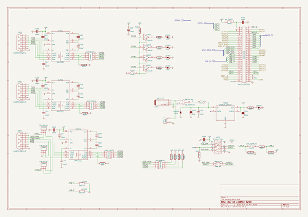
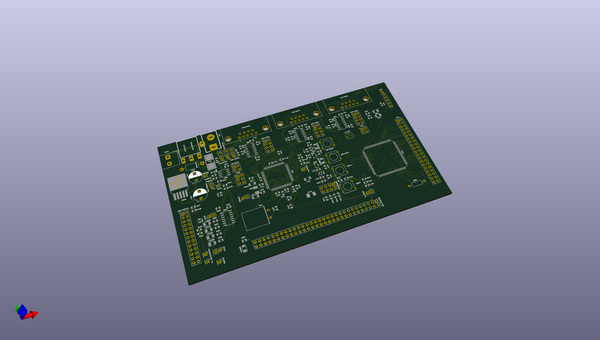
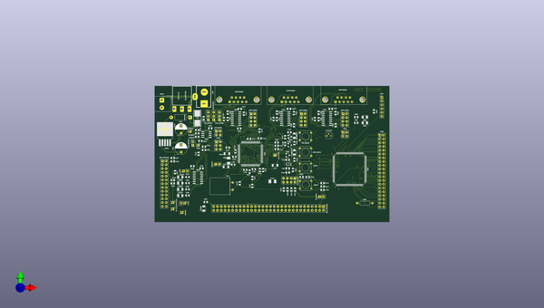
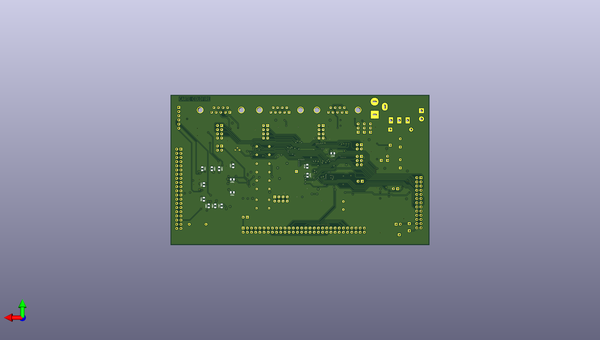

# kicad
 
## summary 
* id: axello_kicad_kit_dev_coldfire_xilinx_5213
* user: axello
* name: kicad
* board: kit_dev_coldfire_xilinx_5213
* repo: https://github.com/axello/kicad
* src_file_repo_kicad_pcb: demos/kit-dev-coldfire-xilinx_5213/kit-dev-coldfire-xilinx_5213.kicad_pcb
* src_file_repo_kicad_pcb_link: https://github.com/axello/kicad/tree/master/demos/kit-dev-coldfire-xilinx_5213/kit-dev-coldfire-xilinx_5213.kicad_pcb
* src_file_repo_kicad_sch: demos/kit-dev-coldfire-xilinx_5213/in_out_conn.kicad_sch
* src_file_repo_kicad_sch_link: https://github.com/axello/kicad/tree/master/demos/kit-dev-coldfire-xilinx_5213/in_out_conn.kicad_sch

* src_file_repo_sch: Arduino_Mega_433Mhz_Shield/Arduino_Mega.sch
* src_file_repo_sch_link: https://github.com/axello/kicad/tree/master/Arduino_Mega_433Mhz_Shield/Arduino_Mega.sch
* full details link: https://github.com/oomlout/oomlout_oomp_project_bot_v_2/tree/main/projects/axello_kicad_kit_dev_coldfire_xilinx_5213/current_version/working  

## schematic  
  
[schematic (pdf)](working_schematic.pdf) 

## pcb  
 
  
  
  
[board (pdf)](working.pdf)  

## working_bom
| Id | Designator | Footprint | Quantity | Designation | Supplier and ref |  | None | 
| --- | --- | --- | --- | --- | --- | --- | --- | 
| 1 | ABRT_SW101,RST_SW101,SW201,SW202 | SW_PUSH_SMALL | 4 | SW_PUSH |  |  | [''] | 
| 2 | ALLPST101,CLKOUT101,GND101,RS201,TA-101,VREF201 | PinHeader_1x01_P2.54mm_Vertical | 6 | CONN_1 |  |  | [''] | 
| 3 | BDM_PORT101 | PinHeader_2x13_P2.54mm_Vertical | 1 | CONN_13X2 |  |  | [''] | 
| 4 | C107,C106 | C_0805_2012Metric | 2 | 10pF |  |  | [''] | 
| 5 | C105,C102 | C_0805_2012Metric | 2 | 1nF |  |  | [''] | 
| 6 | C110,C111,C113,C114,C115,C116,C101,C104,C109,C103,C203,C204,C205,C206,C202,C207,C208,C209,C210,C211,C214,C219,C217,C220,C213,C201,C218,C221,C216,C112,C117,C118,C301,C302,C303,C304,C305,C306,C307,C308,C309,C310,C311 | C_0805_2012Metric | 43 | 100nF |  |  | [''] | 
| 7 | C108 | SM1206POL | 1 | 10uF |  |  | [''] | 
| 8 | C119 | SM1206POL | 1 | 100uF |  |  | [''] | 
| 9 | C212 | CP_Radial_D8.0mm_P5.00mm | 1 | 10uF |  |  | [''] | 
| 10 | C215 | CP_Radial_D8.0mm_P5.00mm | 1 | 220uF |  |  | [''] | 
| 11 | CAN_TERM201,CT101,VDDA101,VX_EN201,JP201 | PinHeader_1x02_P2.54mm_Vertical | 5 | JUMPER |  |  | [''] | 
| 12 | COM_SEL203,COM_SEL202,COM_SEL201 | PinHeader_1x03_P2.54mm_Vertical | 3 | CONN_3 |  |  | [''] | 
| 13 | D101,D102 | D_SOT-23_ANK | 2 | BAT54 |  |  | [''] | 
| 14 | D201 | D_DO-15_P12.70mm_Horizontal | 1 | 1N4004 |  |  | [''] | 
| 15 | D301,D302,LED201,LED202,LED203,LED204,LED205 | LED_1206_3216Metric | 7 | LED |  |  | [''] | 
| 16 | F201 | FSUPCMS | 1 | FUSE |  |  | [''] | 
| 17 | FB101 | R_1206_3216Metric_Pad1.24x1.80mm_HandSolder | 1 | BEAD |  |  | [''] | 
| 18 | J201 | JACK_ALIM | 1 | JACK_2P |  |  | [''] | 
| 19 | L102,L101 | R_1206_3216Metric_Pad1.24x1.80mm_HandSolder | 2 | 10uH |  |  | [''] | 
| 20 | LEDABRT101,LED_RST101 | LED_1206_3216Metric | 2 | LED_RED |  |  | [''] | 
| 21 | LV101 | TO-92_Molded_Narrow | 1 | DS1818 |  |  | [''] | 
| 22 | MCU_PORT201 | PinHeader_2x30_P2.54mm_Vertical | 1 | CONN_30X2 |  |  | [''] | 
| 23 | P301 | PinHeader_1x06_P2.54mm_Vertical | 1 | CONN_6 |  |  | [''] | 
| 24 | P303 | PinHeader_2x20_P2.54mm_Vertical | 1 | CONN_20X2 |  |  | [''] | 
| 25 | PULUPEN201,UART_EN201,UART_EN202,UART_EN203 | PinHeader_2x04_P2.54mm_Vertical | 4 | CONN_4X2 |  |  | [''] | 
| 26 | Q101 | SOT23EBC | 1 | 3906 |  |  | [''] | 
| 27 | R125 | R_0805_2012Metric | 1 | 1M |  |  | [''] | 
| 28 | R102,R106,R111,R107,R108,R109,R110,R101,R112,R214,R213,R212,R211 | R_0805_2012Metric | 13 | 4,7K |  |  | [''] | 
| 29 | R118,R119,R120,R121,R122,R123,R124,R215,R117,R205,R201,R208 | R_0805_2012Metric | 12 | 10K |  |  | [''] | 
| 30 | R104,R210,R303,R304 | R_0805_2012Metric | 4 | 1K |  |  | [''] | 
| 31 | R113 | R_0805_2012Metric | 1 | 0 |  |  | [''] | 
| 32 | R105 | R_0805_2012Metric | 1 | 20K |  |  | [''] | 
| 33 | R103,R116,R202,R203,R204,R206,R207 | R_0805_2012Metric | 7 | 270 |  |  | [''] | 
| 34 | R115 | R_0805_2012Metric | 1 | 4.7K |  |  | [''] | 
| 35 | R209 | R_0805_2012Metric | 1 | 62 |  |  | [''] | 
| 36 | R114 | R_0805_2012Metric | 1 | 22 |  |  | [''] | 
| 37 | R301 | R_0805_2012Metric | 1 | 4K7 |  |  | [''] | 
| 38 | R302 | R_Axial_DIN0207_L6.3mm_D2.5mm_P10.16mm_Horizontal | 1 | 3,3 |  |  | [''] | 
| 39 | RCAN202,RCAN201 | R_0805_2012Metric | 2 | R |  |  | [''] | 
| 40 | SW_ONOFF201 | SW_SPDT | 1 | SWITCH_INV |  |  | [''] | 
| 41 | TB201 | Altech_AK300_1x02_P5.00mm_45-Degree | 1 | CONN_2 |  |  | [''] | 
| 42 | U102 | LQFP-100_14x14mm_P0.5mm | 1 | MCF5213-LQFP100 |  |  | [''] | 
| 43 | U101 | SOT353 | 1 | 74AHC1G14 |  |  | [''] | 
| 44 | U202,U203,U204 | SOIC-16_3.9x9.9mm_P1.27mm | 3 | MAX202 |  |  | [''] | 
| 45 | U205 | SOIC-8_3.9x4.9mm_P1.27mm | 1 | PCA82C251 |  |  | [''] | 
| 46 | VR201 | TO-263-5_TabPin3 | 1 | LT1129_QPACK |  |  | [''] | 
| 47 | Y101 | Crystal_HC18-U_Horizontal | 1 | 8MHz |  |  | [''] | 
| 48 | U301 | TQFP-144_20x20mm_P0.5mm | 1 | XCR3256-TQ144 |  |  | [''] | 
| 49 | CAN_EN201,P302 | PinHeader_2x02_P2.54mm_Vertical | 2 | CONN_2X2 |  |  | [''] | 
| 50 | U201 | SOIC-14_3.9x8.7mm_P1.27mm | 1 | 74HC125 |  |  | [''] | 
| 51 | JP101 | PinHeader_2x03_P2.54mm_Vertical | 1 | JUMPER_TRIPLE |  |  | [''] | 
| 52 | UARTCAN201,UARTCAN202,UARTCAN203 | DSUB-9_Female_Horizontal_P2.77x2.84mm_EdgePinOffset7.70mm_Housed_MountingHolesOffset9.12mm | 3 | DB9 |  |  | [''] | 

## bom_schematic
| Ref | Qnty | Value | Cmp name | Footprint | Description | Vendor | DNP | 
| --- | --- | --- | --- | --- | --- | --- | --- | 
| C201, C202, C203, C204, C205, C206, C207, C208, C209, C210, C211, C213, C214, C216, C217, C218, C219, C220, C221 | 19 | 100nF | C | Capacitor_SMD:C_0805_2012Metric |  |  |  | 
| C212 | 1 | 10uF | CP | Capacitor_THT:CP_Radial_D8.0mm_P5.00mm |  |  |  | 
| C215 | 1 | 220uF | CP | Capacitor_THT:CP_Radial_D8.0mm_P5.00mm |  |  |  | 
| CAN_EN201 | 1 | CONN_2X2 | CONN_2X2 | Connector_PinHeader_2.54mm:PinHeader_2x02_P2.54mm_Vertical |  |  |  | 
| CAN_TERM201 | 1 | JUMPER | JUMPER | Connector_PinHeader_2.54mm:PinHeader_1x02_P2.54mm_Vertical |  |  |  | 
| COM_SEL201, COM_SEL202, COM_SEL203 | 3 | CONN_3 | CONN_3 | Connector_PinHeader_2.54mm:PinHeader_1x03_P2.54mm_Vertical |  |  |  | 
| D201 | 1 | 1N4004 | DIODE | Diode_THT:D_DO-15_P12.70mm_Horizontal | Diode, alternativ symbol |  |  | 
| F201 | 1 | FUSE | FUSE | kit-dev-coldfire:FSUPCMS |  |  |  | 
| J201 | 1 | JACK_2P | JACK_2P | kit-dev-coldfire:JACK_ALIM |  |  |  | 
| JP201 | 1 | JUMPER | JUMPER | Connector_PinHeader_2.54mm:PinHeader_1x02_P2.54mm_Vertical |  |  |  | 
| LED201, LED202, LED203, LED204, LED205 | 5 | LED | LED | LED_SMD:LED_1206_3216Metric |  |  |  | 
| MCU_PORT201 | 1 | CONN_30X2 | CONN_30X2 | Connector_PinHeader_2.54mm:PinHeader_2x30_P2.54mm_Vertical |  |  |  | 
| PULUPEN201 | 1 | CONN_4X2 | CONN_4X2 | Connector_PinHeader_2.54mm:PinHeader_2x04_P2.54mm_Vertical |  |  |  | 
| R201, R205, R208, R215 | 4 | 10K | R | Resistor_SMD:R_0805_2012Metric |  |  |  | 
| R202, R203, R204, R206, R207 | 5 | 270 | R | Resistor_SMD:R_0805_2012Metric |  |  |  | 
| R209 | 1 | 62 | R | Resistor_SMD:R_0805_2012Metric |  |  |  | 
| R210 | 1 | 1K | R | Resistor_SMD:R_0805_2012Metric |  |  |  | 
| R211, R212, R213, R214 | 4 | 4,7K | R | Resistor_SMD:R_0805_2012Metric |  |  |  | 
| RCAN201, RCAN202 | 2 | R | R | Resistor_SMD:R_0805_2012Metric |  |  |  | 
| RS201 | 1 | CONN_1 | CONN_1 | Connector_PinHeader_2.54mm:PinHeader_1x01_P2.54mm_Vertical |  |  |  | 
| SW201, SW202 | 2 | SW_PUSH | SW_PUSH | kit-dev-coldfire:SW_PUSH_SMALL |  |  |  | 
| SW_ONOFF201 | 1 | SWITCH_INV | SWITCH_INV | kit-dev-coldfire:SW_SPDT |  |  |  | 
| TB201 | 1 | CONN_2 | CONN_2 | TerminalBlock_Altech:Altech_AK300_1x02_P5.00mm_45-Degree |  |  |  | 
| U201 | 1 | 74HC125 | 74LS125 | Package_SO:SOIC-14_3.9x8.7mm_P1.27mm |  |  |  | 
| U202, U203, U204 | 3 | MAX202 | MAX202 | Package_SO:SOIC-16_3.9x9.9mm_P1.27mm |  |  |  | 
| U205 | 1 | PCA82C251 | PCA82C251 | Package_SO:SOIC-8_3.9x4.9mm_P1.27mm |  |  |  | 
| UART_EN201, UART_EN202, UART_EN203 | 3 | CONN_4X2 | CONN_4X2 | Connector_PinHeader_2.54mm:PinHeader_2x04_P2.54mm_Vertical |  |  |  | 
| UARTCAN201, UARTCAN202, UARTCAN203 | 3 | DB9 | DB9 | Connector_Dsub:DSUB-9_Female_Horizontal_P2.77x2.84mm_EdgePinOffset7.70mm_Housed_MountingHolesOffset9.12mm |  |  |  | 
| VR201 | 1 | LT1129_QPACK | LT1129_QPACK | Package_TO_SOT_SMD:TO-263-5_TabPin3 |  |  |  | 
| VREF201 | 1 | CONN_1 | CONN_1 | Connector_PinHeader_2.54mm:PinHeader_1x01_P2.54mm_Vertical |  |  |  | 
| VX_EN201 | 1 | JUMPER | JUMPER | Connector_PinHeader_2.54mm:PinHeader_1x02_P2.54mm_Vertical |  |  |  | 

