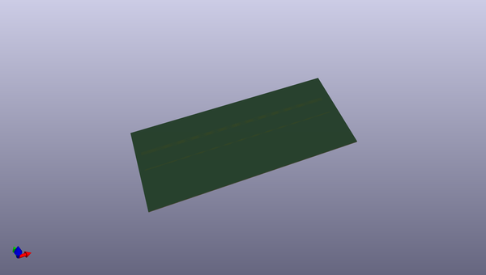

# kicad
 
## summary 
* id: axello_kicad_microwave
* user: axello
* name: kicad
* board: microwave
* repo: https://github.com/axello/kicad
* src_file_repo_kicad_pcb: demos/microwave/microwave.kicad_pcb
* src_file_repo_kicad_pcb_link: https://github.com/axello/kicad/tree/master/demos/microwave/microwave.kicad_pcb
* src_file_repo_kicad_sch: demos/kit-dev-coldfire-xilinx_5213/in_out_conn.kicad_sch
* src_file_repo_kicad_sch_link: https://github.com/axello/kicad/tree/master/demos/kit-dev-coldfire-xilinx_5213/in_out_conn.kicad_sch

* src_file_repo_sch: Arduino_Mega_433Mhz_Shield/Arduino_Mega.sch
* src_file_repo_sch_link: https://github.com/axello/kicad/tree/master/Arduino_Mega_433Mhz_Shield/Arduino_Mega.sch
* full details link: https://github.com/oomlout/oomlout_oomp_project_bot_v_2/tree/main/projects/axello_kicad_microwave/current_version/working  

## pcb  
 
  
  
  
[board (pdf)](working.pdf)  

## working_bom
| Id | Designator | Footprint | Quantity | Designation | Supplier and ref |  | None | 
| --- | --- | --- | --- | --- | --- | --- | --- | 
| 1 | POLY,POLY,POLY,POLY | POLY | 4 | VAL** |  |  | [''] | 

