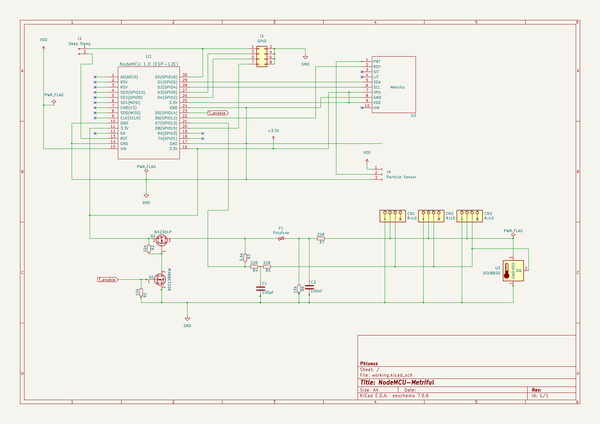
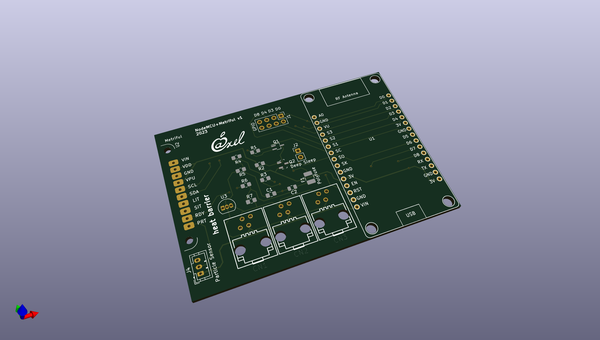
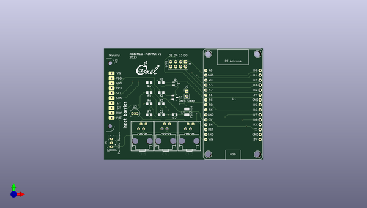
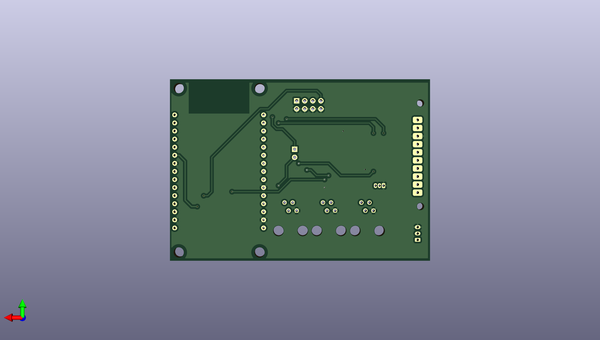

# kicad
 
## summary 
* id: axello_kicad_nodemcu_metriful
* user: axello
* name: kicad
* board: nodemcu_metriful
* repo: https://github.com/axello/kicad
* src_file_repo_kicad_pcb: 6.0/projects/NodeMCU-Metriful2/NodeMCU-Metriful.kicad_pcb
* src_file_repo_kicad_pcb_link: https://github.com/axello/kicad/tree/master/6.0/projects/NodeMCU-Metriful2/NodeMCU-Metriful.kicad_pcb
* src_file_repo_kicad_sch: 6.0/projects/NodeMCU-Metriful2/NodeMCU-Metriful.kicad_sch
* src_file_repo_kicad_sch_link: https://github.com/axello/kicad/tree/master/6.0/projects/NodeMCU-Metriful2/NodeMCU-Metriful.kicad_sch

* src_file_repo_sch: 6.0/projects/1w-grove-v0.1/1w-grove-v0.1.sch
* src_file_repo_sch_link: https://github.com/axello/kicad/tree/master/6.0/projects/1w-grove-v0.1/1w-grove-v0.1.sch
* full details link: https://github.com/oomlout/oomlout_oomp_project_bot_v_2/tree/main/projects/axello_kicad_nodemcu_metriful/current_version/working  

## schematic  
  
[schematic (pdf)](working_schematic.pdf) 

## pcb  
 
  
  
  
[board (pdf)](working.pdf)  

## working_bom
| Id | Designator | Footprint | Quantity | Designation | Supplier and ref |  | None | 
| --- | --- | --- | --- | --- | --- | --- | --- | 
| 1 | R6,R1,R2 | R_0805_2012Metric_Pad1.20x1.40mm_HandSolder | 3 | 10k |  |  | [''] | 
| 2 | R3 | R_0805_2012Metric_Pad1.20x1.40mm_HandSolder | 1 | 5.6k |  |  | [''] | 
| 3 | CN3,CN1,CN2 | rj10 | 3 | RJ10 |  |  | [''] | 
| 4 | Q1 | SOT-323_SC-70_Handsoldering | 1 | BSS138BKW |  |  | [''] | 
| 5 | Q2 | SOT-23-3 | 1 | NX2301P |  |  | [''] | 
| 6 | U2 | Metriful-1 | 1 | Metriful |  |  | [''] | 
| 7 | J4 | JST_PH_B3B-PH-K_1x03_P2.00mm_Vertical | 1 | Particle Sensor |  |  | [''] | 
| 8 | F1 | Fuse_1210_3225Metric_Pad1.42x2.65mm_HandSolder | 1 | Polyfuse |  |  | [''] | 
| 9 | C1 | C_0805_2012Metric_Pad1.18x1.45mm_HandSolder | 1 | 100pF |  |  | [''] | 
| 10 | U1 | NodeMCU_0.1_Axel | 1 | NodeMCU 1.0 (ESP-12E) |  |  | [''] | 
| 11 | J1 | PinHeader_2x04_P2.54mm_Vertical | 1 | GPIO |  |  | [''] | 
| 12 | R5,R4,R7 | R_0805_2012Metric_Pad1.20x1.40mm_HandSolder | 3 | 22R |  |  | [''] | 
| 13 | G*** | LOGO2 | 1 | LOGO |  |  | [''] | 
| 14 | U3 | TO-92_Inline | 1 | DS18B20 |  |  | [''] | 
| 15 | C2 | C_0805_2012Metric | 1 | 100nF |  |  | [''] | 
| 16 | J2 | PinHeader_1x02_P2.54mm_Vertical | 1 | Deep Sleep |  |  | [''] | 

## bom_schematic
| Ref | Qnty | Value | Cmp name | Footprint | Description | Vendor | DNP | 
| --- | --- | --- | --- | --- | --- | --- | --- | 
| C1 | 1 | 100pF | Device_C | Capacitor_SMD:C_0805_2012Metric_Pad1.18x1.45mm_HandSolder |  |  |  | 
| C2 | 1 | 100nF | Device_C | Capacitor_SMD:C_0805_2012Metric |  |  |  | 
| CN1, CN2, CN3 | 3 | RJ10 | RJ10 | 1wire-v0.4:rj10 |  |  |  | 
| F1 | 1 | Polyfuse | Polyfuse_Small | Fuse:Fuse_1210_3225Metric_Pad1.42x2.65mm_HandSolder |  |  |  | 
| J1 | 1 | GPIO | Conn_02x04_Odd_Even | Connector_PinHeader_2.54mm:PinHeader_2x04_P2.54mm_Vertical | Generic connector, double row, 02x04, odd/even pin numbering scheme (row 1 odd numbers, row 2 even numbers), script generated (kicad-library-utils/schlib/autogen/connector/) |  |  | 
| J2 | 1 | Deep Sleep | Conn_01x02_Male | Connector_PinHeader_2.54mm:PinHeader_1x02_P2.54mm_Vertical | Generic connector, single row, 01x02, script generated (kicad-library-utils/schlib/autogen/connector/) |  |  | 
| J4 | 1 | Particle Sensor | Conn_01x03_Female | Connector_JST:JST_PH_B3B-PH-K_1x03_P2.00mm_Vertical | Generic connector, single row, 01x03, script generated (kicad-library-utils/schlib/autogen/connector/) |  |  | 
| Q1 | 1 | BSS138BKW | Device_Q_NMOS_GSD | Package_TO_SOT_SMD:SOT-323_SC-70_Handsoldering |  |  |  | 
| Q2 | 1 | NX2301P | Device_Q_PMOS_GSD | 1wire-v0.4:SOT-23-3 |  |  |  | 
| R1, R2, R6 | 3 | 10k | Device_R_Small | Resistor_SMD:R_0805_2012Metric_Pad1.20x1.40mm_HandSolder |  |  |  | 
| R3 | 1 | 5.6k | Device_R_Small | Resistor_SMD:R_0805_2012Metric_Pad1.20x1.40mm_HandSolder |  |  |  | 
| R4, R5, R7 | 3 | 22R | Device_R_Small | Resistor_SMD:R_0805_2012Metric_Pad1.20x1.40mm_HandSolder |  |  |  | 
| U1 | 1 | NodeMCU 1.0 (ESP-12E) | NodeMCU_1.0_(ESP-12E) | NodeMCU:NodeMCU_0.1_Axel |  |  |  | 
| U2 | 1 | Metriful | Metriful-1 | Sensor:Metriful-1 |  |  |  | 
| U3 | 1 | DS18B20 | DS18B20 | Package_TO_SOT_THT:TO-92_Inline | Programmable Resolution 1-Wire Digital Thermometer TO-92 |  |  | 

