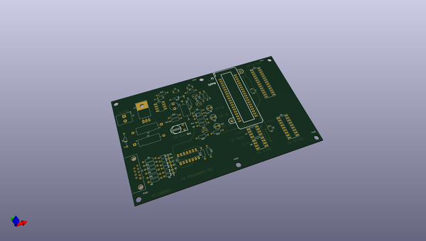

# kicad
 
## summary 
* id: axello_kicad_pic_programmer
* user: axello
* name: kicad
* board: pic_programmer
* repo: https://github.com/axello/kicad
* src_file_repo_kicad_pcb: demos/pic_programmer/pic_programmer.kicad_pcb
* src_file_repo_kicad_pcb_link: https://github.com/axello/kicad/tree/master/demos/pic_programmer/pic_programmer.kicad_pcb
* src_file_repo_kicad_sch: demos/pic_programmer/pic_programmer.kicad_sch
* src_file_repo_kicad_sch_link: https://github.com/axello/kicad/tree/master/demos/pic_programmer/pic_programmer.kicad_sch

* src_file_repo_sch: Arduino_Mega_433Mhz_Shield/Arduino_Mega.sch
* src_file_repo_sch_link: https://github.com/axello/kicad/tree/master/Arduino_Mega_433Mhz_Shield/Arduino_Mega.sch
* full details link: https://github.com/oomlout/oomlout_oomp_project_bot_v_2/tree/main/projects/axello_kicad_pic_programmer/current_version/working  

## pcb  
 
  
  
  
[board (pdf)](working.pdf)  

## working_bom
| Id | Designator | Footprint | Quantity | Designation | Supplier and ref |  | None | 
| --- | --- | --- | --- | --- | --- | --- | --- | 
| 1 | C1 | CP_Axial_L18.0mm_D6.5mm_P25.00mm_Horizontal | 1 | 100µF |  |  | [''] | 
| 2 | C2 | CP_Axial_L18.0mm_D6.5mm_P25.00mm_Horizontal | 1 | 220uF |  |  | [''] | 
| 3 | P101,P102,P103,P104,P105,P106 | MountingHole_4.3mm_M4 | 6 | CONN_1 |  |  | [''] | 
| 4 | P3 | 40tex-Ell600 | 1 | SUPP40 |  |  | [''] | 
| 5 | U6 | DIP-8_W7.62mm_Socket_LongPads | 1 | PIC_8_PINS |  |  | [''] | 
| 6 | U1 | DIP-8_W7.62mm_Socket_LongPads | 1 | 24Cxx |  |  | [''] | 
| 7 | U4 | DIP-8_W7.62mm_LongPads | 1 | LT1373 |  |  | [''] | 
| 8 | P2 | DIP-28_W7.62mm_Socket_LongPads | 1 | SUPP28 |  |  | [''] | 
| 9 | U5 | DIP-18_W7.62mm_Socket_LongPads | 1 | PIC_18_PINS |  |  | [''] | 
| 10 | U2 | DIP-14_W7.62mm_LongPads | 1 | 74HC125 |  |  | [''] | 
| 11 | D2,D3,D4,D5,D11,D7,D6 | D_DO-35_SOD27_P7.62mm_Horizontal | 7 | BAT43 |  |  | [''] | 
| 12 | J1 | DSUB-9_Female_Horizontal_P2.77x2.84mm_EdgePinOffset7.70mm_Housed_MountingHolesOffset9.12mm | 1 | DB9-FEMAL |  |  | [''] | 
| 13 | Q3,Q2 | TO-92 | 2 | BC307 |  |  | [''] | 
| 14 | Q1 | TO-92 | 1 | BC237 |  |  | [''] | 
| 15 | R18 | R_Axial_DIN0207_L6.3mm_D2.5mm_P10.16mm_Horizontal | 1 | 220 |  |  | [''] | 
| 16 | R10 | R_Axial_DIN0207_L6.3mm_D2.5mm_P10.16mm_Horizontal | 1 | 5,1K |  |  | [''] | 
| 17 | R9,R20,R19 | R_Axial_DIN0207_L6.3mm_D2.5mm_P10.16mm_Horizontal | 3 | 2.2K |  |  | [''] | 
| 18 | R1,R2,R3,R4,R5,R7,R6 | R_Axial_DIN0207_L6.3mm_D2.5mm_P10.16mm_Horizontal | 7 | 10K |  |  | [''] | 
| 19 | R21,R14,R13,R12 | R_Axial_DIN0207_L6.3mm_D2.5mm_P10.16mm_Horizontal | 4 | 470 |  |  | [''] | 
| 20 | R17,R11 | R_Axial_DIN0207_L6.3mm_D2.5mm_P10.16mm_Horizontal | 2 | 22K |  |  | [''] | 
| 21 | R16 | R_Axial_DIN0207_L6.3mm_D2.5mm_P10.16mm_Horizontal | 1 | 62K |  |  | [''] | 
| 22 | R15 | R_Axial_DIN0207_L6.3mm_D2.5mm_P10.16mm_Horizontal | 1 | 6.2K |  |  | [''] | 
| 23 | R8 | R_Axial_DIN0207_L6.3mm_D2.5mm_P10.16mm_Horizontal | 1 | 1K |  |  | [''] | 
| 24 | D8 | LED_D5.0mm | 1 | RED-LED |  |  | [''] | 
| 25 | D9 | LED_D5.0mm | 1 | GREEN-LED |  |  | [''] | 
| 26 | D12 | LED_D5.0mm | 1 | YELLOW-LED |  |  | [''] | 
| 27 | C4 | C_Disc_D5.1mm_W3.2mm_P5.00mm | 1 | 0 |  |  | [''] | 
| 28 | C5 | C_Disc_D5.1mm_W3.2mm_P5.00mm | 1 | 10nF |  |  | [''] | 
| 29 | C7,C6 | C_Disc_D5.1mm_W3.2mm_P5.00mm | 2 | 100nF |  |  | [''] | 
| 30 | C9 | C_Disc_D5.1mm_W3.2mm_P5.00mm | 1 | 220nF |  |  | [''] | 
| 31 | D10 | D_DO-35_SOD27_P12.70mm_Horizontal | 1 | SCHOTTKY |  |  | [''] | 
| 32 | RV1 | RV2X4 | 1 | 1K |  |  | [''] | 
| 33 | P1 | Altech_AK300_1x02_P5.00mm_45-Degree | 1 | CONN_2 |  |  | [''] | 
| 34 | U3 | TO-220-3_Horizontal_TabDown | 1 | 7805 |  |  | [''] | 
| 35 | C3 | C_Axial_L12.0mm_D6.5mm_P20.00mm_Horizontal | 1 | 22uF/25V |  |  | [''] | 
| 36 | L1 | L_Radial_D7.8mm_P5.00mm_Fastron_07HCP | 1 | 22uH |  |  | [''] | 
| 37 | D1 | D_DO-35_SOD27_P12.70mm_Horizontal | 1 | 1N4004 |  |  | [''] | 
| 38 | JP1 | SolderJumper-2_P1.3mm_Open_TrianglePad1.0x1.5mm | 1 | JUMPER |  |  | [''] | 

## mounting_holes
| x | y | package | value | ref | size | 
| --- | --- | --- | --- | --- | --- | 
| 0.0 | 0.0 | DSUB-9_Female_Horizontal_P2.77x2.84mm_EdgePinOffset7.70mm_Housed_MountingHolesOffset9.12mm | DB9-FEMAL | J1 | m3 | 

