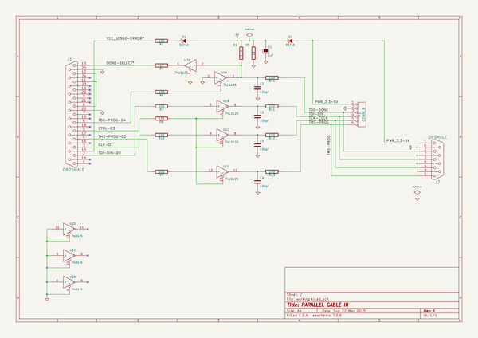
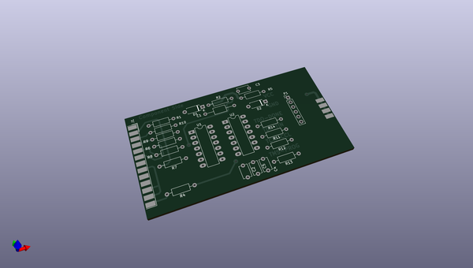
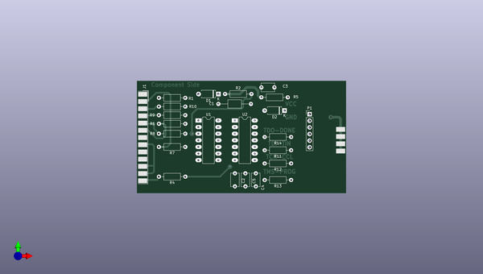
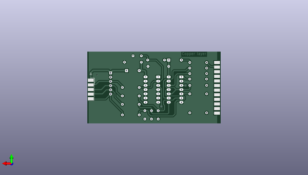

# kicad
 
## summary 
* id: axello_kicad_sonde_xilinx
* user: axello
* name: kicad
* board: sonde_xilinx
* repo: https://github.com/axello/kicad
* src_file_repo_kicad_pcb: demos/sonde xilinx/sonde xilinx.kicad_pcb
* src_file_repo_kicad_pcb_link: https://github.com/axello/kicad/tree/master/demos/sonde xilinx/sonde xilinx.kicad_pcb
* src_file_repo_kicad_sch: demos/sonde xilinx/sonde xilinx.kicad_sch
* src_file_repo_kicad_sch_link: https://github.com/axello/kicad/tree/master/demos/sonde xilinx/sonde xilinx.kicad_sch

* src_file_repo_sch: Arduino_Mega_433Mhz_Shield/Arduino_Mega.sch
* src_file_repo_sch_link: https://github.com/axello/kicad/tree/master/Arduino_Mega_433Mhz_Shield/Arduino_Mega.sch
* full details link: https://github.com/oomlout/oomlout_oomp_project_bot_v_2/tree/main/projects/axello_kicad_sonde_xilinx/current_version/working  

## schematic  
  
[schematic (pdf)](working_schematic.pdf) 

## pcb  
 
  
  
  
[board (pdf)](working.pdf)  

## working_bom
| Id | Designator | Footprint | Quantity | Designation | Supplier and ref |  | None | 
| --- | --- | --- | --- | --- | --- | --- | --- | 
| 1 | R14,R9,R13,R12,R11,R8,R7,R6,R10,R1 | R_Axial_DIN0207_L6.3mm_D2.5mm_P10.16mm_Horizontal | 10 | 100 |  |  | [''] | 
| 2 | R4 | R_Axial_DIN0207_L6.3mm_D2.5mm_P10.16mm_Horizontal | 1 | 47 |  |  | [''] | 
| 3 | R2 | R_Axial_DIN0207_L6.3mm_D2.5mm_P10.16mm_Horizontal | 1 | 5,1K |  |  | [''] | 
| 4 | R5 | R_Axial_DIN0207_L6.3mm_D2.5mm_P10.16mm_Horizontal | 1 | 1K |  |  | [''] | 
| 5 | D2,D1 | D_A-405_P7.62mm_Horizontal | 2 | BAT46 |  |  | [''] | 
| 6 | C1 | C_Axial_L5.1mm_D3.1mm_P12.50mm_Horizontal | 1 | 1uF |  |  | [''] | 
| 7 | P1 | PinHeader_1x06_P2.54mm_Vertical | 1 | CONN_6 |  |  | [''] | 
| 8 | U2,U1 | DIP-14_W7.62mm_LongPads | 2 | 74LS125 |  |  | [''] | 
| 9 | C5,C4,C3,C2 | C_Disc_D5.1mm_W3.2mm_P5.00mm | 4 | 100pF |  |  | [''] | 
| 10 | J1 | DSUB-25_Male_EdgeMount_P2.77mm | 1 | DB25MALE |  |  | [''] | 
| 11 | J2 | DSUB-9_Male_EdgeMount_P2.77mm | 1 | DB9MALE |  |  | [''] | 

## bom_schematic
| Ref | Qnty | Value | Cmp name | Footprint | Description | Vendor | DNP | 
| --- | --- | --- | --- | --- | --- | --- | --- | 
| C1 | 1 | 1uF | CP | Capacitor_THT:C_Axial_L5.1mm_D3.1mm_P12.50mm_Horizontal |  |  |  | 
| C2, C3, C4, C5 | 4 | 100pF | C | Capacitor_THT:C_Disc_D5.1mm_W3.2mm_P5.00mm |  |  |  | 
| D1, D2 | 2 | BAT46 | DIODESCH | Diode_THT:D_A-405_P7.62mm_Horizontal |  |  |  | 
| J1 | 1 | DB25MALE | DB25 | Connector_Dsub:DSUB-25_Male_EdgeMount_P2.77mm |  |  |  | 
| J2 | 1 | DB9MALE | DB9 | Connector_Dsub:DSUB-9_Male_EdgeMount_P2.77mm |  |  |  | 
| P1 | 1 | CONN_6 | CONN_6 | Connector_PinHeader_2.54mm:PinHeader_1x06_P2.54mm_Vertical |  |  |  | 
| R1, R6, R7, R8, R9, R10, R11, R12, R13, R14 | 10 | 100 | R | Resistor_THT:R_Axial_DIN0207_L6.3mm_D2.5mm_P10.16mm_Horizontal |  |  |  | 
| R2 | 1 | 5,1K | R | Resistor_THT:R_Axial_DIN0207_L6.3mm_D2.5mm_P10.16mm_Horizontal |  |  |  | 
| R4 | 1 | 47 | R | Resistor_THT:R_Axial_DIN0207_L6.3mm_D2.5mm_P10.16mm_Horizontal |  |  |  | 
| R5 | 1 | 1K | R | Resistor_THT:R_Axial_DIN0207_L6.3mm_D2.5mm_P10.16mm_Horizontal |  |  |  | 
| U1, U2 | 2 | 74LS125 | 74LS125 | Package_DIP:DIP-14_W7.62mm_LongPads |  |  |  | 

