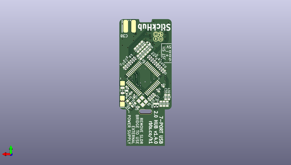

# kicad
 
## summary 
* id: axello_kicad_stickhub
* user: axello
* name: kicad
* board: stickhub
* repo: https://github.com/axello/kicad
* src_file_repo_kicad_pcb: demos/stickhub/StickHub.kicad_pcb
* src_file_repo_kicad_pcb_link: https://github.com/axello/kicad/tree/master/demos/stickhub/StickHub.kicad_pcb
* src_file_repo_kicad_sch: demos/stickhub/StickHub.kicad_sch
* src_file_repo_kicad_sch_link: https://github.com/axello/kicad/tree/master/demos/stickhub/StickHub.kicad_sch

* src_file_repo_sch: Arduino_Mega_433Mhz_Shield/Arduino_Mega.sch
* src_file_repo_sch_link: https://github.com/axello/kicad/tree/master/Arduino_Mega_433Mhz_Shield/Arduino_Mega.sch
* full details link: https://github.com/oomlout/oomlout_oomp_project_bot_v_2/tree/main/projects/axello_kicad_stickhub/current_version/working  

## schematic  
  
[schematic (pdf)](working_schematic.pdf) 

## pcb  
 
  
  
  
[board (pdf)](working.pdf)  

## working_bom
| Id | Designator | Footprint | Quantity | Designation | Supplier and ref |  | None | 
| --- | --- | --- | --- | --- | --- | --- | --- | 
| 1 | D4,D10,D8,D9,D1,D5,D3,D6,D7,D14,D11,D2,D12,D13,D23,D22 | 1006_C | 16 | TVS |  |  | [''] | 
| 2 | J7 | JST_SH_SM04B-SRSS-TB_1x04-1MP_P1.00mm_Horizontal | 1 | USB6 |  |  | [''] | 
| 3 | J8 | JST_SH_SM04B-SRSS-TB_1x04-1MP_P1.00mm_Horizontal | 1 | USB7 |  |  | [''] | 
| 4 | C18,C16,C14,C15,C20,C17,C19,C21 | 2012_C | 8 | 0.1uF 100V |  |  | [''] | 
| 5 | D15,D16,D19,D20,D21,D17,D18 | Duo_LED_1.6x0.8_Kingbright_APHB1608LZGKSURKC | 7 | USB |  |  | [''] | 
| 6 | J2 | JST_SH_SM04B-SRSS-TB_1x04-1MP_P1.00mm_Horizontal | 1 | USB1 |  |  | [''] | 
| 7 | J5 | JST_SH_SM04B-SRSS-TB_1x04-1MP_P1.00mm_Horizontal | 1 | USB4 |  |  | [''] | 
| 8 | J1 | USB_A_PCB_traces_small | 1 | HOST |  |  | [''] | 
| 9 | J4 | JST_SH_SM04B-SRSS-TB_1x04-1MP_P1.00mm_Horizontal | 1 | USB3 |  |  | [''] | 
| 10 | J6 | JST_SH_SM04B-SRSS-TB_1x04-1MP_P1.00mm_Horizontal | 1 | USB5 |  |  | [''] | 
| 11 | H1 | Plain_Hole_3mm | 1 | Strap |  |  | [''] | 
| 12 | J3 | JST_SH_SM04B-SRSS-TB_1x04-1MP_P1.00mm_Horizontal | 1 | USB2 |  |  | [''] | 
| 13 | C36,C32,C37,C22,C26,C25,C34,C29,C24,C35,C31,C33,C30,C27,C23 | 1608_C | 15 | 22uF 10V |  |  | [''] | 
| 14 | R7,R13,R11,R10,R8,R12,R9 | 1005_C | 7 | 470 |  |  | [''] | 
| 15 | C11,C8,C6,C2,C5,C7,C9,C13,C10,C12 | 1005_C | 10 | 0.1uF |  |  | [''] | 
| 16 | U2 | TDFN-8_1.5x2mm_Fused-Lead_JEDEC_MO-252_W2015D | 1 | Dialog_SLG5NT1487V |  |  | [''] | 
| 17 | J9 | 1P-1.5x1.5 | 1 | EXTGND |  |  | [''] | 
| 18 | R4,R2,R5,R3 | 1005_C | 4 | 100k |  |  | [''] | 
| 19 | R6 | 1005_C | 1 | 2.7k |  |  | [''] | 
| 20 | C4,C3 | 1005_C | 2 | 10uF 6.3V |  |  | [''] | 
| 21 | D24,D25 | 1006_C | 2 | 5V |  |  | [''] | 
| 22 | LOGO2 | Creative_Commons_BY_Mask | 1 | Logo |  |  | [''] | 
| 23 | C28 | 1005_C | 1 | 15nF |  |  | [''] | 
| 24 | LOGO1 | Creative_Commons_CC_Mask | 1 | Logo |  |  | [''] | 
| 25 | LOGO3 | Creative_Commons_NC_Mask | 1 | Logo |  |  | [''] | 
| 26 | LOGO4 | Creative_Commons_SA_Mask | 1 | Logo |  |  | [''] | 
| 27 | Y1 | Crystal_4-SMD_2.5x2mm | 1 | 12MHz 50ppm 16-20pF |  |  | [''] | 
| 28 | U1 | LQFP-48_7x7mm_P0.5mm | 1 | MaxLinear_XR22417-48 |  |  | [''] | 
| 29 | JP1 | JP-2_1.5x1.5 | 1 | EXTPWR |  |  | [''] | 
| 30 | R1 | 1005_C | 1 | 10k |  |  | [''] | 
| 31 | C1 | 1005_C | 1 | 1uF 10V |  |  | [''] | 

## bom_schematic
| Ref | Qnty | Value | Cmp name | Footprint | Description | Vendor | DNP | 
| --- | --- | --- | --- | --- | --- | --- | --- | 
| C1 | 1 | 1uF 10V | Csmall | Capacitor_SMD:1608_C |  |  |  | 
| C2, C5, C6, C7, C8, C9, C10, C11, C12, C13 | 10 | 0.1uF | Csmall | Capacitor_SMD:1608_C |  |  |  | 
| C3, C4 | 2 | 10uF 6.3V | Csmall | Capacitor_SMD:1608_C |  |  |  | 
| C14, C15, C16, C17, C18, C19, C20, C21 | 8 | 0.1uF 100V | Csmall | Capacitor_SMD:1608_C |  |  |  | 
| C22, C23, C24, C25, C26, C27, C29, C30, C31, C32, C33, C34, C35, C36, C37 | 15 | 22uF 10V | Csmall | Capacitor_SMD:1608_C |  |  |  | 
| C28 | 1 | 15nF | Csmall | Capacitor_SMD:1608_C |  |  |  | 
| D1, D2, D3, D4, D5, D6, D7, D8, D9, D10, D11, D12, D13, D14, D22, D23 | 16 | TVS | D_TVS_Filled | Diode_SMD:1006_C | Bidirectional transient-voltage-suppression diode, filled shape |  |  | 
| D15, D16, D17, D18, D19, D20, D21 | 7 | USB | LED_DUAL_red_green | LED_SMD:Duo_LED_1.6x0.8_Kingbright_APHB1608LZGKSURKC |  |  |  | 
| D24, D25 | 2 | 5V | D_TVS_Filled | Diode_SMD:1006_C | Bidirectional transient-voltage-suppression diode, filled shape |  |  | 
| H1 | 1 | Strap | MountingHole | MountingHole:Plain_Hole_3mm | Mounting Hole without connection |  |  | 
| J1 | 1 | HOST | Conn_01x04_Male | Connector_USB:USB_A_PCB_traces_small | Generic connector, single row, 01x04, script generated (kicad-library-utils/schlib/autogen/connector/) |  |  | 
| J2 | 1 | USB1 | Conn_01x04_MountingPin | Connector_JST:JST_SH_SM04B-SRSS-TB_1x04-1MP_P1.00mm_Horizontal | Generic connectable mounting pin connector, single row, 01x04, script generated (kicad-library-utils/schlib/autogen/connector/) |  |  | 
| J3 | 1 | USB2 | Conn_01x04_MountingPin | Connector_JST:JST_SH_SM04B-SRSS-TB_1x04-1MP_P1.00mm_Horizontal | Generic connectable mounting pin connector, single row, 01x04, script generated (kicad-library-utils/schlib/autogen/connector/) |  |  | 
| J4 | 1 | USB3 | Conn_01x04_MountingPin | Connector_JST:JST_SH_SM04B-SRSS-TB_1x04-1MP_P1.00mm_Horizontal | Generic connectable mounting pin connector, single row, 01x04, script generated (kicad-library-utils/schlib/autogen/connector/) |  |  | 
| J5 | 1 | USB4 | Conn_01x04_MountingPin | Connector_JST:JST_SH_SM04B-SRSS-TB_1x04-1MP_P1.00mm_Horizontal | Generic connectable mounting pin connector, single row, 01x04, script generated (kicad-library-utils/schlib/autogen/connector/) |  |  | 
| J6 | 1 | USB5 | Conn_01x04_MountingPin | Connector_JST:JST_SH_SM04B-SRSS-TB_1x04-1MP_P1.00mm_Horizontal | Generic connectable mounting pin connector, single row, 01x04, script generated (kicad-library-utils/schlib/autogen/connector/) |  |  | 
| J7 | 1 | USB6 | Conn_01x04_MountingPin | Connector_JST:JST_SH_SM04B-SRSS-TB_1x04-1MP_P1.00mm_Horizontal | Generic connectable mounting pin connector, single row, 01x04, script generated (kicad-library-utils/schlib/autogen/connector/) |  |  | 
| J8 | 1 | USB7 | Conn_01x04_MountingPin | Connector_JST:JST_SH_SM04B-SRSS-TB_1x04-1MP_P1.00mm_Horizontal | Generic connectable mounting pin connector, single row, 01x04, script generated (kicad-library-utils/schlib/autogen/connector/) |  |  | 
| J9 | 1 | EXTGND | Conn_01x01 | SH_Solder_Pads:1P-1.5x1.5 | Generic connector, single row, 01x01, script generated (kicad-library-utils/schlib/autogen/connector/) |  |  | 
| JP1 | 1 | EXTPWR | JUMPER | Connector_PinHeader_2.54mm:PinHeader_1x02_P2.54mm_Vertical |  |  |  | 
| LOGO1, LOGO2, LOGO3, LOGO4 | 4 | Logo | Logo | Logo |  |  |  | 
| R1 | 1 | 10k | RSMALL | Resistor_SMD:1608_C |  |  |  | 
| R2, R3, R4, R5 | 4 | 100k | RSMALL | Resistor_SMD:1608_C |  |  |  | 
| R6 | 1 | 2.7k | RSMALL | Resistor_SMD:1608_C |  |  |  | 
| R7, R8, R9, R10, R11, R12, R13 | 7 | 470 | RSMALL | Resistor_SMD:1608_C |  |  |  | 
| U1 | 1 | MaxLinear_XR22417-48 | MaxLinear_XR22417-48 | Package_QFP:LQFP-48_7x7mm_P0.5mm | 7-Port USB 2.0 hub IC |  |  | 
| U2 | 1 | Dialog_SLG5NT1487V | Dialog_SLG5NT1487V | Package_DFN_QFN:TDFN-8_1.5x2mm_Fused-Lead_JEDEC_MO-252_W2015D |  |  |  | 
| Y1 | 1 | 12MHz 50ppm 16-20pF | Crystal_small_4P | Crystal:Crystal_4-SMD_2.5x2mm |  |  |  | 

