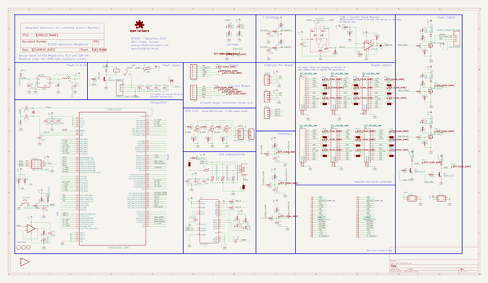

# bcn3dsigma_electronics
 
## summary 
* id: bcn3d_bcn3dsigma_electronics_bcn3d_electronics
* user: bcn3d
* name: bcn3dsigma_electronics
* board: bcn3d_electronics
* repo: https://github.com/BCN3D/BCN3DSigma-Electronics

* src_file_repo_sch: 
* src_file_repo_sch_link: https://github.com/BCN3D/BCN3DSigma-Electronics/tree/master/
* full details link: https://github.com/oomlout/oomlout_oomp_project_bot_v_2/tree/main/projects/bcn3d_bcn3dsigma_electronics_bcn3d_electronics/current_version/working  

## schematic  
  
[schematic (pdf)](working_schematic.pdf)  

## pcb  
 
  
  
  
[board (pdf)](working.pdf)  

## working_bom
| Id | Designator | Footprint | Quantity | Designation | Supplier and ref |  | None | 
| --- | --- | --- | --- | --- | --- | --- | --- | 
| 1 | LED1,LED2,LED3,PWR24,PWR5 | CHIPLED_0805 | 5 | Blue |  |  | [''] | 
| 2 | C21,C3,C19,C6,C24,C10,C20,C4,C5 | C0805 | 9 | 100n |  |  | [''] | 
| 3 | L14,L2,L18,L9,L7,L13,L8,L16,L11,L20,L6,L3,L21,L5,L4,L17,L15,L12,L19,L10 | 0805 | 20 |  |  |  | [''] | 
| 4 | STAT0 | CHIP-LED0805 | 1 | Orange |  |  | [''] | 
| 5 | R35,R19,R6,R33,R45,R43,R9,R21,R27,R47,R15,R22,R36,R20,R34,R12,R14,R46,R30 | M0805 | 19 | 1K |  |  | [''] | 
| 6 | R40,R1,R31,R10,R18,R13,R7,R42 | M0805 | 8 | 10K |  |  | [''] | 
| 7 | LM2595 | TO263-5 | 1 |  |  |  | [''] | 
| 8 | ATMEGA2560 | QFP50P1600X1600X120-100N | 1 | ATMEGA2560-16AU |  |  | [''] | 
| 9 | D4,D2,D6,D9,D7,D3,D5 | SMA-DIODE | 7 | MBRA140 |  |  | [''] | 
| 10 | SUPPLY0,HEATEDBED0 | MOLEX_MINIFIT-JR | 2 | PC4WAY |  |  | [''] | 
| 11 | FID3,FID2,FID1 | FIDUCIAL_1MM | 3 | FIDUCIAL |  |  | [''] | 
| 12 | Q4,Q9,Q5 | SOT23-3 | 3 | MMBT2222A |  |  | [''] | 
| 13 | I2C0,RGBLEDS0,UART1,LEDS1,ADC0 | 1X04 | 5 |  |  |  | [''] | 
| 14 | K1 | G5LE | 1 | G5L |  |  | [''] | 
| 15 | R44 | M0805 | 1 | 100K |  |  | [''] | 
| 16 | C18,C25 | C0805 | 2 | 10n |  |  | [''] | 
| 17 | D8,D10 | SOD123 | 2 | MBR0520LT |  |  | [''] | 
| 18 | IC3 | SO08 | 1 | LM311D |  |  | [''] | 
| 19 | R2,R11,R8 | M0805 | 3 | 5.6k |  |  | [''] | 
| 20 | C7 | CAPAE660X610N | 1 | 150UF |  |  | [''] | 
| 21 | ICSP0 | 2X3-NS | 1 | AVR_SPI_PRG_6NS |  |  | [''] | 
| 22 | R38 | R0805 | 1 | 5.6K |  |  | [''] | 
| 23 | Z0,E0,E1,X0,X1,Y0 | TE_FFC_CON1MM | 6 | FFC_15V_90G_1MM |  |  | [''] | 
| 24 | C15,C9,C11 | C0805 | 3 | 10u |  |  | [''] | 
| 25 | RXLED0,TXLED0 | CHIPLED_0805 | 2 | green |  |  | [''] | 
| 26 | R4,R5 | M0805 | 2 | 4.7k |  |  | [''] | 
| 27 | +24V0,+5V0 | JP2Q | 2 |  |  |  | [''] | 
| 28 | RESET0 | EVQ-Q2 | 1 | SPST |  |  | [''] | 
| 29 | LCD0,SD0 | 1X06 | 2 |  |  |  | [''] | 
| 30 | R16,R29,R26,R28,R17 | M0805 | 5 | 4.7K |  |  | [''] | 
| 31 | R41 | M0805 | 1 | 20K |  |  | [''] | 
| 32 | D1 | SMC | 1 |  |  |  | [''] | 
| 33 | Y1 | HC49US | 1 |  |  |  | [''] | 
| 34 | C23,C22 | C0805 | 2 | 0.1u |  |  | [''] | 
| 35 | VCC2 | JP1 | 1 |  |  |  | [''] | 
| 36 | C12,C13 | UD-8X10_NICHICON | 2 | 100u |  |  | [''] | 
| 37 | Q1,Q2,Q3 | SOIC8 | 3 | MOSFET-NSOIC8 |  |  | [''] | 
| 38 | R37 | M0805 | 1 | 10k |  |  | [''] | 
| 39 | Q7,Q6,Q8 | SOT23 | 3 |  |  |  | [''] | 
| 40 | U$6 | USB-B-PTH | 1 | USB+SHIELD |  |  | [''] | 
| 41 | IC1 | SO08 | 1 | LM358D |  |  | [''] | 
| 42 | C16,C14 | C1210K | 2 | 10u |  |  | [''] | 
| 43 | C2,C1 | C0805 | 2 | 22p |  |  | [''] | 
| 44 | R32 | M0805 | 1 | 330 |  |  | [''] | 
| 45 | @HOLE1,@HOLE0,@HOLE2 |  | 3 |  |  |  | [''] | 
| 46 | C17 | C0805 | 1 | 4.7u |  |  | [''] | 
| 47 | U1 | SOT23-5 | 1 | INA169 |  |  | [''] | 
| 48 | RSHUNT0 | R2512 | 1 | 10m |  |  | [''] | 
| 49 | F3 | MICROBUILDER_1206_PTC | 1 |  |  |  | [''] | 
| 50 | C8 | UD-8X10_NICHICON | 1 | 220u |  |  | [''] | 
| 51 | SH1 | SHORT_TOP-50 | 1 | SHORTT5 |  |  | [''] | 
| 52 | F1 | PTC-1206 | 1 | IN_PTC |  |  | [''] | 
| 53 | R3,R39 | R0805 | 2 | 1K |  |  | [''] | 
| 54 | U$5,U$8 | BCN3D_LOGO | 2 |  |  |  | [''] | 
| 55 | IC2 | SSOP28 | 1 | FT232RL |  |  | [''] | 
| 56 | R23,R25,R24 | CT_CN0805 | 3 | VARISTORCN0805 |  |  | [''] | 
| 57 | U$9 | FCIM_LOGO | 1 |  |  |  | [''] | 
| 58 | HOTEND1,HOTEND0 | 68612014422 | 2 | 68612014422 |  |  | [''] | 
| 59 | L1 | SSR1260 | 1 | 100u |  |  | [''] | 
| 60 | TP24,TP23,TP5,TP21,TP31,TP1,TP26,TP7,TP11,TP34,TP22,TP20,TP28,TP15,TP4,TP13,TP27,TP37,TP8,TP2,TP33,TP25,TP36,TP16,TP3,TP38,TP35,TP30,TP17,TP9,TP32,TP12,TP29,TP19,TP10 | B2,54 | 35 | TPB2,54 |  |  | [''] | 
| 61 | U$3 | FCC_10X4.175MM | 1 |  |  |  | [''] | 
| 62 | U$2 | TONNE_10.00 | 1 |  |  |  | [''] | 
| 63 | U$4 | CE-4MM | 1 |  |  |  | [''] | 
| 64 | LOGO1 | OSHW-LOGO-M | 1 | OSHW-LOGOM |  |  | [''] | 
| 65 | SJ1 | SJ | 1 |  |  |  | [''] | 

## bom_schematic
| Ref | Qnty | Value | Cmp name | Footprint | Description | Vendor | DNP | 
| --- | --- | --- | --- | --- | --- | --- | --- | 
| +5V0 | 1 | JP2Q | JP2Q | working:JP2Q |  |  |  | 
| +24V0 | 1 | JP2Q | JP2Q | working:JP2Q |  |  |  | 
| ADC0 | 1 | M04PTH | M04PTH | working:1X04 |  |  |  | 
| ATMEGA2560 | 1 | ATMEGA2560-16AU | ATMEGA2560-16AU | working:QFP50P1600X1600X120-100N |  |  |  | 
| C1, C2 | 2 | 22p | C-USC0805 | working:C0805 |  |  |  | 
| C3, C4, C5, C6, C10, C19, C20, C21, C24 | 9 | 100n | adafruit_C-USC0805 | working:C0805 |  |  |  | 
| C7 | 1 | EEE--CASE-D | EEE--CASE-D | working:CAPAE660X610N |  |  |  | 
| C8 | 1 | 220u | CPOL-USUD-8X10 | working:UD-8X10_NICHICON |  |  |  | 
| C9, C11, C15 | 3 | 10u | rcl_C-USC0805 | working:C0805 |  |  |  | 
| C12, C13 | 2 | 100u | CPOL-USUD-8X10 | working:UD-8X10_NICHICON |  |  |  | 
| C14, C16 | 2 | 10u | rcl_C-USC1210K | working:C1210K |  |  |  | 
| C17 | 1 | 4.7u | adafruit_C-USC0805 | working:C0805 |  |  |  | 
| C18, C25 | 2 | 10n | rcl_C-USC0805 | working:C0805 |  |  |  | 
| C22, C23 | 2 | 0.1u | rcl_C-USC0805 | working:C0805 |  |  |  | 
| D1 | 1 | SCHOTTKY-DIODESMC | SCHOTTKY-DIODESMC | working:SMC |  |  |  | 
| D2, D3, D4, D5, D6, D7, D9 | 7 | MBRA140 | DIODESMA | working:SMA-DIODE |  |  |  | 
| D8, D10 | 2 | MBR0520LT | MBR0520LT | working:SOD123 |  |  |  | 
| E0, E1 | 2 | FFC_15V_90G_1MM | FFC_15V_90G_1MM | working:TE_FFC_CON1MM |  |  |  | 
| F1 | 1 | PTCSMD | PTCSMD | working:PTC-1206 |  |  |  | 
| F3 | 1 | MICROBUILDER_PTC1206_L | MICROBUILDER_PTC1206_L | working:MICROBUILDER_1206_PTC |  |  |  | 
| FID1, FID2, FID3 | 3 | FIDUCIAL | FIDUCIAL | working:FIDUCIAL_1MM |  |  |  | 
| HEATEDBED0 | 1 | POWER_CONNECTOR_4WAY | POWER_CONNECTOR_4WAY | working:MOLEX_MINIFIT-JR |  |  |  | 
| HOTEND0, HOTEND1 | 2 | 68612014422 | 68612014422 | working:68612014422 |  |  |  | 
| I2C0 | 1 | M04PTH | M04PTH | working:1X04 |  |  |  | 
| IC1 | 1 | LM358D | LM358D | working:SO08 |  |  |  | 
| IC2 | 1 | FT232RL | FT232RL | working:SSOP28 |  |  |  | 
| IC3 | 1 | LM311D | LM311D | working:SO08 |  |  |  | 
| ICSP0 | 1 | AVR_SPI_PRG_6NS | AVR_SPI_PRG_6NS | working:2X3-NS |  |  |  | 
| K1 | 1 | G5L | G5L | working:G5LE |  |  |  | 
| L1 | 1 | 100u | INDUCTANCE | working:SSR1260 |  |  |  | 
| L2, L3, L4, L5, L6, L7, L8, L9, L10, L11, L12, L13, L14, L15, L16, L17, L18, L19, L20, L21 | 20 | WE-CBF_0805 | WE-CBF_0805 | working:0805 |  |  |  | 
| LCD0 | 1 | PINHD-1X6 | PINHD-1X6 | working:1X06 |  |  |  | 
| LED1, LED2, LED3 | 3 | Blue | led_LEDCHIPLED_0805 | working:CHIPLED_0805 |  |  |  | 
| LEDS1 | 1 | M04PTH | M04PTH | working:1X04 |  |  |  | 
| LM2595 | 1 | LM2595 | LM2595 | working:TO263-5 |  |  |  | 
| LOGO1 | 1 | OSHW-LOGOM | OSHW-LOGOM | working:OSHW-LOGO-M |  |  |  | 
| PWR5, PWR24 | 2 | Blue | led_LEDCHIPLED_0805 | working:CHIPLED_0805 |  |  |  | 
| Q1, Q2, Q3 | 3 | MOSFET-NSOIC8 | MOSFET-NSOIC8 | working:SOIC8 |  |  |  | 
| Q4, Q5, Q9 | 3 | MMBT2222A | TRANSISTOR_NPNMMBT2222A | working:SOT23-3 |  |  |  | 
| Q6, Q7, Q8 | 3 | MOSFET-NREFLOW | MOSFET-NREFLOW | working:SOT23 |  |  |  | 
| R1, R7, R10, R13, R18, R31, R40, R42 | 8 | 10K | R-US_M0805 | working:M0805 |  |  |  | 
| R2, R8, R11 | 3 | 5.6k | R-US_M0805 | working:M0805 |  |  |  | 
| R3, R39 | 2 | 1K | R-US_R0805 | working:R0805 |  |  |  | 
| R4, R5 | 2 | 4.7k | R-US_M0805 | working:M0805 |  |  |  | 
| R6, R9, R12, R14, R15, R19, R20, R21, R22, R27, R30, R33, R34, R35, R36, R43, R45, R46, R47 | 19 | 1K | R-US_M0805 | working:M0805 |  |  |  | 
| R16, R17, R26, R28, R29 | 5 | 4.7K | R-US_M0805 | working:M0805 |  |  |  | 
| R23, R24, R25 | 3 | VARISTORCN0805 | VARISTORCN0805 | working:CT_CN0805 |  |  |  | 
| R32 | 1 | 330 | adafruit_R-US_M0805 | working:M0805 |  |  |  | 
| R37 | 1 | 10k | adafruit_R-US_M0805 | working:M0805 |  |  |  | 
| R38 | 1 | 5.6K | R-US_R0805 | working:R0805 |  |  |  | 
| R41 | 1 | 20K | R-US_M0805 | working:M0805 |  |  |  | 
| R44 | 1 | 100K | R-US_M0805 | working:M0805 |  |  |  | 
| RESET0 | 1 | SPST_TACT-EVQQ2 | SPST_TACT-EVQQ2 | working:EVQ-Q2 |  |  |  | 
| RGBLEDS0 | 1 | M04PTH | M04PTH | working:1X04 |  |  |  | 
| RSHUNT0 | 1 | 10m | RESISTOR2512 | working:R2512 |  |  |  | 
| RXLED0 | 1 | green | led_LEDCHIPLED_0805 | working:CHIPLED_0805 |  |  |  | 
| SD0 | 1 | PINHD-1X6 | PINHD-1X6 | working:1X06 |  |  |  | 
| SH1 | 1 | SHORTT5 | SHORTT5 | working:SHORT_TOP-50 |  |  |  | 
| SJ1 | 1 | SJ | SJ | working:SJ |  |  |  | 
| STAT0 | 1 | Orange | LEDCHIP-LED0805 | working:CHIP-LED0805 |  |  |  | 
| SUPPLY0 | 1 | POWER_CONNECTOR_4WAY | POWER_CONNECTOR_4WAY | working:MOLEX_MINIFIT-JR |  |  |  | 
| TP1, TP2, TP3, TP4, TP5, TP7, TP8, TP9, TP10, TP11, TP12, TP13, TP15, TP16, TP17, TP19, TP20, TP21, TP22, TP23, TP24, TP25, TP26, TP27, TP28, TP29, TP30, TP31, TP32, TP33, TP34, TP35, TP36, TP37, TP38 | 35 | TPB2,54 | TPB2,54 | working:B2,54 |  |  |  | 
| TXLED0 | 1 | green | led_LEDCHIPLED_0805 | working:CHIPLED_0805 |  |  |  | 
| U1 | 1 | INA169 | INA169 | working:SOT23-5 |  |  |  | 
| U$6 | 1 | USB+SHIELD | USB+SHIELD | working:USB-B-PTH |  |  |  | 
| UART1 | 1 | M04PTH | M04PTH | working:1X04 |  |  |  | 
| VCC2 | 1 | JP1E | JP1E | working:JP1 |  |  |  | 
| X0, X1 | 2 | FFC_15V_90G_1MM | FFC_15V_90G_1MM | working:TE_FFC_CON1MM |  |  |  | 
| Y0 | 1 | FFC_15V_90G_1MM | FFC_15V_90G_1MM | working:TE_FFC_CON1MM |  |  |  | 
| Y1 | 1 | CRYSTALHC49US | CRYSTALHC49US | working:HC49US |  |  |  | 
| Z0 | 1 | FFC_15V_90G_1MM | FFC_15V_90G_1MM | working:TE_FFC_CON1MM |  |  |  | 

