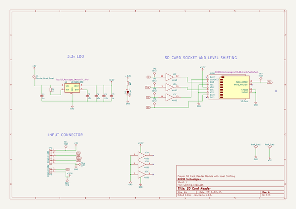
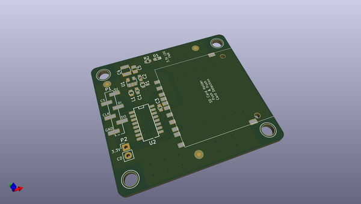
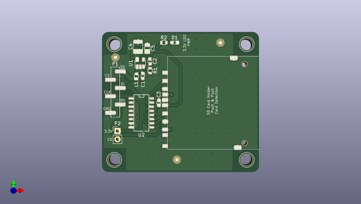
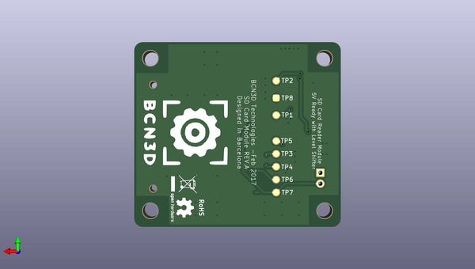

# bcn3dsigma_electronics
 
## summary 
* id: bcn3d_bcn3dsigma_electronics_sd_reader
* user: bcn3d
* name: bcn3dsigma_electronics
* board: sd_reader
* repo: https://github.com/BCN3D/BCN3DSigma-Electronics
* src_file_repo_kicad_pcb: SD Reader/SD_Reader.kicad_pcb
* src_file_repo_kicad_pcb_link: https://github.com/BCN3D/BCN3DSigma-Electronics/tree/master/SD Reader/SD_Reader.kicad_pcb

* src_file_repo_sch: SD Reader/SD_Reader.sch
* src_file_repo_sch_link: https://github.com/BCN3D/BCN3DSigma-Electronics/tree/master/SD Reader/SD_Reader.sch
* full details link: https://github.com/oomlout/oomlout_oomp_project_bot_v_2/tree/main/projects/bcn3d_bcn3dsigma_electronics_sd_reader/current_version/working  

## schematic  
  
[schematic (pdf)](working_schematic.pdf) 

## pcb  
 
  
  
  
[board (pdf)](working.pdf)  

## working_bom
| Id | Designator | Footprint | Quantity | Designation | Supplier and ref |  | None | 
| --- | --- | --- | --- | --- | --- | --- | --- | 
| 1 | C2 | C_0603 | 1 | 10n |  |  | [''] | 
| 2 | C3,C1 | C_0603 | 2 | 1u |  |  | [''] | 
| 3 | D1 | LED_0603 | 1 | LED_ALT |  |  | [''] | 
| 4 | L1 | R_0603 | 1 | Ferrite_Bead_Small |  |  | [''] | 
| 5 | R1,R2 | R_0603 | 2 | 1k |  |  | [''] | 
| 6 | U1 | SOT-23-5 | 1 | LD3985M33R |  |  | [''] | 
| 7 | U2 | SO-16-N | 1 | 4050 |  |  | [''] | 
| 8 | REF**,REF**,REF**,REF** | 1pin | 4 | 1pin |  |  | [''] | 
| 9 | REF**,REF**,REF**,REF**,REF**,REF**,REF**,REF**,REF**,REF**,REF**,REF**,REF**,REF**,REF**,REF**,REF**,REF**,REF**,REF**,REF**,REF**,REF**,REF**,REF**,REF**,REF**,REF**,REF**,REF**,REF**,REF**,REF**,REF**,REF**,REF**,REF**,REF**,REF**,REF**,REF**,REF**,REF**,REF**,REF** | Via-0.6mm | 45 | Via-0.6mm |  |  | [''] | 
| 10 | CON1 | WE_SD_Card_Push&Push | 1 | SD_Card |  |  | [''] | 
| 11 | C4 | C_1210 | 1 | 47u |  |  | [''] | 
| 12 | C5 | C_0805 | 1 | 10u |  |  | [''] | 
| 13 | P2 | Pin_Header_Straight_1x02_Pitch2.54mm | 1 | CONN_01X02 |  |  | [''] | 
| 14 | P1 | Pin_Header_Straight_1x06_Pitch2.54mm_SMD_Pin1Right | 1 | CONN_01X06 |  |  | [''] | 
| 15 | G*** | BCN3D_Logo_small | 1 | LOGO |  |  | [''] | 

## bom_schematic
| Ref | Qnty | Value | Cmp name | Footprint | Description | Vendor | DNP | 
| --- | --- | --- | --- | --- | --- | --- | --- | 
| C1, C3 | 2 | 1u | C_Small | Capacitors_SMD:C_0603 |  |  |  | 
| C2 | 1 | 10n | C_Small | Capacitors_SMD:C_0603 |  |  |  | 
| C4 | 1 | 47u | C_Small | Capacitors_SMD:C_1210 |  |  |  | 
| C5 | 1 | 10u | C_Small | Capacitors_SMD:C_0805 |  |  |  | 
| CON1 | 1 | SD_Card | SD_Card | BCN3D_Technologies:WE_SD_Card_Push&Push |  |  |  | 
| D1 | 1 | LED_ALT | LED_ALT | LEDs:LED_0603 |  |  |  | 
| L1 | 1 | Ferrite_Bead_Small | Ferrite_Bead_Small | Resistors_SMD:R_0603 |  |  |  | 
| P1 | 1 | CONN_01X06 | CONN_01X06 | Pin_Headers:Pin_Header_Straight_1x06_Pitch2.54mm_SMD_Pin1Right |  |  |  | 
| P2 | 1 | CONN_01X02 | CONN_01X02 | Pin_Headers:Pin_Header_Straight_1x02_Pitch2.54mm |  |  |  | 
| R1, R2 | 2 | 1k | R_Small | Resistors_SMD:R_0603 |  |  |  | 
| TP1, TP2, TP3, TP4, TP5, TP6, TP7, TP8 | 8 | TEST | TEST | Measurement_Points:Measurement_Point_Round-SMD-Pad_Small |  |  |  | 
| U1 | 1 | LD3985M33R | LD3985M33R | TO_SOT_Packages_SMD:SOT-23-5 |  |  |  | 
| U2 | 1 | 4050 | 4050 | SMD_Packages:SO-16-N |  |  |  | 

