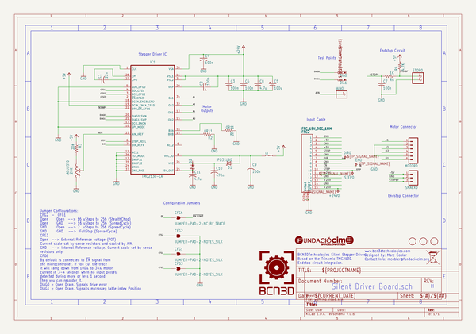
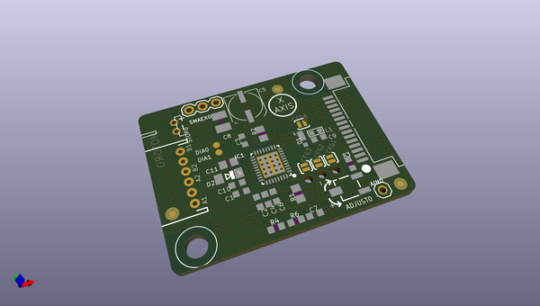
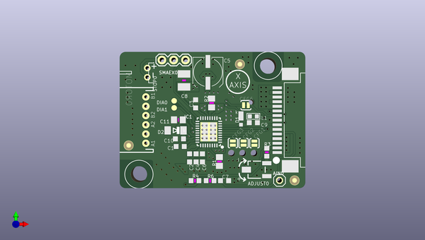
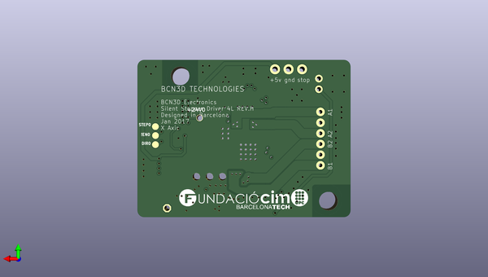

# bcn3dsigma_electronics
 
## summary 
* id: bcn3d_bcn3dsigma_electronics_silent_stepper_driver_x_axis
* user: bcn3d
* name: bcn3dsigma_electronics
* board: silent_stepper_driver_x_axis
* repo: https://github.com/BCN3D/BCN3DSigma-Electronics

* src_file_repo_sch: 
* src_file_repo_sch_link: https://github.com/BCN3D/BCN3DSigma-Electronics/tree/master/
* full details link: https://github.com/oomlout/oomlout_oomp_project_bot_v_2/tree/main/projects/bcn3d_bcn3dsigma_electronics_silent_stepper_driver_x_axis/current_version/working  

## schematic  
  
[schematic (pdf)](working_schematic.pdf) 

## pcb  
 
  
  
  
[board (pdf)](working.pdf)  

## working_bom
| Id | Designator | Footprint | Quantity | Designation | Supplier and ref |  | None | 
| --- | --- | --- | --- | --- | --- | --- | --- | 
| 1 | R1,R2 | R0805 | 2 | 0R11 |  |  | [''] | 
| 2 | IC1 | TMC_QFN36_0.5_5.0X6.0 | 1 |  TMC2130-LA  |  |  | [''] | 
| 3 | DIA0,DIA1 | TP12R | 2 | PTR1TP12R |  |  | [''] | 
| 4 | D2 | MINIMELF | 1 |  |  |  | [''] | 
| 5 | C9,C2,C6,C4,C3,C7 | C0603K | 6 | 100n |  |  | [''] | 
| 6 | L1 | L0603 | 1 |  |  |  | [''] | 
| 7 | R6 | R0603 | 1 | 1K |  |  | [''] | 
| 8 | CFG1,CFG3,CFG2 | PAD-JUMPER-2-NO_YES_SILK | 3 | JUMPER-PAD-2-NOYES_SILK |  |  | [''] | 
| 9 | @HOLE0,@HOLE2,@HOLE1 |  | 3 |  |  |  | [''] | 
| 10 | R4 | R0603 | 1 | 4.7K |  |  | [''] | 
| 11 | SMAEX0 | 1X03 | 1 |  |  |  | [''] | 
| 12 | U$2,U$3,U$4 | FIDUCIAL_1MM | 3 | FIDUCIAL |  |  | [''] | 
| 13 | STOP0 | JST-PH-2-THM-RA | 1 |  |  |  | [''] | 
| 14 | AIN0 | 1X01 | 1 |  |  |  | [''] | 
| 15 | C11 | C0805 | 1 | 4.7u |  |  | [''] | 
| 16 | C10 | C0603K | 1 | 470n |  |  | [''] | 
| 17 | FFC2 | TE_FFC_CON1MM | 1 | FFC_15V_90G_1MM |  |  | [''] | 
| 18 | C5 | UD-6,3X7,7_NICHICON | 1 | 100u |  |  | [''] | 
| 19 | ADJUST0 | 3223G | 1 | 20K |  |  | [''] | 
| 20 | CFG6 | PAD-JUMPER-2-NC_BY_TRACE_YES_SILK | 1 | JUMPER-PAD-2-NC_BY_TRACE |  |  | [''] | 
| 21 | R3 | R0603 | 1 | 20K |  |  | [''] | 
| 22 | D1 | POWERDI323 | 1 | PD3S160 |  |  | [''] | 
| 23 | C1 | C0603K | 1 | 22n |  |  | [''] | 
| 24 | C8 | C1210 | 1 | 4.7u |  |  | [''] | 
| 25 | MOTOR0 | JST-6-PTH | 1 |  |  |  | [''] | 
| 26 | STEP0,+24V0,DIR0,!EN0 | B1,27 | 4 | TPB1,27 |  |  | [''] | 
| 27 | U$5 | FCIM_LOGO | 1 |  |  |  | [''] | 

## bom_schematic
| Ref | Qnty | Value | Cmp name | Footprint | Description | Vendor | DNP | 
| --- | --- | --- | --- | --- | --- | --- | --- | 
| !EN0 | 1 | TPB1,27 | TPB1,27 | working:B1,27 |  |  |  | 
| +24V0 | 1 | TPB1,27 | TPB1,27 | working:B1,27 |  |  |  | 
| ADJUST0 | 1 | 20K | TRIM_US-3223G | working:3223G |  |  |  | 
| AIN0 | 1 | PINHD-1X1 | PINHD-1X1 | working:1X01 |  |  |  | 
| C1 | 1 | 22n | C-USC0603K | working:C0603K |  |  |  | 
| C2, C3, C4, C6, C7, C9 | 6 | 100n | C-USC0603K | working:C0603K |  |  |  | 
| C5 | 1 | 100u | CPOL-USUD-6,3X7,7 | working:UD-6,3X7,7_NICHICON |  |  |  | 
| C8 | 1 | 4.7u | C-USC1210 | working:C1210 |  |  |  | 
| C10 | 1 | 470n | C-USC0603K | working:C0603K |  |  |  | 
| C11 | 1 | 4.7u | C-USC0805 | working:C0805 |  |  |  | 
| CFG1, CFG2, CFG3 | 3 | JUMPER-PAD-2-NOYES_SILK | JUMPER-PAD-2-NOYES_SILK | working:PAD-JUMPER-2-NO_YES_SILK |  |  |  | 
| CFG6 | 1 | JUMPER-PAD-2-NC_BY_TRACE | JUMPER-PAD-2-NC_BY_TRACE | working:PAD-JUMPER-2-NC_BY_TRACE_YES_SILK |  |  |  | 
| D1 | 1 | PD3S160 | PD3S160 | working:POWERDI323 |  |  |  | 
| D2 | 1 | DIODE-MINIMELF | DIODE-MINIMELF | working:MINIMELF |  |  |  | 
| DIA0, DIA1 | 2 | PTR1TP12R | PTR1TP12R | working:TP12R |  |  |  | 
| DIR0 | 1 | TPB1,27 | TPB1,27 | working:B1,27 |  |  |  | 
| FFC2 | 1 | FFC_15V_90G_1MM | FFC_15V_90G_1MM | working:TE_FFC_CON1MM |  |  |  | 
| IC1 | 1 | TMC2130-LA | TMC2130-LA | working:TMC_QFN36_0.5_5.0X6.0 |  |  |  | 
| L1 | 1 | INDUCTOR/FERRITE-BEAD'0603' | INDUCTOR/FERRITE-BEAD'0603' | working:L0603 |  |  |  | 
| MOTOR0 | 1 | M06 | M06 | working:JST-6-PTH |  |  |  | 
| R1, R2 | 2 | 0R11 | R-US_R0805 | working:R0805 |  |  |  | 
| R3 | 1 | 20K | R-US_R0603 | working:R0603 |  |  |  | 
| R4 | 1 | 4.7K | R-US_R0603 | working:R0603 |  |  |  | 
| R6 | 1 | 1K | R-US_R0603 | working:R0603 |  |  |  | 
| SMAEX0 | 1 | M03PTH | M03PTH | working:1X03 |  |  |  | 
| STEP0 | 1 | TPB1,27 | TPB1,27 | working:B1,27 |  |  |  | 
| STOP0 | 1 | JST_2PIN-THM-RA | JST_2PIN-THM-RA | working:JST-PH-2-THM-RA |  |  |  | 
| U$2, U$3, U$4 | 3 | FIDUCIAL | FIDUCIAL | working:FIDUCIAL_1MM |  |  |  | 

