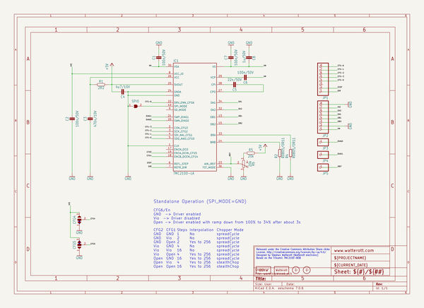

# bcn3dsigma_electronics
 
## summary 
* id: bcn3d_bcn3dsigma_electronics_silentstepstick_v11
* user: bcn3d
* name: bcn3dsigma_electronics
* board: silentstepstick_v11
* repo: https://github.com/BCN3D/BCN3DSigma-Electronics

* src_file_repo_sch: 
* src_file_repo_sch_link: https://github.com/BCN3D/BCN3DSigma-Electronics/tree/master/
* full details link: https://github.com/oomlout/oomlout_oomp_project_bot_v_2/tree/main/projects/bcn3d_bcn3dsigma_electronics_silentstepstick_v11/current_version/working  

## schematic  
  
[schematic (pdf)](working_schematic.pdf)  

## pcb  
 
  
  
  
[board (pdf)](working.pdf)  

## working_bom
| Id | Designator | Footprint | Quantity | Designation | Supplier and ref |  | None | 
| --- | --- | --- | --- | --- | --- | --- | --- | 
| 1 | X1,X2 | PASSER_07MM | 2 | PASSER-07 |  |  | [''] | 
| 2 | R6 | POT_EVM3R | 1 | 20k |  |  | [''] | 
| 3 | IC1 | QFN36-PAD | 1 | TMC2100-LA |  |  | [''] | 
| 4 | JP3,JP4,JP5 | 1X01 | 3 |  |  |  | [''] | 
| 5 | R4,R2 | M0805 | 2 | R0805/0R11 |  |  | [''] | 
| 6 | R1 | C0402 | 1 | 2R2 |  |  | [''] | 
| 7 | CFG4,CFG5 | JUMPER3-0201 | 2 | JUMPER3-0201 |  |  | [''] | 
| 8 | C6,C7,C1,C2 | C0402 | 4 | 100n/50V |  |  | [''] | 
| 9 | C5 | C0402 | 1 | 22n/50V |  |  | [''] | 
| 10 | C8 | C0603 | 1 | 1u/50V |  |  | [''] | 
| 11 | JP2,JP1 | 1X08-S | 2 |  |  |  | [''] | 
| 12 | SPI0 | JUMPER2-0402_NC | 1 | JUMPER2-0402-NC |  |  | [''] | 
| 13 | C3 | C0402 | 1 | 470n/10V |  |  | [''] | 
| 14 | C4 | C0402 | 1 | 4u7/10V |  |  | [''] | 
| 15 | R5 | C0402 | 1 | 20k |  |  | [''] | 
| 16 | LOGO2 | SPARK_TPLACE_M | 1 | LOGO-S_PLACE_M |  |  | [''] | 
| 17 | LOGO1 | OSHW_6X70 | 1 | OSHW_LOGOX0070 |  |  | [''] | 

## bom_schematic
| Ref | Qnty | Value | Cmp name | Footprint | Description | Vendor | DNP | 
| --- | --- | --- | --- | --- | --- | --- | --- | 
| C1, C2, C6, C7 | 4 | 100n/50V | CAPACITOR-0402 | working:C0402 |  |  |  | 
| C3 | 1 | 470n/10V | CAPACITOR-0402 | working:C0402 |  |  |  | 
| C4 | 1 | 4u7/10V | CAPACITOR-0402 | working:C0402 |  |  |  | 
| C5 | 1 | 22n/50V | CAPACITOR-0402 | working:C0402 |  |  |  | 
| C8 | 1 | 1u/50V | C-EUC0603 | working:C0603 |  |  |  | 
| CFG4, CFG5 | 2 | JUMPER3-0201 | JUMPER3-0201 | working:JUMPER3-0201 |  |  |  | 
| IC1 | 1 | TMC2100-LA | TMC2100-LA | working:QFN36-PAD |  |  |  | 
| JP1, JP2 | 2 | PINHD-1X08_2.54-S | PINHD-1X08_2.54-S | working:1X08-S |  |  |  | 
| JP3, JP4, JP5 | 3 | PINHD-1X1 | PINHD-1X1 | working:1X01 |  |  |  | 
| LOGO1 | 1 | OSHW_LOGOX0070 | OSHW_LOGOX0070 | working:OSHW_6X70 |  |  |  | 
| LOGO2 | 1 | LOGO-S_PLACE_M | LOGO-S_PLACE_M | working:SPARK_TPLACE_M |  |  |  | 
| R1 | 1 | 2R2 | RESISTOR-0402 | working:C0402 |  |  |  | 
| R2, R4 | 2 | R0805/0R11 | R-EU_M0805 | working:M0805 |  |  |  | 
| R5 | 1 | 20k | RESISTOR-0402 | working:C0402 |  |  |  | 
| R6 | 1 | 20k | POTEVM3R | working:POT_EVM3R |  |  |  | 
| SPI0 | 1 | JUMPER2-0402-NC | JUMPER2-0402-NC | working:JUMPER2-0402_NC |  |  |  | 
| X1, X2 | 2 | PASSER-07 | PASSER-07 | working:PASSER_07MM |  |  |  | 

