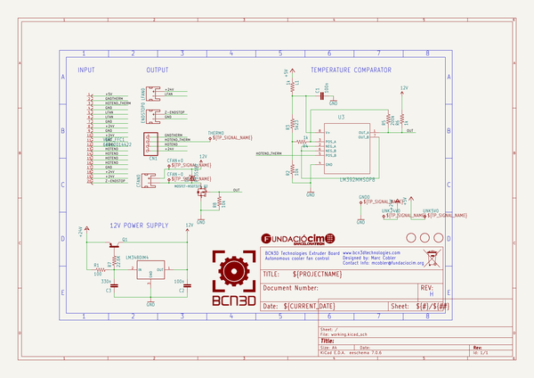
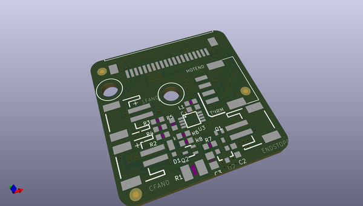
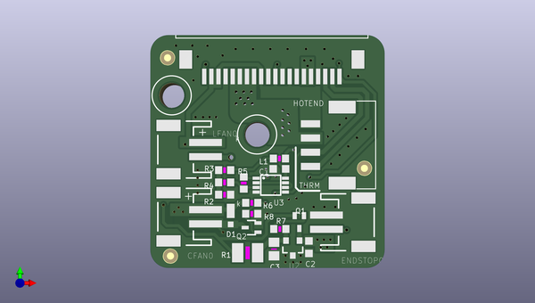
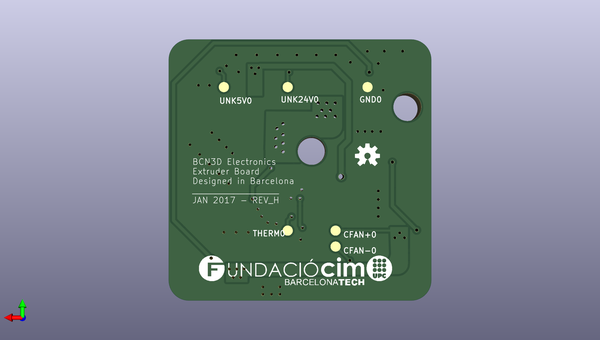

# bcn3dsigma_electronics
 
## summary 
* id: bcn3d_bcn3dsigma_electronics_smart_extruder_board
* user: bcn3d
* name: bcn3dsigma_electronics
* board: smart_extruder_board
* repo: https://github.com/BCN3D/BCN3DSigma-Electronics

* src_file_repo_sch: 
* src_file_repo_sch_link: https://github.com/BCN3D/BCN3DSigma-Electronics/tree/master/
* full details link: https://github.com/oomlout/oomlout_oomp_project_bot_v_2/tree/main/projects/bcn3d_bcn3dsigma_electronics_smart_extruder_board/current_version/working  

## schematic  
  
[schematic (pdf)](working_schematic.pdf) 

## pcb  
 
  
  
  
[board (pdf)](working.pdf)  

## working_bom
| Id | Designator | Footprint | Quantity | Designation | Supplier and ref |  | None | 
| --- | --- | --- | --- | --- | --- | --- | --- | 
| 1 | @HOLE0,@HOLE1 |  | 2 |  |  |  | [''] | 
| 2 | C2,C1 | C0603K | 2 | 100n |  |  | [''] | 
| 3 | CFAN0,LFAN0,ENDSTOP0 | JST-2-SMD | 3 |  |  |  | [''] | 
| 4 | R8,R2 | R0603 | 2 | 10k |  |  | [''] | 
| 5 | R6,L1,R4 | R0603 | 3 | 1k |  |  | [''] | 
| 6 | R5 | R0603 | 1 | 200k |  |  | [''] | 
| 7 | U2 | SOT23-3 | 1 | LM3480IM4 |  |  | [''] | 
| 8 | R1 | R1210 | 1 | 100 |  |  | [''] | 
| 9 | U$1,U$2,U$3 | FIDUCIAL_1MM | 3 | FIDUCIAL |  |  | [''] | 
| 10 | U3 | MSOP8 | 1 | LM392MMSOP8 |  |  | [''] | 
| 11 | CN1 | JST_PA_04 | 1 |  |  |  | [''] | 
| 12 | D1 | POWERDI323 | 1 | PD3S160 |  |  | [''] | 
| 13 | Q2 | SOT323 | 1 | MOSFET-NSOT323 |  |  | [''] | 
| 14 | Q1 | SOT323-BEC | 1 | BC807W |  |  | [''] | 
| 15 | R3 | R0603 | 1 | 5k23 |  |  | [''] | 
| 16 | C3 | C0805 | 1 | 330n |  |  | [''] | 
| 17 | VERT_FFC1 | 68612014422 | 1 | 68612014422 |  |  | [''] | 
| 18 | R7 | R0603 | 1 | 22.6K |  |  | [''] | 
| 19 | GND0,THERM0,CFAN-0,UNK5V0,UNK24V0,CFAN+0 | B1,27 | 6 | TPB1,27 |  |  | [''] | 
| 20 | U$5 | OSHW-LOGO-S | 1 |  |  |  | [''] | 
| 21 | U$6 | FCIM_LOGO | 1 |  |  |  | [''] | 

## bom_schematic
| Ref | Qnty | Value | Cmp name | Footprint | Description | Vendor | DNP | 
| --- | --- | --- | --- | --- | --- | --- | --- | 
| C1, C2 | 2 | 100n | C-EUC0603K | working:C0603K |  |  |  | 
| C3 | 1 | 330n | C-EUC0805 | working:C0805 |  |  |  | 
| CFAN0 | 1 | JST_2MM_MALE | JST_2MM_MALE | working:JST-2-SMD |  |  |  | 
| CFAN+0 | 1 | TPB1,27 | TPB1,27 | working:B1,27 |  |  |  | 
| CFAN-0 | 1 | TPB1,27 | TPB1,27 | working:B1,27 |  |  |  | 
| CN1 | 1 | JST_4PINPA | JST_4PINPA | working:JST_PA_04 |  |  |  | 
| D1 | 1 | PD3S160 | PD3S160 | working:POWERDI323 |  |  |  | 
| ENDSTOP0 | 1 | JST_2MM_MALE | JST_2MM_MALE | working:JST-2-SMD |  |  |  | 
| GND0 | 1 | TPB1,27 | TPB1,27 | working:B1,27 |  |  |  | 
| L1 | 1 | 1k | R-US_R0603 | working:R0603 |  |  |  | 
| LFAN0 | 1 | JST_2MM_MALE | JST_2MM_MALE | working:JST-2-SMD |  |  |  | 
| Q1 | 1 | BC807W | BC807W | working:SOT323-BEC |  |  |  | 
| Q2 | 1 | MOSFET-NSOT323 | MOSFET-NSOT323 | working:SOT323 |  |  |  | 
| R1 | 1 | 100 | R-US_R1210 | working:R1210 |  |  |  | 
| R2, R8 | 2 | 10k | R-US_R0603 | working:R0603 |  |  |  | 
| R3 | 1 | 5k23 | R-US_R0603 | working:R0603 |  |  |  | 
| R4, R6 | 2 | 1k | R-US_R0603 | working:R0603 |  |  |  | 
| R5 | 1 | 200k | R-US_R0603 | working:R0603 |  |  |  | 
| R7 | 1 | 22.6K | R-US_R0603 | working:R0603 |  |  |  | 
| THERM0 | 1 | TPB1,27 | TPB1,27 | working:B1,27 |  |  |  | 
| U2 | 1 | LM3480IM4 | LM3480IM4 | working:SOT23-3 |  |  |  | 
| U3 | 1 | LM392MMSOP8 | LM392MMSOP8 | working:MSOP8 |  |  |  | 
| U$1, U$2, U$3 | 3 | FIDUCIAL | FIDUCIAL | working:FIDUCIAL_1MM |  |  |  | 
| UNK5V0 | 1 | TPB1,27 | TPB1,27 | working:B1,27 |  |  |  | 
| UNK24V0 | 1 | TPB1,27 | TPB1,27 | working:B1,27 |  |  |  | 
| VERT_FFC1 | 1 | 68612014422 | 68612014422 | working:68612014422 |  |  |  | 

