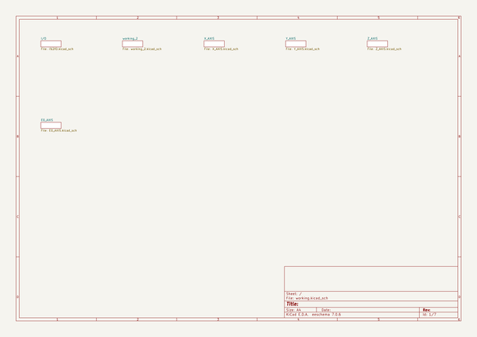

# bcn3dsigma_electronics
 
## summary 
* id: bcn3d_bcn3dsigma_electronics_tmc5130_3d_printer_board_v_2
* user: bcn3d
* name: bcn3dsigma_electronics
* board: tmc5130_3d_printer_board_v_2
* repo: https://github.com/BCN3D/BCN3DSigma-Electronics

* src_file_repo_sch: 
* src_file_repo_sch_link: https://github.com/BCN3D/BCN3DSigma-Electronics/tree/master/
* full details link: https://github.com/oomlout/oomlout_oomp_project_bot_v_2/tree/main/projects/bcn3d_bcn3dsigma_electronics_tmc5130_3d_printer_board_v_2/current_version/working  

## schematic  
  
[schematic (pdf)](working_schematic.pdf) 

## pcb  
 
  
  
  
[board (pdf)](working.pdf)  

## working_bom
| Id | Designator | Footprint | Quantity | Designation | Supplier and ref |  | None | 
| --- | --- | --- | --- | --- | --- | --- | --- | 
| 1 | T2,T3,T1 | DFN3X3_8L | 3 | AON7508 |  |  | [''] | 
| 2 | HEATBED0,EX_0,FAN0 | RIA_AKL_220_2_PINS | 3 | RIA_AKL_220_2_PINS |  |  | [''] | 
| 3 | C31,C19,C27,C11,C23,C4,C6,C35 | C0603 | 8 | 4.7µF |  |  | [''] | 
| 4 | C45,C46,C1,C48,C44,C47,C49,C40 | 0603 | 8 | 1nF |  |  | [''] | 
| 5 | C34,C13,C12,C22,C15,C41,C20,C26,C2,C7,C14,C32,C30,C36,C24,C28,C16,C5,C39,C18,C3,C10,C38 | C0603 | 23 | 100nF |  |  | [''] | 
| 6 | AUX-2 | AVR_ICSP | 1 |  |  |  | [''] | 
| 7 | R29,R21,R28,R33,R19,R27,R34,R1,RL2,R24,R26,R3,R20,RL3,R2 | R0603 | 15 | 4.7kΩ |  |  | [''] | 
| 8 | R4,R25,R31,R9,R8,R22,R23,R32,R30 | R0603 | 9 | 100Ω |  |  | [''] | 
| 9 | R_PD7,R_PD8,R_PD12,R_PD10,R_PD9,R_PD11,R_PD6,R_PD13 | R0603 | 8 | 100kΩ |  |  | [''] | 
| 10 | Z_MOTOR_1,Z_MOTOR_2,Y_MOTOR0,X_MOTOR0,E0_MOTOR0 | 4PIN_1ROW_2.54_THT | 5 |  |  |  | [''] | 
| 11 | C21,C9,C37 | 0603 | 3 | 470nF |  |  | [''] | 
| 12 | D2,D5,D4,D6 | SMB | 4 | SMBJ43A |  |  | [''] | 
| 13 | VM1,VM0,THERM1,THERM2,THERM0 | 2PIN_1ROW_2.54_THT | 5 | 2PIN_1ROW |  |  | [''] | 
| 14 | Z_ENDSTOP0,X_ENDSTOP0,Y_ENDSTOP0,E0_ENDSTOP0 | 5PIN_1ROW_2.54_THT | 4 | 5PIN_1ROWTHT |  |  | [''] | 
| 15 | C43,C42 | E5-10,5 | 2 | 1000µ 30V |  |  | [''] | 
| 16 | AUX-4 | 1X18 | 1 |  |  |  | [''] | 
| 17 | R16,R11,R13,R17,R7,R10,R5,R14 | R1206 | 8 | R1206,0R15/0.5W |  |  | [''] | 
| 18 | LED4,LED1,LED6 | CHIPLED_0603 | 3 | RED |  |  | [''] | 
| 19 | XTAL0 | SM77H | 1 | SM77H 16MHz |  |  | [''] | 
| 20 | D_HB0,D_HB1,D_HB2 | MICRO_SMP | 3 | MSS1P6 |  |  | [''] | 
| 21 | LED3,LED2 | CHIPLED_0603 | 2 | GREEN |  |  | [''] | 
| 22 | F2,F1 | LITTLEFUSE_TR5_383_SERIES | 2 | LITTLEFUSE_TR5_383_SERIES |  |  | [''] | 
| 23 | R12,R6,R18,R15 | 0603 | 4 | 2.2Ω |  |  | [''] | 
| 24 | SERVO0,I2C0 | 1X04 | 2 |  |  |  | [''] | 
| 25 | SHIELD0 | ARDUINO_MEGA_SHIELD | 1 | ARDUINO_MEGA_SHIELD_BIG |  |  | [''] | 
| 26 | IC2,IC1,IC6 | US8_DCU | 3 | SN74LVC3G17DCUR |  |  | [''] | 
| 27 | TMC2,TMC3,TMC5130,TMC1 | QFP50P900X900X113-49N_NOFID | 4 |  |  |  | [''] | 
| 28 | AUX-3,SERV_SUPPLY0,AUX-1 | 2X4 | 3 |  |  |  | [''] | 
| 29 | C25,C8,C17,C33 | C0603 | 4 | 22nF |  |  | [''] | 
| 30 | C29 | C0603 | 1 | C0603/470nF/16V |  |  | [''] | 
| 31 | U$10 | TRINAMIC_LOGO_WHITE_NOTEXT | 1 |  |  |  | [''] | 
| 32 | MAIN_IN0 | RIA_AKL_220_4_PINS | 1 | RIA_AKL_220_4_PINS |  |  | [''] | 
| 33 | S1 | B3F-10XX | 1 |  |  |  | [''] | 
| 34 | U$11 | TRAMS_PRINT | 1 |  |  |  | [''] | 

## bom_schematic
no data

