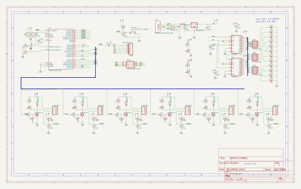

# hotend_test_bench
 
## summary 
* id: bcn3d_hotend_test_bench_testbench
* user: bcn3d
* name: hotend_test_bench
* board: testbench
* repo: https://github.com/BCN3D/Hotend-Test-Bench

* src_file_repo_sch: 
* src_file_repo_sch_link: https://github.com/BCN3D/Hotend-Test-Bench/tree/master/
* full details link: https://github.com/oomlout/oomlout_oomp_project_bot_v_2/tree/main/projects/bcn3d_hotend_test_bench_testbench/current_version/working  

## schematic  
  
[schematic (pdf)](working_schematic.pdf)  

## pcb  
 
  
  
  
[board (pdf)](working.pdf)  

## working_bom
| Id | Designator | Footprint | Quantity | Designation | Supplier and ref |  | None | 
| --- | --- | --- | --- | --- | --- | --- | --- | 
| 1 | R21,R13,R5,R17,R1,R9,R25 | R0805 | 7 | 5k6 |  |  | [''] | 
| 2 | C3,C12,C1,C13,C18,C15,C17,C11,C6,C19,C10,C9,C4,C16,C5,C2 | C0805K | 16 | 100n |  |  | [''] | 
| 3 | F1 | PTC-1206-WIDE | 1 | PTCSMD-W |  |  | [''] | 
| 4 | C7,C8 | C0805K | 2 | 22p |  |  | [''] | 
| 5 | R11,R15,R7,R23,R26,R3,R19 | R0805 | 7 | 10k |  |  | [''] | 
| 6 | R14,R18,R10,R2,R22,R6 | R0805 | 6 | 100 |  |  | [''] | 
| 7 | D5,D1,D7,D3,D4,D6,D2 | SMA-DIODE | 7 | MBRA140 |  |  | [''] | 
| 8 | R20,R8,R24,R12,R4,R16 | R0805 | 6 | 4k7 |  |  | [''] | 
| 9 | Q3,Q2,Q6,Q4,Q1,Q5 | SOIC8 | 6 | MOSFET-N |  |  | [''] | 
| 10 | C14 | C0805K | 1 | 330n |  |  | [''] | 
| 11 | LED3,LED1,LED5,LED4,LED6,LED2,LED16,LED13,LED14,LED18,+5V0,LED15,LED10,LED8,LED11,LED17,LED9,LED12,LED7,+24V0 | CHIP-LED0805 | 20 |  |  |  | [''] | 
| 12 | PC1 | MOLEX_MINIFIT-JR | 1 | POWER INPUT |  |  | [''] | 
| 13 | HOTEND5,HOTEND6,HOTEND1,HOTEND3,HOTEND2,HOTEND4 | 1X04 | 6 |  |  |  | [''] | 
| 14 | @HOLE0,@HOLE1 |  | 2 |  |  |  | [''] | 
| 15 | U1 | TQFP32-08 | 1 | ATMEGA328P_TQFP |  |  | [''] | 
| 16 | IC2,IC1 | SO16 | 2 | 74LS595D |  |  | [''] | 
| 17 | RESET0 | EVQ-Q2 | 1 | SPST_TACT-EVQQ2 |  |  | [''] | 
| 18 | U$3 | OSHW-LOGO-L | 1 |  |  |  | [''] | 
| 19 | ICSP0 | 2X3 | 1 | AVR_SPI_PRG_6PTH |  |  | [''] | 
| 20 | Y1 | HC49US | 1 | 16MHz |  |  | [''] | 
| 21 | U2 | TO-252 | 1 | KA7805ERTF |  |  | [''] | 
| 22 | JP8 | FTDI_BASIC | 1 | FTDI_BASICPTH |  |  | [''] | 
| 23 | RN2,RN3,RN1 | CTS742C083 | 3 | CTS742C083 |  |  | [''] | 
| 24 | R27 | R0805 | 1 | 1k |  |  | [''] | 
| 25 | U$2 | BCN3D_LOGO | 1 |  |  |  | [''] | 
| 26 | U$1 | FCIM_LOGO | 1 |  |  |  | [''] | 

## bom_schematic
| Ref | Qnty | Value | Cmp name | Footprint | Description | Vendor | DNP | 
| --- | --- | --- | --- | --- | --- | --- | --- | 
| +5V0 | 1 | LEDCHIP-LED0805 | LEDCHIP-LED0805 | working:CHIP-LED0805 |  |  |  | 
| +24V0 | 1 | LEDCHIP-LED0805 | LEDCHIP-LED0805 | working:CHIP-LED0805 |  |  |  | 
| C1, C2, C3, C4, C5, C6, C9, C10, C11, C12, C13, C15, C16, C17, C18, C19 | 16 | 100n | C-USC0805K | working:C0805K |  |  |  | 
| C7, C8 | 2 | 22p | C-USC0805K | working:C0805K |  |  |  | 
| C14 | 1 | 330n | C-USC0805K | working:C0805K |  |  |  | 
| D1, D2, D3, D4, D5, D6, D7 | 7 | MBRA140 | MBRA140 | working:SMA-DIODE |  |  |  | 
| F1 | 1 | PTCSMD-W | PTCSMD-W | working:PTC-1206-WIDE |  |  |  | 
| HOTEND1, HOTEND2, HOTEND3, HOTEND4, HOTEND5, HOTEND6 | 6 | PINHD-1X4 | PINHD-1X4 | working:1X04 |  |  |  | 
| IC1, IC2 | 2 | 74595D | 74595D | working:SO16 |  |  |  | 
| ICSP0 | 1 | AVR_SPI_PRG_6PTH | AVR_SPI_PRG_6PTH | working:2X3 |  |  |  | 
| JP8 | 1 | FTDI_BASICPTH | FTDI_BASICPTH | working:FTDI_BASIC |  |  |  | 
| LED1, LED2, LED3, LED4, LED5, LED6, LED7, LED8, LED9, LED10, LED11, LED12, LED13, LED14, LED15, LED16, LED17, LED18 | 18 | LEDCHIP-LED0805 | LEDCHIP-LED0805 | working:CHIP-LED0805 |  |  |  | 
| PC1 | 1 | POWER_CONNECTOR_4WAY | POWER_CONNECTOR_4WAY | working:MOLEX_MINIFIT-JR |  |  |  | 
| Q1, Q2, Q3, Q4, Q5, Q6 | 6 | MOSFET-N | MarcEagleParts_MOSFET-N | working:SOIC8 |  |  |  | 
| R1, R5, R9, R13, R17, R21, R25 | 7 | 5k6 | R-US_R0805 | working:R0805 |  |  |  | 
| R2, R6, R10, R14, R18, R22 | 6 | 100 | R-US_R0805 | working:R0805 |  |  |  | 
| R3, R7, R11, R15, R19, R23, R26 | 7 | 10k | R-US_R0805 | working:R0805 |  |  |  | 
| R4, R8, R12, R16, R20, R24 | 6 | 4k7 | R-US_R0805 | working:R0805 |  |  |  | 
| R27 | 1 | 1k | R-US_R0805 | working:R0805 |  |  |  | 
| RESET0 | 1 | SPST_TACT-EVQQ2 | SPST_TACT-EVQQ2 | working:EVQ-Q2 |  |  |  | 
| RN1, RN2, RN3 | 3 | CTS742C083 | CTS742C083 | working:CTS742C083 |  |  |  | 
| U1 | 1 | ATMEGA328P_TQFP | ATMEGA328P_TQFP | working:TQFP32-08 |  |  |  | 
| U2 | 1 | KA7805ERTF | V_REG_78XX7812 | working:TO-252 |  |  |  | 
| Y1 | 1 | 16MHz | CRYSTALHC49US | working:HC49US |  |  |  | 

