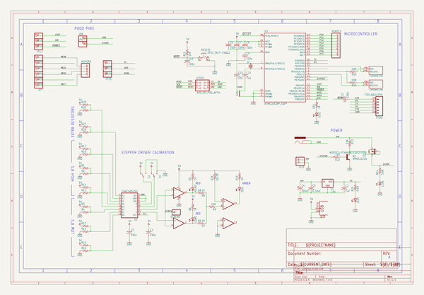
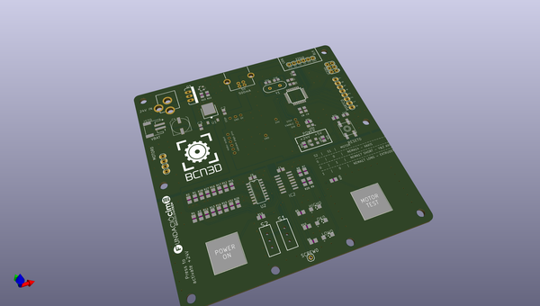
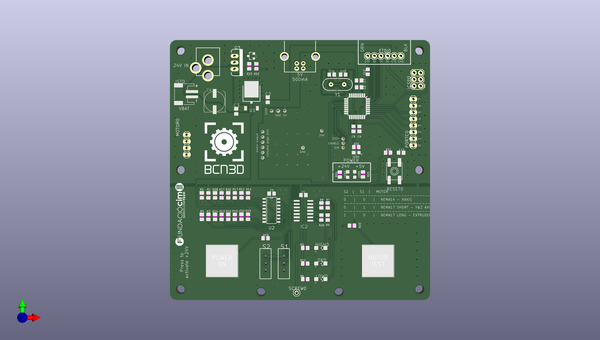
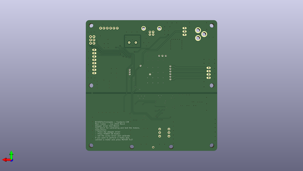

# stepper_driver_testbench
 
## summary 
* id: bcn3d_stepper_driver_testbench_stepper_driver_jig_top
* user: bcn3d
* name: stepper_driver_testbench
* board: stepper_driver_jig_top
* repo: https://github.com/BCN3D/Stepper-Driver-testbench

* src_file_repo_sch: 
* src_file_repo_sch_link: https://github.com/BCN3D/Stepper-Driver-testbench/tree/master/
* full details link: https://github.com/oomlout/oomlout_oomp_project_bot_v_2/tree/main/projects/bcn3d_stepper_driver_testbench_stepper_driver_jig_top/current_version/working  

## schematic  
  
[schematic (pdf)](working_schematic.pdf)  

## pcb  
 
  
  
  
[board (pdf)](working.pdf)  

## working_bom
| Id | Designator | Footprint | Quantity | Designation | Supplier and ref |  | None | 
| --- | --- | --- | --- | --- | --- | --- | --- | 
| 1 | R18,R15,R12,R30,R28,R17,R14,R16,R11,R13,R1,R2,R3,R27,R4,R29 | M0805 | 16 |  |  |  | [''] | 
| 2 | C10,C11 | C0805 | 2 | 22p |  |  | [''] | 
| 3 | PORTC0 | 1X08 | 1 |  |  |  | [''] | 
| 4 | R19,R20 | M0805 | 2 | 10M |  |  | [''] | 
| 5 | @HOLE1,@HOLE0 |  | 2 |  |  |  | [''] | 
| 6 | RESET0 | EVQ-Q2 | 1 | SPST_TACT-EVQQ2 |  |  | [''] | 
| 7 | U$3 | USB-B-PTH | 1 | USB+SHIELD |  |  | [''] | 
| 8 | U$7,U$9,U$6,U$4,U$8,U$5 | STAND-OFF | 6 |  |  |  | [''] | 
| 9 | R24,R25 | M0805 | 2 | 5.6K |  |  | [''] | 
| 10 | R26,R8,R7 | M0805 | 3 | 68.1K |  |  | [''] | 
| 11 | C8,C5,C9,C12,C7,C13,C6,C1 | C0805 | 8 | 100n |  |  | [''] | 
| 12 | JP5,JP9,JP14,JP12,JP7,JP13,JP6,JP4,JP11,JP3,JP15,JP2,JP10,JP8 | POGOPIN | 14 |  |  |  | [''] | 
| 13 | C2 | C0805 | 1 | 1uF |  |  | [''] | 
| 14 | R21,R23,R9 | M0805 | 3 | 10K |  |  | [''] | 
| 15 | C3 | C0805 | 1 | 0.33uF |  |  | [''] | 
| 16 | R31,R5,R10,R6 | M0805 | 4 | 1K |  |  | [''] | 
| 17 | C4 | UD-8X10_NICHICON | 1 | 100uF |  |  | [''] | 
| 18 | JP1 | POWER_JACK_PTH | 1 | POWER_JACKPTH |  |  | [''] | 
| 19 | U$2,U$1 | CAPSENSE_PAD | 2 | CAPSENSE_PAD |  |  | [''] | 
| 20 | LED1 | CHIP-LED0805 | 1 |  |  |  | [''] | 
| 21 | SH1 | SHORT_TOP-50 | 1 | SHORTT5 |  |  | [''] | 
| 22 | U$11 | BCN3D_LOGO | 1 |  |  |  | [''] | 
| 23 | MOTOR0 | 1X04 | 1 |  |  |  | [''] | 
| 24 | U2 | SO16 | 1 | 74HC4052 |  |  | [''] | 
| 25 | R22 | M0805 | 1 | 100 |  |  | [''] | 
| 26 | LED5,LED4 | CHIPLED_0805 | 2 |  |  |  | [''] | 
| 27 | JST0 | JST-PH-2-SMT-RA | 1 |  |  |  | [''] | 
| 28 | ICSP0 | 2X3 | 1 | AVR_SPI_PRG_6PTH |  |  | [''] | 
| 29 | FTDI0 | FTDI_BASIC | 1 | FTDI_BASICPTH |  |  | [''] | 
| 30 | IC2 | SO14 | 1 | LM339D |  |  | [''] | 
| 31 | U$10 | FCIM_LOGO | 1 |  |  |  | [''] | 
| 32 | SCREW0 | 1X01 | 1 |  |  |  | [''] | 
| 33 | LOW0,HIGH0,OK0 | CHIPLED_1206 | 3 |  |  |  | [''] | 
| 34 | S1,S2 | SWITCH-SPDT_KIT | 2 |  |  |  | [''] | 
| 35 | U1 | TO-252 | 1 | +5V |  |  | [''] | 
| 36 | Y1 | HC49US | 1 |  |  |  | [''] | 
| 37 | U3 | TQFP32-08 | 1 | ATMEGA328P |  |  | [''] | 
| 38 | Q2 | SOT23-3 | 1 | MMBT2222A |  |  | [''] | 
| 39 | Q3 | TO220V | 1 | MOSFET-PCHANNELFQP27P06 |  |  | [''] | 

## bom_schematic
| Ref | Qnty | Value | Cmp name | Footprint | Description | Vendor | DNP | 
| --- | --- | --- | --- | --- | --- | --- | --- | 
| C1, C5, C6, C7, C8, C9, C12, C13 | 8 | 100n | C-USC0805 | working:C0805 |  |  |  | 
| C2 | 1 | 1uF | C-USC0805 | working:C0805 |  |  |  | 
| C3 | 1 | 0.33uF | C-USC0805 | working:C0805 |  |  |  | 
| C4 | 1 | 100uF | CPOL-USUD-8X10 | working:UD-8X10_NICHICON |  |  |  | 
| C10, C11 | 2 | 22p | C-USC0805 | working:C0805 |  |  |  | 
| FTDI0 | 1 | FTDI_BASICPTH | FTDI_BASICPTH | working:FTDI_BASIC |  |  |  | 
| HIGH0 | 1 | LEDCHIPLED_1206 | LEDCHIPLED_1206 | working:CHIPLED_1206 |  |  |  | 
| IC2 | 1 | LM339D | LM339D | working:SO14 |  |  |  | 
| ICSP0 | 1 | AVR_SPI_PRG_6PTH | AVR_SPI_PRG_6PTH | working:2X3 |  |  |  | 
| JP1 | 1 | POWER_JACKPTH | POWER_JACKPTH | working:POWER_JACK_PTH |  |  |  | 
| JP2, JP3, JP4, JP5, JP6, JP7, JP8, JP9, JP10, JP11, JP12, JP13, JP14, JP15 | 14 | PINHD-1X1 | MarcEagleParts_PINHD-1X1 | working:POGOPIN |  |  |  | 
| JST0 | 1 | JST_2PIN-SMT-RA | JST_2PIN-SMT-RA | working:JST-PH-2-SMT-RA |  |  |  | 
| LED1 | 1 | LEDCHIP-LED0805 | LEDCHIP-LED0805 | working:CHIP-LED0805 |  |  |  | 
| LED4, LED5 | 2 | LEDCHIPLED_0805 | LEDCHIPLED_0805 | working:CHIPLED_0805 |  |  |  | 
| LOW0 | 1 | LEDCHIPLED_1206 | LEDCHIPLED_1206 | working:CHIPLED_1206 |  |  |  | 
| MOTOR0 | 1 | PINHD-1X4 | PINHD-1X4 | working:1X04 |  |  |  | 
| OK0 | 1 | LEDCHIPLED_1206 | LEDCHIPLED_1206 | working:CHIPLED_1206 |  |  |  | 
| PORTC0 | 1 | PINHD-1X8 | PINHD-1X8 | working:1X08 |  |  |  | 
| Q2 | 1 | MMBT2222A | TRANSISTOR_NPNMMBT2222A | working:SOT23-3 |  |  |  | 
| Q3 | 1 | MOSFET-PCHANNELFQP27P06 | MOSFET-PCHANNELFQP27P06 | working:TO220V |  |  |  | 
| R1, R2, R3, R4, R11, R12, R13, R14, R15, R16, R17, R18, R27, R28, R29, R30 | 16 | R-US_M0805 | R-US_M0805 | working:M0805 |  |  |  | 
| R5, R6, R10, R31 | 4 | 1K | R-US_M0805 | working:M0805 |  |  |  | 
| R7, R8, R26 | 3 | 68.1K | R-US_M0805 | working:M0805 |  |  |  | 
| R9, R21, R23 | 3 | 10K | R-US_M0805 | working:M0805 |  |  |  | 
| R19, R20 | 2 | 10M | R-US_M0805 | working:M0805 |  |  |  | 
| R22 | 1 | 100 | R-US_M0805 | working:M0805 |  |  |  | 
| R24, R25 | 2 | 5.6K | R-US_M0805 | working:M0805 |  |  |  | 
| RESET0 | 1 | SPST_TACT-EVQQ2 | SPST_TACT-EVQQ2 | working:EVQ-Q2 |  |  |  | 
| S1, S2 | 2 | SWITCH-SPDTKIT | SWITCH-SPDTKIT | working:SWITCH-SPDT_KIT |  |  |  | 
| SCREW0 | 1 | PINHD-1X1 | PINHD-1X1 | working:1X01 |  |  |  | 
| SH1 | 1 | SHORTT5 | SHORTT5 | working:SHORT_TOP-50 |  |  |  | 
| U1 | 1 | +5V | V_REG_78XX7812 | working:TO-252 |  |  |  | 
| U2 | 1 | 74HC4052SO | 74HC4052SO | working:SO16 |  |  |  | 
| U3 | 1 | ATMEGA328P_TQFP | ATMEGA328P_TQFP | working:TQFP32-08 |  |  |  | 
| U$1, U$2 | 2 | CAPSENSE_PAD | CAPSENSE_PAD | working:CAPSENSE_PAD |  |  |  | 
| U$3 | 1 | USB+SHIELD | USB+SHIELD | working:USB-B-PTH |  |  |  | 
| Y1 | 1 | CRYSTALHC49US | CRYSTALHC49US | working:HC49US |  |  |  | 

