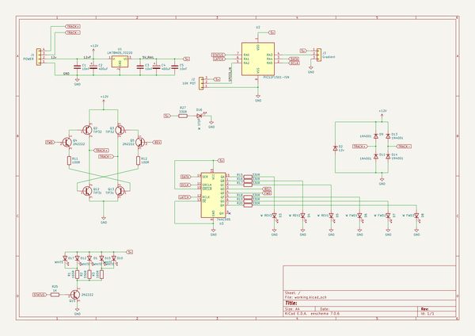
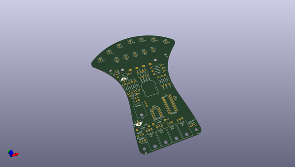
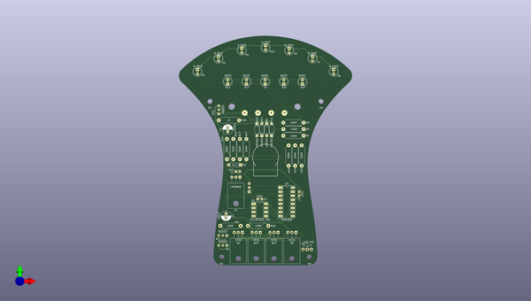
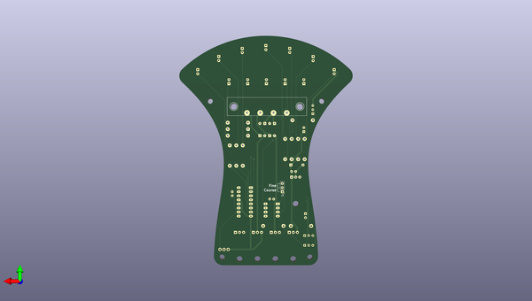

# golden_key
 
## summary 
* id: carnivalben_golden_key_controller
* user: carnivalben
* name: golden_key
* board: controller
* repo: https://github.com/CarnivalBen/golden-key
* src_file_repo_kicad_pcb: controller/pcb/controller.kicad_pcb
* src_file_repo_kicad_pcb_link: https://github.com/CarnivalBen/golden-key/tree/master/controller/pcb/controller.kicad_pcb

* src_file_repo_sch: controller/pcb/controller.sch
* src_file_repo_sch_link: https://github.com/CarnivalBen/golden-key/tree/master/controller/pcb/controller.sch
* full details link: https://github.com/oomlout/oomlout_oomp_project_bot_v_2/tree/main/projects/carnivalben_golden_key_controller/current_version/working  

## schematic  
  
[schematic (pdf)](working_schematic.pdf)  

## pcb  
 
  
  
  
[board (pdf)](working.pdf)  

## working_bom
| Id | Designator | Footprint | Quantity | Designation | Supplier and ref |  | None | 
| --- | --- | --- | --- | --- | --- | --- | --- | 
| 1 | C5,C1,C3 | C_Disc_D3.0mm_W1.6mm_P2.50mm | 3 | 10nF |  |  | [''] | 
| 2 | D1,D17,D10,D12,D15 | LED_D5.0mm | 5 | WHITE |  |  | [''] | 
| 3 | D3 | LED_D5.0mm | 1 | W REV3 |  |  | [''] | 
| 4 | D4 | LED_D5.0mm | 1 | W REV2 |  |  | [''] | 
| 5 | D5 | LED_D5.0mm | 1 | W REV1 |  |  | [''] | 
| 6 | D6 | LED_D5.0mm | 1 | W FWD1 |  |  | [''] | 
| 7 | D7 | LED_D5.0mm | 1 | W FWD2 |  |  | [''] | 
| 8 | D8 | LED_D5.0mm | 1 | W FWD3 |  |  | [''] | 
| 9 | D9,D13,D14,D11 | D_A-405_P7.62mm_Horizontal | 4 | 1N4001 |  |  | [''] | 
| 10 | Q2,Q3 | TO-220-3_Horizontal | 2 | TIP32 |  |  | [''] | 
| 11 | Q4,Q5,Q15 | TO-92_Inline_Wide | 3 | 2N2222 |  |  | [''] | 
| 12 | Q12,Q13 | TO-220-3_Horizontal | 2 | TIP31 |  |  | [''] | 
| 13 | R2,R15,R16,R18,R19,R20,R27,R17 | R_Axial_DIN0411_L9.9mm_D3.6mm_P12.70mm_Horizontal | 8 | 330R |  |  | [''] | 
| 14 | R3,R1 | R_Axial_DIN0411_L9.9mm_D3.6mm_P12.70mm_Horizontal | 2 | 165R |  |  | [''] | 
| 15 | R11,R12 | R_Axial_DIN0411_L9.9mm_D3.6mm_P12.70mm_Horizontal | 2 | 100R |  |  | [''] | 
| 16 | R25 | R_Axial_DIN0411_L9.9mm_D3.6mm_P12.70mm_Horizontal | 1 | 1K |  |  | [''] | 
| 17 | U1 | TO-220-3_Horizontal | 1 | LM78M05 |  |  | [''] | 
| 18 | U2 | DIP-8_W7.62mm_Socket_LongPads | 1 | PIC12F1501-ISN |  |  | [''] | 
| 19 | U3 | DIP-16_W7.62mm_Socket_LongPads | 1 | 74HC595 |  |  | [''] | 
| 20 | D2 | D_A-405_P7.62mm_Horizontal | 1 | 12v |  |  | [''] | 
| 21 | D16 | LED_D5.0mm | 1 | W STOP |  |  | [''] | 
| 22 | J2 | Potentiometer_WirePads_Small | 1 | 10K POT |  |  | [''] | 
| 23 | C4,C2 | CP_Radial_D6.3mm_P2.50mm | 2 | 400uF |  |  | [''] | 
| 24 | J1 | Barrier_Terminal_P8.27_1x4 | 1 | POWER |  |  | [''] | 
| 25 | J3 | Pin_Header_Straight_1x03_Pitch2.54mm | 1 | Gradient |  |  | [''] | 

## bom_schematic
| Ref | Qnty | Value | Cmp name | Footprint | Description | Vendor | DNP | 
| --- | --- | --- | --- | --- | --- | --- | --- | 
| C1, C3, C5 | 3 | 10nF | C | Capacitors_THT:C_Disc_D3.0mm_W1.6mm_P2.50mm | Unpolarized capacitor |  |  | 
| C2, C4 | 2 | 400uF | CP-Device | Capacitors_THT:CP_Radial_D6.3mm_P2.50mm |  |  |  | 
| D1, D10, D12, D15, D17 | 5 | WHITE | LED | LEDs:LED_D5.0mm | Light emitting diode |  |  | 
| D2 | 1 | 12v | D_Zener | Diodes_THT:D_A-405_P7.62mm_Horizontal | Zener diode |  |  | 
| D3 | 1 | W REV3 | LED | LEDs:LED_D5.0mm | Light emitting diode |  |  | 
| D4 | 1 | W REV2 | LED | LEDs:LED_D5.0mm | Light emitting diode |  |  | 
| D5 | 1 | W REV1 | LED | LEDs:LED_D5.0mm | Light emitting diode |  |  | 
| D6 | 1 | W FWD1 | LED | LEDs:LED_D5.0mm | Light emitting diode |  |  | 
| D7 | 1 | W FWD2 | LED | LEDs:LED_D5.0mm | Light emitting diode |  |  | 
| D8 | 1 | W FWD3 | LED | LEDs:LED_D5.0mm | Light emitting diode |  |  | 
| D9, D11, D13, D14 | 4 | 1N4001 | D | Diodes_THT:D_A-405_P7.62mm_Horizontal | Diode |  |  | 
| D16 | 1 | W STOP | LED | LEDs:LED_D5.0mm | Light emitting diode |  |  | 
| J1 | 1 | POWER | Conn_01x04 | carnivalben:Barrier_Terminal_P8.27_1x4 | Generic connector, single row, 01x04, script generated (kicad-library-utils/schlib/autogen/connector/) |  |  | 
| J2 | 1 | 10K POT | Conn_01x03 | Potentiometers:Potentiometer_WirePads_Small | Generic connector, single row, 01x03, script generated (kicad-library-utils/schlib/autogen/connector/) |  |  | 
| J3 | 1 | Gradient | Conn_01x03 | Pin_Headers:Pin_Header_Straight_1x03_Pitch2.54mm | Generic connector, single row, 01x03, script generated (kicad-library-utils/schlib/autogen/connector/) |  |  | 
| Q2, Q3 | 2 | TIP32 | TIP42 | TO_SOT_Packages_THT:TO-220-3_Horizontal | -6A Ic, -40V Vce, Power PNP Transistor, TO-220 |  |  | 
| Q4, Q5, Q15 | 3 | 2N2222 | BC237 | TO_SOT_Packages_THT:TO-92_Inline_Wide | 100mA Ic, 50V Vce, Epitaxial Silicon NPN Transistor, TO-92 |  |  | 
| Q12, Q13 | 2 | TIP31 | TIP41 | TO_SOT_Packages_THT:TO-220-3_Horizontal | 6A Ic, 40V Vce, Power NPN Transistor, TO-220 |  |  | 
| R1, R3 | 2 | 165R | R | Resistors_THT:R_Axial_DIN0411_L9.9mm_D3.6mm_P12.70mm_Horizontal | Resistor |  |  | 
| R2, R15, R16, R17, R18, R19, R20, R27 | 8 | 330R | R | Resistors_THT:R_Axial_DIN0411_L9.9mm_D3.6mm_P12.70mm_Horizontal | Resistor |  |  | 
| R11, R12 | 2 | 100R | R | Resistors_THT:R_Axial_DIN0411_L9.9mm_D3.6mm_P12.70mm_Horizontal | Resistor |  |  | 
| R25 | 1 | 1K | R | Resistors_THT:R_Axial_DIN0411_L9.9mm_D3.6mm_P12.70mm_Horizontal | Resistor |  |  | 
| U1 | 1 | LM78M05_TO220 | LM78M05_TO220 | TO_SOT_Packages_THT:TO-220-3_Horizontal | Positive 500mA 35V Linear Regulator, Fixed Output 5V, TO-220 |  |  | 
| U2 | 1 | PIC12F1501-ISN | PIC12F1501-ISN | Housings_DIP:DIP-8_W7.62mm_Socket_LongPads | PIC12F1501, 1024W FLASH, 64B SRAM, SO8 |  |  | 
| U3 | 1 | 74HC595 | 74HC595 | Housings_DIP:DIP-16_W7.62mm_Socket_LongPads | 8-bit serial in/out Shift Register 3-State Outputs |  |  | 

