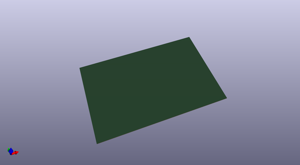

# golden_key
 
## summary 
* id: carnivalben_golden_key_layout_diag
* user: carnivalben
* name: golden_key
* board: layout_diag
* repo: https://github.com/CarnivalBen/golden-key
* src_file_repo_kicad_pcb: layout-diag/layout-diag.kicad_pcb
* src_file_repo_kicad_pcb_link: https://github.com/CarnivalBen/golden-key/tree/master/layout-diag/layout-diag.kicad_pcb

* src_file_repo_sch: layout-diag/layout-diag.sch
* src_file_repo_sch_link: https://github.com/CarnivalBen/golden-key/tree/master/layout-diag/layout-diag.sch
* full details link: https://github.com/oomlout/oomlout_oomp_project_bot_v_2/tree/main/projects/carnivalben_golden_key_layout_diag/current_version/working  

## schematic  
  
[schematic (pdf)](working_schematic.pdf)  

## pcb  
 
  
  
  
[board (pdf)](working.pdf)  

## bom_schematic
no data

