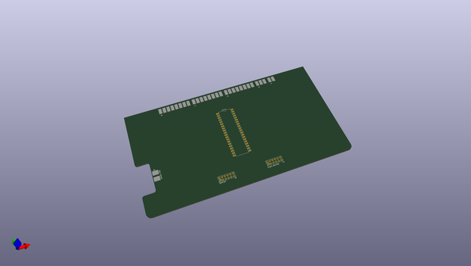
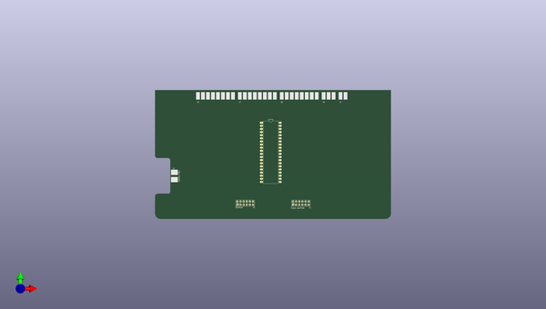
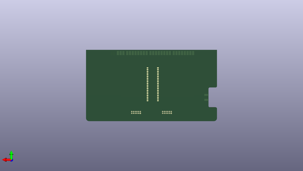

# golden_key
 
## summary 
* id: carnivalben_golden_key_panel_main_copy
* user: carnivalben
* name: golden_key
* board: panel_main_copy
* repo: https://github.com/CarnivalBen/golden-key
* src_file_repo_kicad_pcb: panel/pcb-main/panel-main - Copy.kicad_pcb
* src_file_repo_kicad_pcb_link: https://github.com/CarnivalBen/golden-key/tree/master/panel/pcb-main/panel-main - Copy.kicad_pcb

* src_file_repo_sch: layout-diag/layout-diag.sch
* src_file_repo_sch_link: https://github.com/CarnivalBen/golden-key/tree/master/layout-diag/layout-diag.sch
* full details link: https://github.com/oomlout/oomlout_oomp_project_bot_v_2/tree/main/projects/carnivalben_golden_key_panel_main_copy/current_version/working  

## pcb  
 
  
  
  
[board (pdf)](working.pdf)  

## working_bom
| Id | Designator | Footprint | Quantity | Designation | Supplier and ref |  | None | 
| --- | --- | --- | --- | --- | --- | --- | --- | 
| 1 | C1,C2 | CP_Radial_D10.0mm_P5.00mm | 2 | 470uF |  |  | [''] | 
| 2 | C3 | C_Disc_D4.7mm_W2.5mm_P5.00mm | 1 | 10nF |  |  | [''] | 
| 3 | C4,C5 | C_Disc_D3.4mm_W2.1mm_P2.50mm | 2 | 33pF |  |  | [''] | 
| 4 | C6,C7 | CP_Radial_D18.0mm_P7.50mm | 2 | 4700uF |  |  | [''] | 
| 5 | D1,D2,D3,D4,D5,D6,D7,D8,D9,D10,D11,D12,D13,D14,D15,D16,D17,D18 | D_DO-15_P12.70mm_Horizontal | 18 | 1N4001 |  |  | [''] | 
| 6 | D19 | D_DO-15_P10.16mm_Horizontal | 1 | 12V |  |  | [''] | 
| 7 | D20 | D_DO-15_P10.16mm_Horizontal | 1 | 5V |  |  | [''] | 
| 8 | J1 | Wire_Pads_Edge_1x2 | 1 | PSU IN |  |  | [''] | 
| 9 | J2 | DIN_Socket_Edge_Solder_4pin | 1 | SPEED CTRL |  |  | [''] | 
| 10 | J3 | Pin_Header_Straight_1x06_Pitch2.54mm | 1 | ICSP |  |  | [''] | 
| 11 | J5 | Pin_Header_Straight_2x06_Pitch2.54mm | 1 | DISPLAY |  |  | [''] | 
| 12 | J6 | Wire_Pads_Edge_2x8 | 1 | CONN-L1 |  |  | [''] | 
| 13 | J7 | Wire_Pads_Edge_2x8 | 1 | CONN-L2 |  |  | [''] | 
| 14 | J8 | Wire_Pads_Edge_2x8 | 1 | CONN-R1 |  |  | [''] | 
| 15 | J9 | Wire_Pads_Edge_2x3 | 1 | CONN-R2 |  |  | [''] | 
| 16 | K1,K2,K3,K4,K5,K6,K7,K8,K9,K10,K11 | TRK22X3-XXDC | 11 | TRK2233-12DC |  |  | [''] | 
| 17 | Q1,Q14 | TO-92_Inline_Wide | 2 | 2N2222 |  |  | [''] | 
| 18 | Q2,Q9 | TO-220-3_Vertical | 2 | TIP32 |  |  | [''] | 
| 19 | Q3,Q4,Q5,Q6,Q7,Q8,Q10,Q11,Q12,Q13,Q15,Q16,Q17,Q18,Q19,Q37 | TO-126_Vertical | 16 | BD679 |  |  | [''] | 
| 20 | R1 | R_Axial_DIN0207_L6.3mm_D2.5mm_P10.16mm_Horizontal | 1 | 10K |  |  | [''] | 
| 21 | R2,R3,R8,R9 | R_Axial_DIN0207_L6.3mm_D2.5mm_P10.16mm_Horizontal | 4 | 5K |  |  | [''] | 
| 22 | R4,R5,R6,R7,R10,R11,R12,R13,R14,R15,R16,R17,R18,R19,R20,R21 | R_Axial_DIN0207_L6.3mm_D2.5mm_P10.16mm_Horizontal | 16 | 1K |  |  | [''] | 
| 23 | U1 | TO-220-3_Vertical | 1 | LM7805_TO220 |  |  | [''] | 
| 24 | U2,U3,U4,U5 | DIP-16_W7.62mm_LongPads | 4 | 74HC595 |  |  | [''] | 
| 25 | U6,U7 | DIP-16_W7.62mm_LongPads | 2 | ULN2003A |  |  | [''] | 
| 26 | U***1 | DIP-40_W15.24mm_LongPads | 1 | PIC16F877A |  |  | [''] | 
| 27 | Y1 | Crystal_HC49-U_Vertical | 1 | 20MHz |  |  | [''] | 
| 28 | J4 | Pin_Header_Straight_2x06_Pitch2.54mm | 1 | PUSH-BUTTON |  |  | [''] | 

