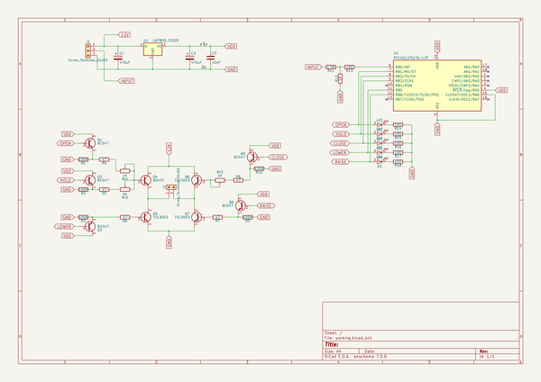
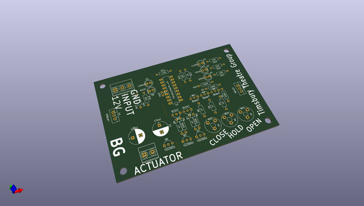
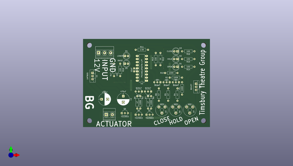
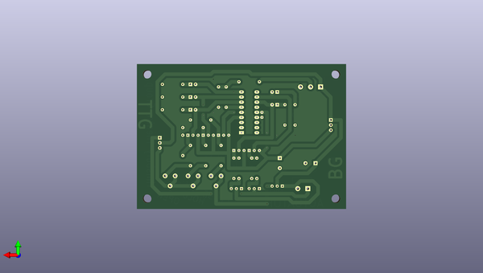

# shuttercontroller
 
## summary 
* id: carnivalben_shuttercontroller_shuttercontroller
* user: carnivalben
* name: shuttercontroller
* board: shuttercontroller
* repo: https://github.com/CarnivalBen/ShutterController
* src_file_repo_kicad_pcb: PCB/ShutterController.kicad_pcb
* src_file_repo_kicad_pcb_link: https://github.com/CarnivalBen/ShutterController/tree/master/PCB/ShutterController.kicad_pcb

* src_file_repo_sch: PCB/ShutterController.sch
* src_file_repo_sch_link: https://github.com/CarnivalBen/ShutterController/tree/master/PCB/ShutterController.sch
* full details link: https://github.com/oomlout/oomlout_oomp_project_bot_v_2/tree/main/projects/carnivalben_shuttercontroller_shuttercontroller/current_version/working  

## schematic  
  
[schematic (pdf)](working_schematic.pdf)  

## pcb  
 
  
  
  
[board (pdf)](working.pdf)  

## working_bom
| Id | Designator | Footprint | Quantity | Designation | Supplier and ref |  | None | 
| --- | --- | --- | --- | --- | --- | --- | --- | 
| 1 | C1,C2 | CP_Radial_D10.0mm_P5.00mm | 2 | 470uF |  |  | [''] | 
| 2 | C3 | C_Disc_D3.0mm_W1.6mm_P2.50mm | 1 | 10nF |  |  | [''] | 
| 3 | D1 | LED_D5.0mm | 1 | OPEN |  |  | [''] | 
| 4 | D2 | LED_D5.0mm | 1 | HOLD |  |  | [''] | 
| 5 | D3 | LED_D5.0mm | 1 | CLOSE |  |  | [''] | 
| 6 | D4 | LED_D5.0mm | 1 | LOWER |  |  | [''] | 
| 7 | D5 | LED_D5.0mm | 1 | RAISE |  |  | [''] | 
| 8 | J1 | TerminalBlock_Phoenix_MKDS1.5-3pol | 1 | Screw_Terminal_01x03 |  |  | [''] | 
| 9 | J2 | TerminalBlock_Phoenix_MKDS1.5-2pol | 1 | Screw_Terminal_01x02 |  |  | [''] | 
| 10 | Q1,Q2,Q3,Q8,Q9 | TO-92_Inline_Wide | 5 | BC547 |  |  | [''] | 
| 11 | Q4 | TO-220-3_Vertical | 1 | BD437 |  |  | [''] | 
| 12 | Q5,Q6,Q7 | TO-92_Inline_Wide | 3 | TS13003 |  |  | [''] | 
| 13 | R1,R2,R3,R9,R10 | R_Axial_DIN0207_L6.3mm_D2.5mm_P10.16mm_Horizontal | 5 | 100K |  |  | [''] | 
| 14 | R4,R5,R6,R7,R8 | R_Axial_DIN0207_L6.3mm_D2.5mm_P10.16mm_Horizontal | 5 | 47 |  |  | [''] | 
| 15 | R11 | R_Axial_DIN0207_L6.3mm_D2.5mm_P10.16mm_Horizontal | 1 | 1.5K |  |  | [''] | 
| 16 | R12 | R_Axial_DIN0207_L6.3mm_D2.5mm_P10.16mm_Horizontal | 1 | 1K |  |  | [''] | 
| 17 | R13,R14,R15,R16,R17,R18 | R_Axial_DIN0207_L6.3mm_D2.5mm_P10.16mm_Horizontal | 6 | 100 |  |  | [''] | 
| 18 | RV1,RV3 | Potentiometer_Trimmer_Piher_PT-10v5_Horizontal_Px5.0mm_Py5.0mm | 2 | 1K |  |  | [''] | 
| 19 | RV2 | Potentiometer_Trimmer_Piher_PT-10v5_Horizontal_Px5.0mm_Py5.0mm | 1 | 5K |  |  | [''] | 
| 20 | U1 | TO-220-3_Vertical | 1 | LM7805 |  |  | [''] | 
| 21 | U2 | DIP-18_W7.62mm_LongPads | 1 | PIC16(L)F627A-I/P |  |  | [''] | 

## bom_schematic
| Ref | Qnty | Value | Cmp name | Footprint | Description | Vendor | DNP | 
| --- | --- | --- | --- | --- | --- | --- | --- | 
| C1, C2 | 2 | 470uF | CP | Capacitors_THT:CP_Radial_D10.0mm_P5.00mm |  |  |  | 
| C3 | 1 | 10nF | C | Capacitors_THT:C_Disc_D3.0mm_W1.6mm_P2.50mm |  |  |  | 
| D1, D2, D3, D4, D5 | 5 | LED | LED | LEDs:LED_D5.0mm |  |  |  | 
| J1 | 1 | Screw_Terminal_01x03 | Screw_Terminal_01x03 | TerminalBlocks_Phoenix:TerminalBlock_Phoenix_MKDS1.5-3pol |  |  |  | 
| J2 | 1 | Screw_Terminal_01x02 | Screw_Terminal_01x02 | TerminalBlocks_Phoenix:TerminalBlock_Phoenix_MKDS1.5-2pol |  |  |  | 
| Q1, Q2, Q3, Q8, Q9 | 5 | BC547 | 2N2219 | TO_SOT_Packages_THT:TO-92_Inline_Wide |  |  |  | 
| Q4 | 1 | BD437 | 2SC1815 | TO_SOT_Packages_THT:TO-220-3_Vertical |  |  |  | 
| Q5, Q6, Q7 | 3 | TS13003 | 2SC1815 | TO_SOT_Packages_THT:TO-92_Inline_Wide |  |  |  | 
| R1, R2, R3, R9, R10 | 5 | 100K | R | Resistors_THT:R_Axial_DIN0207_L6.3mm_D2.5mm_P10.16mm_Horizontal |  |  |  | 
| R4, R5, R6, R7, R8 | 5 | 47 | R | Resistors_THT:R_Axial_DIN0207_L6.3mm_D2.5mm_P10.16mm_Horizontal |  |  |  | 
| R11 | 1 | 1.5K | R | Resistors_THT:R_Axial_DIN0207_L6.3mm_D2.5mm_P10.16mm_Horizontal |  |  |  | 
| R12 | 1 | 1K | R | Resistors_THT:R_Axial_DIN0207_L6.3mm_D2.5mm_P10.16mm_Horizontal |  |  |  | 
| R13, R14, R15, R16, R17, R18 | 6 | 100 | R | Resistors_THT:R_Axial_DIN0207_L6.3mm_D2.5mm_P10.16mm_Horizontal |  |  |  | 
| RV1, RV3 | 2 | 1K | POT_TRIM | Potentiometers:Potentiometer_Trimmer_Piher_PT-10v5_Horizontal_Px5.0mm_Py5.0mm |  |  |  | 
| RV2 | 1 | 5K | POT_TRIM | Potentiometers:Potentiometer_Trimmer_Piher_PT-10v5_Horizontal_Px5.0mm_Py5.0mm |  |  |  | 
| U1 | 1 | LM7805_TO220 | LM7805_TO220 | TO_SOT_Packages_THT:TO-220-3_Vertical |  |  |  | 
| U2 | 1 | PIC16(L)F627A-I/P | PIC16(L)F627A-I/P | Housings_DIP:DIP-18_W7.62mm_LongPads |  |  |  | 

