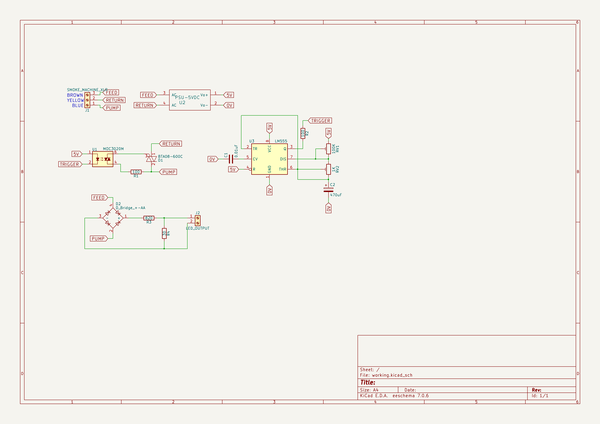
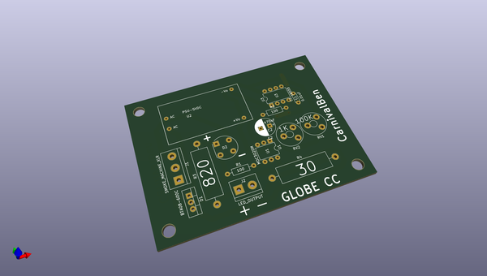
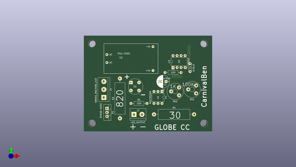
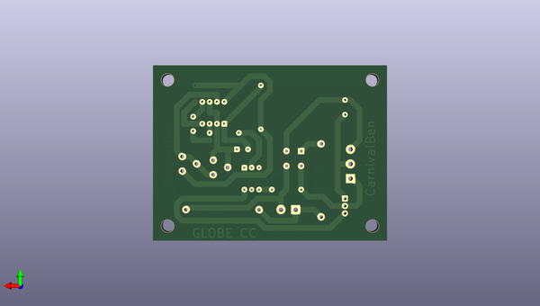

# smokecannoncontroller
 
## summary 
* id: carnivalben_smokecannoncontroller_smokecannoncontroller
* user: carnivalben
* name: smokecannoncontroller
* board: smokecannoncontroller
* repo: https://github.com/CarnivalBen/SmokeCannonController
* src_file_repo_kicad_pcb: SmokeCannonController.kicad_pcb
* src_file_repo_kicad_pcb_link: https://github.com/CarnivalBen/SmokeCannonController/tree/master/SmokeCannonController.kicad_pcb

* src_file_repo_sch: SmokeCannonController.sch
* src_file_repo_sch_link: https://github.com/CarnivalBen/SmokeCannonController/tree/master/SmokeCannonController.sch
* full details link: https://github.com/oomlout/oomlout_oomp_project_bot_v_2/tree/main/projects/carnivalben_smokecannoncontroller_smokecannoncontroller/current_version/working  

## schematic  
  
[schematic (pdf)](working_schematic.pdf)  

## pcb  
 
  
  
  
[board (pdf)](working.pdf)  

## working_bom
| Id | Designator | Footprint | Quantity | Designation | Supplier and ref |  | None | 
| --- | --- | --- | --- | --- | --- | --- | --- | 
| 1 | C2 | CP_Radial_D8.0mm_P3.80mm | 1 | 470uF |  |  | [''] | 
| 2 | D1 | TO-220-3_Vertical | 1 | BTA08-600C |  |  | [''] | 
| 3 | D2 | Diode_Bridge_Round_D9.8mm | 1 | D_Bridge_+-AA |  |  | [''] | 
| 4 | J1 | TerminalBlock_bornier-3_P5.08mm | 1 | SMOKE_MACHINE_XLR |  |  | [''] | 
| 5 | J2 | TerminalBlock_bornier-2_P5.08mm | 1 | LED_OUTPUT |  |  | [''] | 
| 6 | R1,R2 | R_Axial_DIN0207_L6.3mm_D2.5mm_P10.16mm_Horizontal | 2 | 100 |  |  | [''] | 
| 7 | R3 | R_Axial_Power_L20.0mm_W6.4mm_P25.40mm | 1 | 820 |  |  | [''] | 
| 8 | R4 | R_Axial_Power_L20.0mm_W6.4mm_P25.40mm | 1 | 30 |  |  | [''] | 
| 9 | RV1 | Potentiometer_Trimmer_Piher_PT-10v5_Horizontal_Px5.0mm_Py5.0mm | 1 | 100K |  |  | [''] | 
| 10 | RV2 | Potentiometer_Trimmer_Piher_PT-10v5_Horizontal_Px5.0mm_Py5.0mm | 1 | 1K |  |  | [''] | 
| 11 | U1 | DIP-6_W7.62mm | 1 | MOC3020M |  |  | [''] | 
| 12 | U3 | DIP-8_W7.62mm | 1 | LM555 |  |  | [''] | 
| 13 | C1 | C_Disc_D4.3mm_W1.9mm_P5.00mm | 1 | 0.01uF |  |  | [''] | 
| 14 | U2 | HLK-PM01 | 1 | PSU-5VDC |  |  | [''] | 

## bom_schematic
| Ref | Qnty | Value | Cmp name | Footprint | Description | Vendor | DNP | 
| --- | --- | --- | --- | --- | --- | --- | --- | 
| C1 | 1 | 0.01uF | C | Capacitors_THT:C_Disc_D4.3mm_W1.9mm_P5.00mm |  |  |  | 
| C2 | 1 | 470uF | CP | Capacitors_THT:CP_Radial_D8.0mm_P3.80mm |  |  |  | 
| D1 | 1 | BTA08-600C | Q_TRIAC_AAG2 | TO_SOT_Packages_THT:TO-220-3_Vertical |  |  |  | 
| D2 | 1 | D_Bridge_+-AA | D_Bridge_+A-A | Diodes_THT:Diode_Bridge_Round_D9.8mm |  |  |  | 
| J1 | 1 | SMOKE_MACHINE_XLR | Screw_Terminal_01x03 | Connectors_Terminal_Blocks:TerminalBlock_bornier-3_P5.08mm |  |  |  | 
| J2 | 1 | LED_OUTPUT | Screw_Terminal_01x02 | Connectors_Terminal_Blocks:TerminalBlock_bornier-2_P5.08mm |  |  |  | 
| R1, R2 | 2 | 100 | R | Resistors_THT:R_Axial_DIN0207_L6.3mm_D2.5mm_P10.16mm_Horizontal |  |  |  | 
| R3 | 1 | 820 | R | Resistors_THT:R_Axial_Power_L20.0mm_W6.4mm_P25.40mm |  |  |  | 
| R4 | 1 | 30 | R | Resistors_THT:R_Axial_Power_L20.0mm_W6.4mm_P25.40mm |  |  |  | 
| RV1 | 1 | 100K | POT_TRIM | Potentiometers:Potentiometer_Trimmer_Piher_PT-10v5_Horizontal_Px5.0mm_Py5.0mm |  |  |  | 
| RV2 | 1 | 1K | POT_TRIM | Potentiometers:Potentiometer_Trimmer_Piher_PT-10v5_Horizontal_Px5.0mm_Py5.0mm |  |  |  | 
| U1 | 1 | MOC3020M | MOC3020M | Housings_DIP:DIP-6_W7.62mm |  |  |  | 
| U2 | 1 | PSU-5VDC | PSU-5VDC | BGCustom:HLK-PM01 |  |  |  | 
| U3 | 1 | LM555 | LM555 | Housings_DIP:DIP-8_W7.62mm |  |  |  | 

