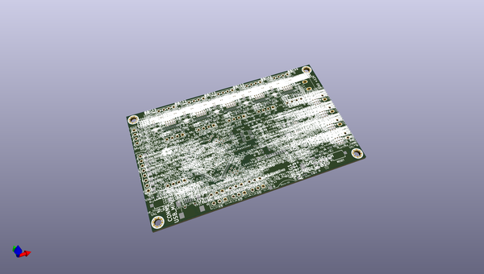

# 3dpcb
 
## summary 
* id: christianlerche_3dpcb_3dpcb_rev_b_drv8825
* user: christianlerche
* name: 3dpcb
* board: 3dpcb_rev_b_drv8825
* repo: https://github.com/ChristianLerche/3DPCB
* src_file_repo_kicad_pcb: 3DPCB Rev B DRV8825.kicad_pcb
* src_file_repo_kicad_pcb_link: https://github.com/ChristianLerche/3DPCB/tree/master/3DPCB Rev B DRV8825.kicad_pcb

* src_file_repo_sch: 3DPCB Rev B DRV8825.sch
* src_file_repo_sch_link: https://github.com/ChristianLerche/3DPCB/tree/master/3DPCB Rev B DRV8825.sch
* full details link: https://github.com/oomlout/oomlout_oomp_project_bot_v_2/tree/main/projects/christianlerche_3dpcb_3dpcb_rev_b_drv8825/current_version/working  

## schematic  
  
[schematic (pdf)](working_schematic.pdf)  

## pcb  
 
  
  
  
[board (pdf)](working.pdf)  

## working_bom
| Id | Designator | Footprint | Quantity | Designation | Supplier and ref |  | None | 
| --- | --- | --- | --- | --- | --- | --- | --- | 
| 1 | U6 | TQFP_100 | 1 | LPC1768_TQFP100 |  |  | [''] | 
| 2 | U3 | Lerche_SOT23-3 | 1 | BSS84 |  |  | [''] | 
| 3 | U2,U15 | Lerche_SPST_ITEAD | 2 | SPST_MOMENTARY |  |  | [''] | 
| 4 | R11 | Lerche_R0603 | 1 | 1k5 |  |  | [''] | 
| 5 | R3,R4,R5,R6,R2,R28,R25,R51,R26,R50,R49,R17 | Lerche_R0603 | 12 | 1k |  |  | [''] | 
| 6 | R16,R12,R13,R10,R15,R14,R20,R34 | Lerche_R0603 | 8 | 4K7 |  |  | [''] | 
| 7 | R8,R7 | Lerche_R0603 | 2 | 33R |  |  | [''] | 
| 8 | R1,R18,R19,R27,R41,R42,R43,R9 | Lerche_R0603 | 8 | 10k |  |  | [''] | 
| 9 | L1 | Lerche_R0603 | 1 | INDUCTOR |  |  | [''] | 
| 10 | U10 | Lerche_Molex_502774-0891 | 1 | MICRO-SD |  |  | [''] | 
| 11 | CONN1 | Lerche_MINI_USB | 1 | USB_MINI |  |  | [''] | 
| 12 | U9 | Lerche_Crystal_2.5x2.0mm | 1 | CRYSTAL_SMALL |  |  | [''] | 
| 13 | C14,C16,C15,C23,C13,C12,C28,C29,C30,C31,C22,C17,C6,C2,C1,C32,C33,C34,C39,C44,C45,C46,C50,C52,C51,C53,C54,C48,C49,C59,C57,C60,C56,C58,C61,C65,C71,C69,C64 | Lerche_C0603 | 39 | 100n |  |  | [''] | 
| 14 | C19,C18 | Lerche_C0603 | 2 | 12p |  |  | [''] | 
| 15 | C5,C9 | Lerche_C0603 | 2 | 18p |  |  | [''] | 
| 16 | P1 | Lerche_8P_2.54mm | 1 | CONN_8 |  |  | [''] | 
| 17 | U4,U1,U21,U22,U25,U13 | PIN_ARRAY_4x1 | 6 | CONN_4_LERCHE |  |  | [''] | 
| 18 | P9,P6,P7,P5,P13 | PIN_ARRAY_4x1 | 5 | CONN_4 |  |  | [''] | 
| 19 | K2,K3,K4,K6,K1,K5 | PIN_ARRAY_3X1 | 6 | CONN_3 |  |  | [''] | 
| 20 | P2,P3,P4,P10 | Lerche_2P_2.54mm_Large | 4 | CONN_2 |  |  | [''] | 
| 21 | D3,D4,D2,D1,D6,D7,D8 | LED-0603 | 7 | LED |  |  | [''] | 
| 22 | C10,C7,C4,C55,C3 | c_tant_A | 5 | 10uF |  |  | [''] | 
| 23 | C27,C24,C26,C25,C43,C70 | c_elec_5x5.8 | 6 | 100uF |  |  | [''] | 
| 24 | R33,R37,R22,R30,R32,R24,R21,R29,R23,R31 | SM0805 | 10 | 0R05 |  |  | [''] | 
| 25 | C41,C42,C40,C35,C68 | Lerche_C0603 | 5 | 470n |  |  | [''] | 
| 26 | C37,C38,C36,C8,C67 | Lerche_C0603 | 5 | 10n |  |  | [''] | 
| 27 | J9,J8,J6,J5,J3,J2,J11,J12,J4,J7,J10,J13,J15,J16,J14 | Lerche_2PsolderJumper | 15 |   |  |  | [''] | 
| 28 | Lerche_via_0.35_GND,Lerche_via_0.35_GND,Lerche_via_0.35_GND,Lerche_via_0.35_GND,Lerche_via_0.35_GND,Lerche_via_0.35_GND,Lerche_via_0.35_GND,Lerche_via_0.35_GND,Lerche_via_0.35_GND,Lerche_via_0.35_GND,Lerche_via_0.35_GND,Lerche_via_0.35_GND,Lerche_via_0.35_GND,Lerche_via_0.35_GND,Lerche_via_0.35_GND,Lerche_via_0.35_GND,Lerche_via_0.35_GND,Lerche_via_0.35_GND,Lerche_via_0.35_GND,Lerche_via_0.35_GND,Lerche_via_0.35_GND,Lerche_via_0.35_GND,Lerche_via_0.35_GND,Lerche_via_0.35_GND,Lerche_via_0.35_GND,Lerche_via_0.35_GND,Lerche_via_0.35_GND,Lerche_via_0.35_GND,Lerche_via_0.35_GND,Lerche_via_0.35_GND,Lerche_via_0.35_GND,Lerche_via_0.35_GND,Lerche_via_0.35_GND,Lerche_via_0.35_GND,Lerche_via_0.35_GND,Lerche_via_0.35_GND,Lerche_via_0.35_GND,Lerche_via_0.35_GND,Lerche_via_0.35_GND,Lerche_via_0.35_GND,Lerche_via_0.35_GND,Lerche_via_0.35_GND,Lerche_via_0.35_GND,Lerche_via_0.35_GND,Lerche_via_0.35_GND,Lerche_via_0.35_GND,Lerche_via_0.35_GND,Lerche_via_0.35_GND,Lerche_via_0.35_GND,Lerche_via_0.35_GND,Lerche_via_0.35_GND,Lerche_via_0.35_GND,Lerche_via_0.35_GND,Lerche_via_0.35_GND,Lerche_via_0.35_GND,Lerche_via_0.35_GND,Lerche_via_0.35_GND,Lerche_via_0.35_GND,Lerche_via_0.35_GND,Lerche_via_0.35_GND,Lerche_via_0.35_GND,Lerche_via_0.35_GND,Lerche_via_0.35_GND,Lerche_via_0.35_GND,Lerche_via_0.35_GND,Lerche_via_0.35_GND,Lerche_via_0.35_GND,Lerche_via_0.35_GND,Lerche_via_0.35_GND,Lerche_via_0.35_GND,Lerche_via_0.35_GND,Lerche_via_0.35_GND,Lerche_via_0.35_GND,Lerche_via_0.35_GND,Lerche_via_0.35_GND,Lerche_via_0.35_GND,Lerche_via_0.35_GND,Lerche_via_0.35_GND,Lerche_via_0.35_GND,Lerche_via_0.35_GND,Lerche_via_0.35_GND,Lerche_via_0.35_GND,Lerche_via_0.35_GND,Lerche_via_0.35_GND,Lerche_via_0.35_GND,Lerche_via_0.35_GND,Lerche_via_0.35_GND,Lerche_via_0.35_GND,Lerche_via_0.35_GND,Lerche_via_0.35_GND,Lerche_via_0.35_GND,Lerche_via_0.35_GND,Lerche_via_0.35_GND,Lerche_via_0.35_GND,Lerche_via_0.35_GND,Lerche_via_0.35_GND,Lerche_via_0.35_GND,Lerche_via_0.35_GND,Lerche_via_0.35_GND,Lerche_via_0.35_GND,Lerche_via_0.35_GND,Lerche_via_0.35_GND,Lerche_via_0.35_GND,Lerche_via_0.35_GND,Lerche_via_0.35_GND,Lerche_via_0.35_GND,Lerche_via_0.35_GND,Lerche_via_0.35_GND,Lerche_via_0.35_GND,Lerche_via_0.35_GND,Lerche_via_0.35_GND,Lerche_via_0.35_GND,Lerche_via_0.35_GND,Lerche_via_0.35_GND,Lerche_via_0.35_GND,Lerche_via_0.35_GND,Lerche_via_0.35_GND,Lerche_via_0.35_GND,Lerche_via_0.35_GND,Lerche_via_0.35_GND,Lerche_via_0.35_GND,Lerche_via_0.35_GND,Lerche_via_0.35_GND,Lerche_via_0.35_GND,Lerche_via_0.35_GND,Lerche_via_0.35_GND,Lerche_via_0.35_GND,Lerche_via_0.35_GND,Lerche_via_0.35_GND,Lerche_via_0.35_GND,Lerche_via_0.35_GND,Lerche_via_0.35_GND,Lerche_via_0.35_GND,Lerche_via_0.35_GND,Lerche_via_0.35_GND,Lerche_via_0.35_GND,Lerche_via_0.35_GND,Lerche_via_0.35_GND,Lerche_via_0.35_GND,Lerche_via_0.35_GND,Lerche_via_0.35_GND,Lerche_via_0.35_GND,Lerche_via_0.35_GND,Lerche_via_0.35_GND,Lerche_via_0.35_GND,Lerche_via_0.35_GND,Lerche_via_0.35_GND,Lerche_via_0.35_GND,Lerche_via_0.35_GND,Lerche_via_0.35_GND,Lerche_via_0.35_GND | Lerche_via_0.35_GND | 151 | VAL** |  |  | [''] | 
| 29 | P8 | Lerche_2P_5MM | 1 | CONN_2 |  |  | [''] | 
| 30 | U17,U11 | so-8 | 2 | TC4427 |  |  | [''] | 
| 31 | R44,R45 | Lerche_R0603 | 2 | 3k3 |  |  | [''] | 
| 32 | U16 | Lerche_4P_2.54mm | 1 | CONN_4_LERCHE |  |  | [''] | 
| 33 | U20 | Lerche_QFN16-EP | 1 | TPS6213X |  |  | [''] | 
| 34 | L2 | Lerche_IHLP-1212BZ-11_Inductor | 1 | INDUCTOR |  |  | [''] | 
| 35 | C47 | Lerche_C0603 | 1 | 3.3nF |  |  | [''] | 
| 36 | U23,U12 | Lerche_MSOP-10 | 2 | MCP4728 |  |  | [''] | 
| 37 | U5,U7,U8,U24 | Lerche_PQFN_5x6B | 4 | MOS_NFET |  |  | [''] | 
| 38 | VREG1 | Lerche_SOT-223 | 1 | AMS1117 |  |  | [''] | 
| 39 | J1 | Lerche_Solder_Jumper_3P | 1 | SOLDER_JUMPER_3P |  |  | [''] | 
| 40 | Lerche_via_0.35_GND_MaskOver,Lerche_via_0.35_GND_MaskOver,Lerche_via_0.35_GND_MaskOver,Lerche_via_0.35_GND_MaskOver,Lerche_via_0.35_GND_MaskOver,Lerche_via_0.35_GND_MaskOver,Lerche_via_0.35_GND_MaskOver,Lerche_via_0.35_GND_MaskOver,Lerche_via_0.35_GND_MaskOver,Lerche_via_0.35_GND_MaskOver,Lerche_via_0.35_GND_MaskOver,Lerche_via_0.35_GND_MaskOver,Lerche_via_0.35_GND_MaskOver,Lerche_via_0.35_GND_MaskOver,Lerche_via_0.35_GND_MaskOver,Lerche_via_0.35_GND_MaskOver,Lerche_via_0.35_GND_MaskOver,Lerche_via_0.35_GND_MaskOver,Lerche_via_0.35_GND_MaskOver,Lerche_via_0.35_GND_MaskOver,Lerche_via_0.35_GND_MaskOver,Lerche_via_0.35_GND_MaskOver,Lerche_via_0.35_GND_MaskOver,Lerche_via_0.35_GND_MaskOver,Lerche_via_0.35_GND_MaskOver,Lerche_via_0.35_GND_MaskOver,Lerche_via_0.35_GND_MaskOver,Lerche_via_0.35_GND_MaskOver,Lerche_via_0.35_GND_MaskOver,Lerche_via_0.35_GND_MaskOver,Lerche_via_0.35_GND_MaskOver,Lerche_via_0.35_GND_MaskOver,Lerche_via_0.35_GND_MaskOver,Lerche_via_0.35_GND_MaskOver,Lerche_via_0.35_GND_MaskOver,Lerche_via_0.35_GND_MaskOver,Lerche_via_0.35_GND_MaskOver,Lerche_via_0.35_GND_MaskOver,Lerche_via_0.35_GND_MaskOver,Lerche_via_0.35_GND_MaskOver,Lerche_via_0.35_GND_MaskOver,Lerche_via_0.35_GND_MaskOver,Lerche_via_0.35_GND_MaskOver,Lerche_via_0.35_GND_MaskOver,Lerche_via_0.35_GND_MaskOver,Lerche_via_0.35_GND_MaskOver,Lerche_via_0.35_GND_MaskOver,Lerche_via_0.35_GND_MaskOver | Lerche_via_0.35_GND_MaskOver | 48 | VAL** |  |  | [''] | 
| 41 | Lerche_via_0.5mm_GND,Lerche_via_0.5mm_GND,Lerche_via_0.5mm_GND,Lerche_via_0.5mm_GND,Lerche_via_0.5mm_GND,Lerche_via_0.5mm_GND,Lerche_via_0.5mm_GND,Lerche_via_0.5mm_GND,Lerche_via_0.5mm_GND,Lerche_via_0.5mm_GND,Lerche_via_0.5mm_GND,Lerche_via_0.5mm_GND,Lerche_via_0.5mm_GND,Lerche_via_0.5mm_GND,Lerche_via_0.5mm_GND,Lerche_via_0.5mm_GND,Lerche_via_0.5mm_GND,Lerche_via_0.5mm_GND,Lerche_via_0.5mm_GND,Lerche_via_0.5mm_GND,Lerche_via_0.5mm_GND,Lerche_via_0.5mm_GND,Lerche_via_0.5mm_GND,Lerche_via_0.5mm_GND,Lerche_via_0.5mm_GND,Lerche_via_0.5mm_GND,Lerche_via_0.5mm_GND,Lerche_via_0.5mm_GND,Lerche_via_0.5mm_GND,Lerche_via_0.5mm_GND,Lerche_via_0.5mm_GND,Lerche_via_0.5mm_GND,Lerche_via_0.5mm_GND,Lerche_via_0.5mm_GND,Lerche_via_0.5mm_GND,Lerche_via_0.5mm_GND,Lerche_via_0.5mm_GND,Lerche_via_0.5mm_GND,Lerche_via_0.5mm_GND,Lerche_via_0.5mm_GND,Lerche_via_0.5mm_GND,Lerche_via_0.5mm_GND,Lerche_via_0.5mm_GND,Lerche_via_0.5mm_GND,Lerche_via_0.5mm_GND,Lerche_via_0.5mm_GND,Lerche_via_0.5mm_GND,Lerche_via_0.5mm_GND,Lerche_via_0.5mm_GND,Lerche_via_0.5mm_GND,Lerche_via_0.5mm_GND,Lerche_via_0.5mm_GND,Lerche_via_0.5mm_GND,Lerche_via_0.5mm_GND,Lerche_via_0.5mm_GND,Lerche_via_0.5mm_GND,Lerche_via_0.5mm_GND,Lerche_via_0.5mm_GND,Lerche_via_0.5mm_GND,Lerche_via_0.5mm_GND,Lerche_via_0.5mm_GND,Lerche_via_0.5mm_GND,Lerche_via_0.5mm_GND,Lerche_via_0.5mm_GND,Lerche_via_0.5mm_GND,Lerche_via_0.5mm_GND,Lerche_via_0.5mm_GND,Lerche_via_0.5mm_GND,Lerche_via_0.5mm_GND,Lerche_via_0.5mm_GND,Lerche_via_0.5mm_GND,Lerche_via_0.5mm_GND,Lerche_via_0.5mm_GND,Lerche_via_0.5mm_GND,Lerche_via_0.5mm_GND,Lerche_via_0.5mm_GND,Lerche_via_0.5mm_GND,Lerche_via_0.5mm_GND,Lerche_via_0.5mm_GND,Lerche_via_0.5mm_GND,Lerche_via_0.5mm_GND,Lerche_via_0.5mm_GND,Lerche_via_0.5mm_GND,Lerche_via_0.5mm_GND,Lerche_via_0.5mm_GND,Lerche_via_0.5mm_GND,Lerche_via_0.5mm_GND,Lerche_via_0.5mm_GND,Lerche_via_0.5mm_GND,Lerche_via_0.5mm_GND,Lerche_via_0.5mm_GND,Lerche_via_0.5mm_GND,Lerche_via_0.5mm_GND,Lerche_via_0.5mm_GND,Lerche_via_0.5mm_GND,Lerche_via_0.5mm_GND,Lerche_via_0.5mm_GND,Lerche_via_0.5mm_GND,Lerche_via_0.5mm_GND,Lerche_via_0.5mm_GND,Lerche_via_0.5mm_GND,Lerche_via_0.5mm_GND,Lerche_via_0.5mm_GND,Lerche_via_0.5mm_GND,Lerche_via_0.5mm_GND,Lerche_via_0.5mm_GND,Lerche_via_0.5mm_GND,Lerche_via_0.5mm_GND,Lerche_via_0.5mm_GND,Lerche_via_0.5mm_GND,Lerche_via_0.5mm_GND,Lerche_via_0.5mm_GND,Lerche_via_0.5mm_GND,Lerche_via_0.5mm_GND,Lerche_via_0.5mm_GND,Lerche_via_0.5mm_GND,Lerche_via_0.5mm_GND,Lerche_via_0.5mm_GND,Lerche_via_0.5mm_GND,Lerche_via_0.5mm_GND,Lerche_via_0.5mm_GND,Lerche_via_0.5mm_GND,Lerche_via_0.5mm_GND,Lerche_via_0.5mm_GND,Lerche_via_0.5mm_GND,Lerche_via_0.5mm_GND,Lerche_via_0.5mm_GND,Lerche_via_0.5mm_GND,Lerche_via_0.5mm_GND | Lerche_via_0.5mm_GND | 129 | VAL** |  |  | [''] | 
| 42 | R54,R48,R53,R47,R52,R46 | Lerche_R0603 | 6 | 5k6 |  |  | [''] | 
| 43 | Lerche_Hole_3mm,Lerche_Hole_3mm,Lerche_Hole_3mm,Lerche_Hole_3mm | Lerche_Hole_3mm | 4 | VAL** |  |  | [''] | 
| 44 | K7 | Lerche_3P_1.27MM | 1 | CONN_3 |  |  | [''] | 
| 45 | P11,P12 | Lerche_6P_1.6mm_2ROW | 2 | CONN_3X2 |  |  | [''] | 
| 46 | R55 | Lerche_R0603 | 1 | 5k8 |  |  | [''] | 
| 47 | Lerche_via_0.35mm_GND_MaskOver,Lerche_via_0.35mm_GND_MaskOver,Lerche_via_0.35mm_GND_MaskOver,Lerche_via_0.35mm_GND_MaskOver,Lerche_via_0.35mm_GND_MaskOver,Lerche_via_0.35mm_GND_MaskOver,Lerche_via_0.35mm_GND_MaskOver,Lerche_via_0.35mm_GND_MaskOver,Lerche_via_0.35mm_GND_MaskOver,Lerche_via_0.35mm_GND_MaskOver,Lerche_via_0.35mm_GND_MaskOver,,,,,,,,,,,,,,,,,,,,,,,,,,,,,,,,,,,,,,,,,,,,,,,,,,,,,,,,,,,,,,,,,,,,,,,,,,,,,,,,,,,,,,,,,,,,,,,,,,,,,,,,,,,,,,,,,,,,,,,,,,,,,,,,,,,,,,,,,,,,,,,,,,,,,,,,,,,,,,,,,,,,,,,,,,,,,,,,,,,,,,,,,,,,,,,,,,,,,,,,,,,,,,,,,,,,,,,,,,,,,,,,,,,,,,,,,,,,,,,,,,,,,,,,,,,,,,,,,,,,,,,,,,,,,,,,,,,,,,,,, | Lerche_via_0.35mm_GND_MaskOver | 292 | VAL** |  |  | [''] | 
| 48 | IC1,IC2,IC3,IC4,IC5 | Lerche_TSSOP28_EP | 5 | DRV8825 |  |  | [''] | 
| 49 | Lerche_via_0.35_+12V,Lerche_via_0.35_+12V,Lerche_via_0.35_+12V,Lerche_via_0.35_+12V,Lerche_via_0.35_+12V,Lerche_via_0.35_+12V,Lerche_via_0.35_+12V,Lerche_via_0.35_+12V,Lerche_via_0.35_+12V,Lerche_via_0.35_+12V,Lerche_via_0.35_+12V,Lerche_via_0.35_+12V,Lerche_via_0.35_+12V,Lerche_via_0.35_+12V,Lerche_via_0.35_+12V,Lerche_via_0.35_+12V,Lerche_via_0.35_+12V,Lerche_via_0.35_+12V,Lerche_via_0.35_+12V,Lerche_via_0.35_+12V | Lerche_via_0.35_+12V | 20 | VAL** |  |  | [''] | 
| 50 | G*** | Logo_silk_OSHW_6x6mm | 1 | LOGO |  |  | [''] | 
| 51 | D5,D10,D9 | Lerche_SOD323 | 3 | DIODESCH |  |  | [''] | 
| 52 | G*** | Logo_silk_WEEE_8x10mm | 1 | LOGO |  |  | [''] | 

## bom_schematic
| Ref | Qnty | Value | Cmp name | Footprint | Description | Vendor | DNP | 
| --- | --- | --- | --- | --- | --- | --- | --- | 
| C1, C2, C6, C12, C13, C14, C15, C16, C17, C22, C23, C28, C29, C30, C31, C32, C33, C34, C39, C44, C45, C46, C48, C49, C50, C51, C52, C53, C54, C56, C57, C58, C59, C60, C61, C64, C65, C69, C71 | 39 | 100n | C-RESCUE-3DPCB_Rev_B_DRV8825 |  |  |  |  | 
| C3, C4, C7, C10, C55 | 5 | 10uF | CP-RESCUE-3DPCB_Rev_B_DRV8825 |  |  |  |  | 
| C5, C9 | 2 | 18p | C-RESCUE-3DPCB_Rev_B_DRV8825 |  |  |  |  | 
| C8, C36, C37, C38, C67 | 5 | 10n | C-RESCUE-3DPCB_Rev_B_DRV8825 |  |  |  |  | 
| C18, C19 | 2 | 12p | C-RESCUE-3DPCB_Rev_B_DRV8825 |  |  |  |  | 
| C24, C25, C26, C27, C43, C70 | 6 | 100uF | CP-RESCUE-3DPCB_Rev_B_DRV8825 |  |  |  |  | 
| C35, C40, C41, C42, C68 | 5 | 470n | C-RESCUE-3DPCB_Rev_B_DRV8825 |  |  |  |  | 
| C47 | 1 | 3.3nF | C-RESCUE-3DPCB_Rev_B_DRV8825 |  |  |  |  | 
| CONN1 | 1 | USB_MINI | USB_MINI |  |  |  |  | 
| D1, D2, D3, D4, D6, D7, D8 | 7 | LED | LED-RESCUE-3DPCB_Rev_B_DRV8825 |  |  |  |  | 
| D5, D9, D10 | 3 | DIODESCH | DIODESCH |  |  |  |  | 
| IC1, IC2, IC3, IC4, IC5 | 5 | DRV8825 | DRV8825 |  |  |  |  | 
| J1 | 1 | SOLDER_JUMPER_3P | SOLDER_JUMPER_3P |  |  |  |  | 
| J2, J3, J4, J5, J6, J7, J8, J9, J10, J11, J12, J13, J14, J15, J16 | 15 |  | SOLDER_JUMPER |  |  |  |  | 
| K1, K2, K3, K4, K5, K6, K7 | 7 | CONN_3 | CONN_3 |  |  |  |  | 
| L1, L2 | 2 | INDUCTOR | INDUCTOR |  |  |  |  | 
| P1 | 1 | CONN_8 | CONN_8 |  |  |  |  | 
| P2, P3, P4, P8, P10 | 5 | CONN_2 | CONN_2 |  |  |  |  | 
| P5, P6, P7, P9, P13 | 5 | CONN_4 | CONN_4 |  |  |  |  | 
| P11, P12 | 2 | CONN_3X2 | CONN_3X2 |  |  |  |  | 
| R1, R9, R18, R19, R27, R41, R42, R43 | 8 | 10k | R-RESCUE-3DPCB_Rev_B_DRV8825 |  |  |  |  | 
| R2, R3, R4, R5, R6, R17, R25, R26, R28, R49, R50, R51 | 12 | 1k | R-RESCUE-3DPCB_Rev_B_DRV8825 |  |  |  |  | 
| R7, R8 | 2 | 33R | R-RESCUE-3DPCB_Rev_B_DRV8825 |  |  |  |  | 
| R10, R12, R13, R14, R15, R16, R20, R34 | 8 | 4K7 | R-RESCUE-3DPCB_Rev_B_DRV8825 |  |  |  |  | 
| R11 | 1 | 1k5 | R-RESCUE-3DPCB_Rev_B_DRV8825 |  |  |  |  | 
| R21, R22, R23, R24, R29, R30, R31, R32, R33, R37 | 10 | 0R05 | R-RESCUE-3DPCB_Rev_B_DRV8825 |  |  |  |  | 
| R44, R45 | 2 | 3k3 | R-RESCUE-3DPCB_Rev_B_DRV8825 |  |  |  |  | 
| R46, R47, R48, R52, R53, R54 | 6 | 5k6 | R-RESCUE-3DPCB_Rev_B_DRV8825 |  |  |  |  | 
| R55 | 1 | 5k8 | R-RESCUE-3DPCB_Rev_B_DRV8825 |  |  |  |  | 
| U1, U4, U13, U16, U21, U22, U25 | 7 | CONN_4_LERCHE | CONN_4_LERCHE |  |  |  |  | 
| U2, U15 | 2 | SPST_MOMENTARY | SPST_MOMENTARY |  |  |  |  | 
| U3 | 1 | BSS84 | BSS84 |  |  |  |  | 
| U5, U7, U8, U24 | 4 | MOS_NFET | MOS_NFET |  |  |  |  | 
| U6 | 1 | LPC1768_TQFP100 | LPC1768_TQFP100 |  |  |  |  | 
| U9 | 1 | CRYSTAL_SMALL | CRYSTAL_SMALL |  |  |  |  | 
| U10 | 1 | MICRO-SD | MICRO-SD |  |  |  |  | 
| U11, U17 | 2 | TC4427 | TC4427 |  |  |  |  | 
| U12, U23 | 2 | MCP4728 | MCP4728 |  |  |  |  | 
| U20 | 1 | TPS6213X | TPS6213X |  |  |  |  | 
| VREG1 | 1 | AMS1117 | AMS1117 |  |  |  |  | 

